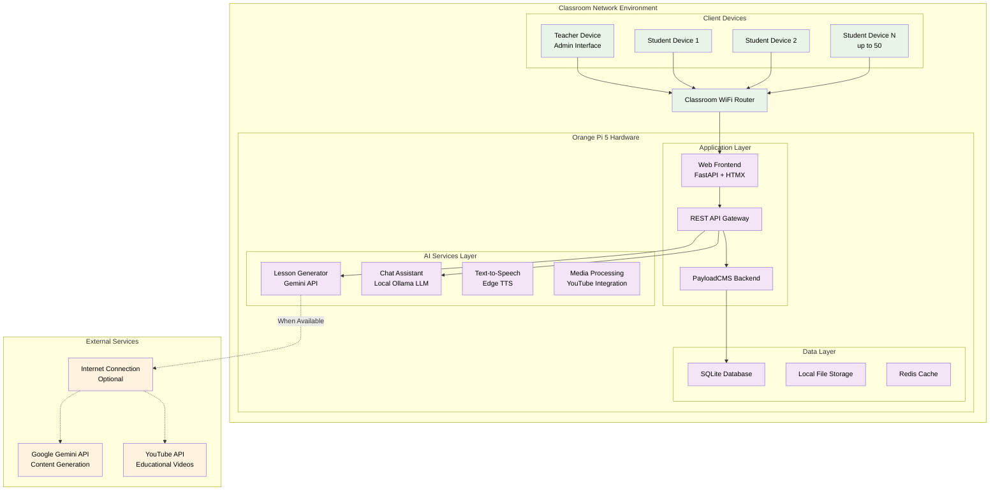
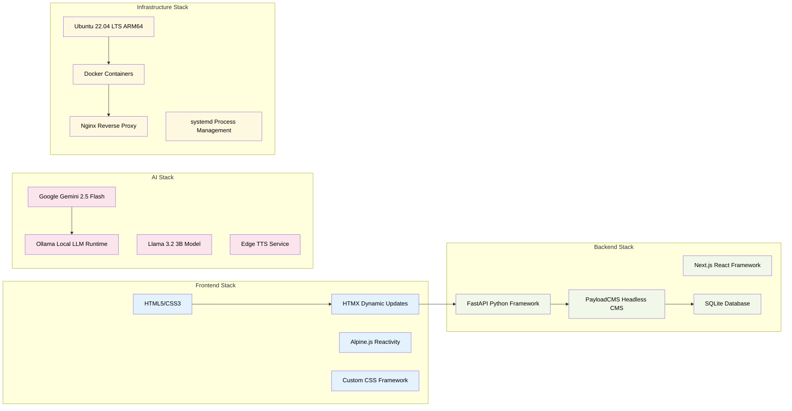

# Pi-LMS Software Development and Design Plan

## Executive Summary

Pi-LMS is an innovative offline-first Learning Management System designed for deployment on single-board computers (Orange Pi 5/Raspberry Pi). The system serves mixed-use educational environments with 40-50 users per classroom, supporting multiple age groups and course types. The architecture emphasizes local processing, minimal internet dependency, and AI-powered content generation.

### Project Overview

- **Target Platform**: Orange Pi 5 (ARM64 Single Board Computer)
- **User Capacity**: 40-50 users per classroom deployment
- **Network Architecture**: Offline-first with optional internet connectivity
- **Educational Scope**: Mixed-use environment supporting K-12, higher education, and vocational training
- **Deployment Model**: One Pi-LMS instance per classroom

### Key Innovation Points

- **AI-Powered Content Generation**: PDF-to-lesson conversion using Google Gemini API
- **Offline AI Tutoring**: Local Ollama LLM for student assistance
- **Edge Computing Optimization**: Optimized for ARM64 SBC hardware constraints
- **Zero-Configuration Deployment**: Docker-based containerized deployment
- **Hybrid Online/Offline Operation**: Internet required only for lesson generation

## Table of Contents

### Core Documentation

1. **[System Architecture](./architecture/system-architecture.md)** - Complete system architecture overview
2. **[Technical Stack](./architecture/technical-stack.md)** - Technology choices and justifications
3. **[Database Design](./architecture/database-design.md)** - Complete ERD and schema design

### Feature Documentation

4. **[User Management System](./features/user-management.md)** - Authentication, authorization, and user workflows
5. **[Course & Lesson Management](./features/course-management.md)** - Content creation and organization
6. **[AI Services Integration](./features/ai-services.md)** - Lesson generator and chat assistant
7. **[Assessment System](./features/assessment-system.md)** - Assignments, quizzes, and grading

### Technical Documentation

8. **[API Specification](./technical/api-specification.md)** - Complete REST and WebSocket API docs
9. **[Security Architecture](./technical/security-architecture.md)** - Security framework and implementation
10. **[Performance Optimization](./technical/performance-optimization.md)** - Orange Pi 5 optimization strategies

### Deployment Documentation

11. **[Deployment Architecture](./deployment/deployment-architecture.md)** - Container setup and infrastructure
12. **[Development Roadmap](./deployment/development-roadmap.md)** - Implementation timeline and phases
13. **[Testing Strategy](./deployment/testing-strategy.md)** - Comprehensive testing approach

### Business Documentation

14. **[Cost Analysis (PHP)](./business/cost-analysis.md)** - Complete cost breakdown in Philippine Peso
15. **[Monitoring & Maintenance](./business/monitoring-maintenance.md)** - Operational procedures

## System Overview

### High-Level Architecture Diagram

### Current Implementation Status

| Component                    | Status         | Completion | Notes                        |
| ---------------------------- | -------------- | ---------- | ---------------------------- |
| **Frontend System**          | ✅ Implemented | 90%        | FastAPI + HTMX working       |
| **Backend CMS**              | ✅ Implemented | 85%        | PayloadCMS with collections  |
| **User Authentication**      | ✅ Implemented | 95%        | JWT + Session management     |
| **Course Management**        | ✅ Implemented | 80%        | Basic CRUD operations        |
| **Lesson Management**        | ✅ Implemented | 85%        | Rich text with Lexical       |
| **AI Lesson Generator**      | ✅ Implemented | 90%        | PDF to lesson pipeline       |
| **AI Chat Assistant**        | ✅ Implemented | 85%        | Local Ollama integration     |
| **Media Management**         | ✅ Implemented | 75%        | File upload and storage      |
| **Assessment System**        | 🔄 In Progress | 30%        | Basic framework              |
| **Deployment Setup**         | 📋 Planned     | 10%        | Docker configuration started |
| **Performance Optimization** | 📋 Planned     | 20%        | Initial optimizations        |
| **Testing Framework**        | 📋 Planned     | 15%        | Basic unit tests             |

### Technology Stack Summary

## Key Features Overview

### 1. User Management System

- **Multi-role Authentication**: Admin, Instructor, Student roles
- **Session Management**: Secure JWT-based authentication
- **Profile Management**: User preferences and settings
- **Offline Session Caching**: Maintain sessions without internet

### 2. Course & Lesson Management

- **Rich Content Creation**: Lexical.js rich text editor
- **Media Integration**: Images, audio, video support
- **Course Organization**: Structured lesson sequences
- **Publication Control**: Draft/published status management

### 3. AI-Powered Content Generation

- **PDF to Lesson Conversion**: Automated content extraction
- **Intelligent Structuring**: AI-generated lesson organization
- **Audio Narration**: Text-to-speech lesson narration
- **Video Integration**: Automatic educational video suggestions

### 4. AI Chat Assistant

- **Context-Aware Tutoring**: Lesson-specific assistance
- **Multiple Conversation Modes**: Explanation, quiz, discussion
- **Offline Operation**: Local LLM for 24/7 availability
- **Real-time Streaming**: Live response generation

### 5. Assessment & Progress Tracking

- **Assignment Management**: Create and grade assignments
- **Progress Analytics**: Student learning progress tracking
- **Automated Quizzing**: AI-generated practice questions
- **Grade Book**: Comprehensive grade management

## Hardware Requirements

### Orange Pi 5 Specifications

- **SoC**: Rockchip RK3588S (8-core ARM Cortex)
- **CPU**: 4× Cortex-A76 @ 2.4GHz + 4× Cortex-A55 @ 1.8GHz
- **GPU**: Mali-G610 MP4 with OpenGL ES 3.2
- **RAM**: 8GB LPDDR4X (6400MT/s)
- **Storage**: 128GB eMMC 5.1 + microSD expansion
- **Network**: Gigabit Ethernet + Wi-Fi 6 802.11ax
- **USB**: 2× USB 3.0 + 2× USB 2.0
- **Display**: HDMI 2.1 (4K@60Hz)

### Performance Characteristics

- **User Capacity**: Optimized for 40-50 concurrent users
- **Response Time**: <500ms for typical operations
- **AI Processing**: 5-10 seconds for chat responses
- **Lesson Generation**: 2-5 minutes for PDF processing
- **Storage Requirements**: 50-100GB per classroom
- **Power Consumption**: 10-15W typical operation

## Development Approach

### Agile Development Methodology

- **Sprint Duration**: 2-week sprints
- **Development Phases**: 5 phases over 20 weeks
- **Testing Strategy**: Continuous integration with automated testing
- **Deployment Strategy**: Blue-green deployment with rollback capability

### Quality Assurance

- **Code Quality**: ESLint, Prettier, Black formatting
- **Testing Coverage**: >80% unit test coverage target
- **Performance Testing**: Load testing with 50 concurrent users
- **Security Testing**: Regular security audits and penetration testing

### Documentation Standards

- **API Documentation**: OpenAPI/Swagger specifications
- **Code Documentation**: Inline comments and docstrings
- **User Documentation**: Comprehensive user guides
- **Technical Documentation**: Architecture and deployment guides

## Next Steps

This plan is organized into detailed sections for easier navigation and implementation. Each linked document provides comprehensive details for its respective area.

### Immediate Actions Required:

1. **Review Architecture Documents**: Start with system architecture overview
2. **Examine Cost Analysis**: Review PHP-based cost breakdown
3. **Plan Development Phases**: Review roadmap and timeline
4. **Setup Development Environment**: Follow deployment architecture guide

### Implementation Priority:

1. Complete assessment system implementation
2. Optimize performance for Orange Pi 5 hardware
3. Implement comprehensive testing framework
4. Finalize Docker deployment configuration
5. Create production deployment scripts

---

**Document Version**: 1.0  
**Last Updated**: January 6, 2025  
**Next Review**: January 20, 2025

For detailed information on any component, please refer to the linked documentation sections.
