# Database Design - Pi-LMS

## Overview

Pi-LMS uses SQLite as the primary database, optimized for single-board computer deployment with 40-50 concurrent users. The database design emphasizes educational workflow efficiency, data integrity, and performance optimization for the Orange Pi 5 hardware constraints.

## Complete Entity Relationship Diagram (ERD)

```mermaid
erDiagram
    USERS {
        int id PK
        string email UK "Unique email address"
        string firstName "User first name"
        string lastName "User last name"
        enum role "admin, instructor, student"
        string passwordHash "bcrypt hashed password"
        boolean isActive "Account status"
        datetime createdAt "Account creation date"
        datetime updatedAt "Last profile update"
        datetime lastLoginAt "Last successful login"
        json preferences "User preferences and settings"
        string profileImage "Profile image path"
        string phoneNumber "Contact phone number"
        date dateOfBirth "Birth date for students"
        text bio "User biography"
        json socialLinks "Social media links"
    }

    COURSES {
        int id PK
        string title "Course title"
        text description "Course description"
        text syllabus "Detailed course syllabus"
        int instructor FK "Instructor user ID"
        date startDate "Course start date"
        date endDate "Course end date"
        boolean published "Publication status"
        int image FK "Course thumbnail image"
        json metadata "Course metadata and settings"
        int maxStudents "Maximum enrollment capacity"
        enum status "draft, active, archived, completed"
        enum difficulty "beginner, intermediate, advanced"
        json prerequisites "Course prerequisites"
        json learningObjectives "Learning objectives"
        float estimatedHours "Estimated completion time"
        json tags "Course category tags"
        datetime createdAt "Creation timestamp"
        datetime updatedAt "Last update timestamp"
    }

    LESSONS {
        int id PK
        string title "Lesson title"
        text summary "Lesson summary"
        json content "Lexical JSON content structure"
        text narration "Audio narration script"
        string audioFile "Audio narration file path"
        boolean published "Publication status"
        int course FK "Parent course ID"
        int orderIndex "Lesson sequence order"
        int estimatedMinutes "Estimated completion time"
        json objectives "Specific learning objectives"
        json keywords "Search and discovery keywords"
        enum difficulty "easy, medium, hard"
        json prerequisites "Lesson prerequisites"
        boolean allowComments "Enable student comments"
        boolean trackProgress "Enable progress tracking"
        json aiMetadata "AI generation metadata"
        datetime createdAt "Creation timestamp"
        datetime updatedAt "Last modification timestamp"
        datetime publishedAt "Publication timestamp"
    }

    ENROLLMENTS {
        int id PK
        int user FK "Student user ID"
        int course FK "Course ID"
        datetime enrolledAt "Enrollment timestamp"
        enum status "active, completed, withdrawn, suspended"
        float progressPercentage "Overall course progress (0-100)"
        datetime completedAt "Course completion timestamp"
        datetime lastAccessedAt "Last course access"
        json metadata "Enrollment specific data"
        float finalGrade "Final course grade"
        text certificateData "Certificate information"
        boolean notificationsEnabled "Email notifications preference"
        json customFields "Institution specific fields"
    }

    MEDIA {
        int id PK
        string filename "Original uploaded filename"
        string storedFilename "Server stored filename"
        string mimetype "MIME content type"
        int filesize "File size in bytes"
        string alt "Alt text for accessibility"
        enum mediaType "image, audio, video, document, archive"
        json metadata "File metadata (dimensions, duration, etc)"
        string uploadedBy "User who uploaded the file"
        json processingStatus "Processing and optimization status"
        string thumbnail "Thumbnail image path"
        boolean isPublic "Public access flag"
        json accessControl "Access control settings"
        datetime createdAt "Upload timestamp"
        datetime updatedAt "Last modification"
    }

    ASSIGNMENTS {
        int id PK
        string title "Assignment title"
        text description "Assignment description"
        text instructions "Detailed instructions"
        int lesson FK "Parent lesson ID"
        datetime dueDate "Assignment due date"
        datetime availableFrom "Availability start date"
        datetime availableUntil "Availability end date"
        int maxPoints "Maximum possible points"
        enum submissionType "text, file, both, quiz"
        boolean allowLateSubmission "Late submission policy"
        int latePenaltyPercent "Late penalty percentage"
        json rubric "Detailed grading rubric"
        json attachments "Reference materials"
        boolean requirePlagiarismCheck "Plagiarism detection flag"
        int maxAttempts "Maximum submission attempts"
        boolean isGroupAssignment "Group work flag"
        json groupSettings "Group assignment configuration"
        datetime createdAt "Creation timestamp"
        datetime updatedAt "Last modification"
    }

    SUBMISSIONS {
        int id PK
        int assignment FK "Assignment ID"
        int student FK "Student user ID"
        int attemptNumber "Submission attempt number"
        text content "Submission text content"
        json attachments "Submitted files metadata"
        datetime submittedAt "Submission timestamp"
        datetime lastModifiedAt "Last edit timestamp"
        int grade "Assigned grade points"
        float gradePercentage "Grade as percentage"
        text feedback "Instructor feedback"
        json detailedFeedback "Structured feedback"
        enum status "draft, submitted, graded, returned, late"
        datetime gradedAt "Grading timestamp"
        int gradedBy FK "Instructor who graded"
        boolean flaggedForReview "Manual review flag"
        json plagiarismReport "Plagiarism check results"
        json rubricScores "Rubric-based scoring"
        boolean isLate "Late submission flag"
        int collaborators "Group member IDs for group work"
    }

    CHAT_SESSIONS {
        int id PK
        string sessionId UK "Unique session identifier"
        int lesson FK "Associated lesson ID"
        int user FK "User ID"
        json history "Complete chat message history"
        json context "Cached lesson context"
        enum mode "default, quiz, explanation, study_guide, discussion"
        json aiSettings "AI behavior configuration"
        datetime createdAt "Session creation timestamp"
        datetime lastActivity "Last interaction timestamp"
        boolean isActive "Session active status"
        int messageCount "Total messages in session"
        json analytics "Conversation analytics"
        enum userSatisfaction "poor, fair, good, excellent"
        text userFeedback "User feedback on AI responses"
    }

    PROGRESS {
        int id PK
        int user FK "Student user ID"
        int lesson FK "Lesson ID"
        int course FK "Course ID"
        float completionPercentage "Lesson completion percentage"
        int timeSpentSeconds "Total time spent in seconds"
        datetime startedAt "First access timestamp"
        datetime lastAccessed "Last access timestamp"
        datetime completedAt "Completion timestamp"
        json interactions "Detailed interaction data"
        json bookmarks "User created bookmarks"
        json notes "Student personal notes"
        int scrollPosition "Last scroll position"
        boolean isCompleted "Completion flag"
        json learningPath "Personalized learning path"
        float engagementScore "Calculated engagement score"
        json strugglingConcepts "Areas needing help"
    }

    QUIZ_ATTEMPTS {
        int id PK
        int user FK "Student user ID"
        int lesson FK "Lesson ID"
        int quiz FK "Quiz assignment ID"
        json questions "Quiz questions and options"
        json answers "Student provided answers"
        json correctAnswers "Correct answer key"
        int score "Total points earned"
        int maxScore "Maximum possible score"
        float percentage "Score as percentage"
        datetime startedAt "Quiz start timestamp"
        datetime completedAt "Quiz completion timestamp"
        datetime submittedAt "Submission timestamp"
        int timeSpentSeconds "Time spent on quiz"
        enum status "in_progress, completed, abandoned, timed_out"
        boolean isRetake "Retake attempt flag"
        int attemptNumber "Attempt sequence number"
        json analytics "Performance analytics"
        json hints "Hints provided during quiz"
        boolean allowReview "Allow answer review flag"
    }

    NOTIFICATIONS {
        int id PK
        int user FK "Target user ID"
        enum type "info, warning, success, error, reminder, assignment"
        string title "Notification title"
        text message "Notification content"
        json metadata "Additional notification data"
        boolean isRead "Read status flag"
        boolean isArchived "Archive status"
        datetime createdAt "Creation timestamp"
        datetime readAt "Read timestamp"
        datetime expiresAt "Expiration timestamp"
        enum priority "low, normal, high, urgent"
        json actionButtons "Action button configuration"
        string relatedEntity "Related entity type"
        int relatedEntityId "Related entity ID"
        boolean emailSent "Email notification sent flag"
        datetime emailSentAt "Email sent timestamp"
    }

    SYSTEM_LOGS {
        int id PK
        enum level "debug, info, warning, error, critical"
        string component "System component name"
        string action "Action performed"
        text message "Log message content"
        json context "Additional context data"
        string userId "User ID if applicable"
        string sessionId "Session ID if applicable"
        string ipAddress "Client IP address"
        string userAgent "Client user agent"
        json requestData "Request data if applicable"
        json responseData "Response data if applicable"
        int responseTime "Response time in milliseconds"
        datetime timestamp "Log entry timestamp"
        string correlationId "Request correlation ID"
        json systemMetrics "System metrics at log time"
    }

    COURSE_CATEGORIES {
        int id PK
        string name "Category name"
        string slug "URL-friendly slug"
        text description "Category description"
        string icon "Category icon"
        string color "Category color code"
        int parentCategory FK "Parent category for hierarchy"
        int sortOrder "Display sort order"
        boolean isActive "Category active status"
        datetime createdAt "Creation timestamp"
        datetime updatedAt "Last update timestamp"
    }

    LEARNING_ANALYTICS {
        int id PK
        int user FK "User ID"
        int course FK "Course ID"
        int lesson FK "Lesson ID if specific"
        enum metricType "engagement, performance, time, interaction"
        string metricName "Specific metric name"
        float metricValue "Metric value"
        string unit "Metric unit (minutes, percentage, count)"
        json dimensions "Metric dimensions and context"
        datetime recordedAt "Metric recording timestamp"
        datetime calculatedAt "Metric calculation timestamp"
        boolean isAggregate "Aggregate metric flag"
        string aggregationPeriod "Aggregation period (daily, weekly, monthly)"
        json metadata "Additional metric metadata"
    }

    API_KEYS {
        int id PK
        string keyName "Key identifier name"
        string hashedKey "Hashed API key"
        int userId FK "Associated user ID"
        json permissions "API permissions"
        json rateLimits "Rate limiting configuration"
        boolean isActive "Key active status"
        datetime createdAt "Key creation timestamp"
        datetime expiresAt "Key expiration timestamp"
        datetime lastUsedAt "Last usage timestamp"
        int usageCount "Total usage count"
        json usageAnalytics "Usage analytics data"
    }

    %% Primary Relationships
    USERS ||--o{ ENROLLMENTS : "user enrolls in courses"
    USERS ||--o{ SUBMISSIONS : "user submits assignments"
    USERS ||--o{ CHAT_SESSIONS : "user has chat sessions"
    USERS ||--o{ PROGRESS : "user tracks progress"
    USERS ||--o{ QUIZ_ATTEMPTS : "user attempts quizzes"
    USERS ||--o{ NOTIFICATIONS : "user receives notifications"
    USERS ||--o{ LEARNING_ANALYTICS : "user generates analytics"
    USERS ||--o{ API_KEYS : "user has API keys"

    %% Course Relationships
    COURSES ||--o{ LESSONS : "course contains lessons"
    COURSES ||--o{ ENROLLMENTS : "course has enrollments"
    COURSES ||--o{ PROGRESS : "course tracks progress"
    COURSES ||--o{ LEARNING_ANALYTICS : "course generates analytics"
    COURSES }o--|| COURSE_CATEGORIES : "course belongs to category"
    COURSE_CATEGORIES ||--o{ COURSE_CATEGORIES : "category hierarchy"

    %% Lesson Relationships
    LESSONS ||--o{ ASSIGNMENTS : "lesson includes assignments"
    LESSONS ||--o{ CHAT_SESSIONS : "lesson supports chat"
    LESSONS ||--o{ PROGRESS : "lesson tracks progress"
    LESSONS ||--o{ QUIZ_ATTEMPTS : "lesson has quizzes"
    LESSONS ||--o{ LEARNING_ANALYTICS : "lesson generates analytics"

    %% Assignment and Assessment Relationships
    ASSIGNMENTS ||--o{ SUBMISSIONS : "assignment receives submissions"
    ASSIGNMENTS ||--o{ QUIZ_ATTEMPTS : "assignment includes quizzes"

    %% Media Relationships
    MEDIA ||--o{ COURSES : "media illustrates courses"
    MEDIA ||--o{ LESSONS : "media enhances lessons"
    MEDIA ||--o{ SUBMISSIONS : "media included in submissions"

    %% User Role Relationships
    USERS ||--o{ COURSES : "instructor teaches courses"
    USERS ||--o{ SUBMISSIONS : "instructor grades submissions"

    %% System Relationships
    USERS ||--o{ SYSTEM_LOGS : "user actions logged"
    CHAT_SESSIONS ||--o{ SYSTEM_LOGS : "chat sessions logged"
```



## Database Schema Implementation

### Core Tables Schema

```sql
-- Users table with comprehensive user management
CREATE TABLE users (
    id INTEGER PRIMARY KEY AUTOINCREMENT,
    email VARCHAR(255) UNIQUE NOT NULL,
    firstName VARCHAR(100) NOT NULL,
    lastName VARCHAR(100) NOT NULL,
    role VARCHAR(20) CHECK(role IN ('admin', 'instructor', 'student')) DEFAULT 'student',
    passwordHash VARCHAR(255) NOT NULL,
    isActive BOOLEAN DEFAULT TRUE,
    createdAt DATETIME DEFAULT CURRENT_TIMESTAMP,
    updatedAt DATETIME DEFAULT CURRENT_TIMESTAMP,
    lastLoginAt DATETIME,
    preferences JSON,
    profileImage VARCHAR(255),
    phoneNumber VARCHAR(20),
    dateOfBirth DATE,
    bio TEXT,
    socialLinks JSON
);

-- Courses table with enhanced educational metadata
CREATE TABLE courses (
    id INTEGER PRIMARY KEY AUTOINCREMENT,
    title VARCHAR(255) NOT NULL,
    description TEXT,
    syllabus TEXT,
    instructor INTEGER NOT NULL,
    startDate DATE NOT NULL,
    endDate DATE,
    published BOOLEAN DEFAULT FALSE,
    image INTEGER,
    metadata JSON,
    maxStudents INTEGER DEFAULT 50,
    status VARCHAR(20) CHECK(status IN ('draft', 'active', 'archived', 'completed')) DEFAULT 'draft',
    difficulty VARCHAR(20) CHECK(difficulty IN ('beginner', 'intermediate', 'advanced')) DEFAULT 'beginner',
    prerequisites JSON,
    learningObjectives JSON,
    estimatedHours FLOAT,
    tags JSON,
    createdAt DATETIME DEFAULT CURRENT_TIMESTAMP,
    updatedAt DATETIME DEFAULT CURRENT_TIMESTAMP,
    FOREIGN KEY (instructor) REFERENCES users(id) ON DELETE RESTRICT,
    FOREIGN KEY (image) REFERENCES media(id) ON DELETE SET NULL
);

-- Lessons table with rich content support
CREATE TABLE lessons (
    id INTEGER PRIMARY KEY AUTOINCREMENT,
    title VARCHAR(255) NOT NULL,
    summary TEXT,
    content JSON NOT NULL,
    narration TEXT,
    audioFile VARCHAR(255),
    published BOOLEAN DEFAULT FALSE,
    course INTEGER NOT NULL,
    orderIndex INTEGER DEFAULT 0,
    estimatedMinutes INTEGER DEFAULT 30,
    objectives JSON,
    keywords JSON,
    difficulty VARCHAR(10) CHECK(difficulty IN ('easy', 'medium', 'hard')) DEFAULT 'medium',
    prerequisites JSON,
    allowComments BOOLEAN DEFAULT TRUE,
    trackProgress BOOLEAN DEFAULT TRUE,
    aiMetadata JSON,
    createdAt DATETIME DEFAULT CURRENT_TIMESTAMP,
    updatedAt DATETIME DEFAULT CURRENT_TIMESTAMP,
    publishedAt DATETIME,
    FOREIGN KEY (course) REFERENCES courses(id) ON DELETE CASCADE
);

-- Enrollments with comprehensive tracking
CREATE TABLE enrollments (
    id INTEGER PRIMARY KEY AUTOINCREMENT,
    user INTEGER NOT NULL,
    course INTEGER NOT NULL,
    enrolledAt DATETIME DEFAULT CURRENT_TIMESTAMP,
    status VARCHAR(20) CHECK(status IN ('active', 'completed', 'withdrawn', 'suspended')) DEFAULT 'active',
    progressPercentage FLOAT DEFAULT 0.0 CHECK(progressPercentage >= 0 AND progressPercentage <= 100),
    completedAt DATETIME,
    lastAccessedAt DATETIME,
    metadata JSON,
    finalGrade FLOAT,
    certificateData TEXT,
    notificationsEnabled BOOLEAN DEFAULT TRUE,
    customFields JSON,
    FOREIGN KEY (user) REFERENCES users(id) ON DELETE CASCADE,
    FOREIGN KEY (course) REFERENCES courses(id) ON DELETE CASCADE,
    UNIQUE(user, course)
);

-- Media management with comprehensive metadata
CREATE TABLE media (
    id INTEGER PRIMARY KEY AUTOINCREMENT,
    filename VARCHAR(255) NOT NULL,
    storedFilename VARCHAR(255) NOT NULL,
    mimetype VARCHAR(100) NOT NULL,
    filesize INTEGER NOT NULL,
    alt VARCHAR(500),
    mediaType VARCHAR(20) CHECK(mediaType IN ('image', 'audio', 'video', 'document', 'archive')) NOT NULL,
    metadata JSON,
    uploadedBy VARCHAR(100),
    processingStatus JSON,
    thumbnail VARCHAR(255),
    isPublic BOOLEAN DEFAULT FALSE,
    accessControl JSON,
    createdAt DATETIME DEFAULT CURRENT_TIMESTAMP,
    updatedAt DATETIME DEFAULT CURRENT_TIMESTAMP
);

-- Enhanced progress tracking
CREATE TABLE progress (
    id INTEGER PRIMARY KEY AUTOINCREMENT,
    user INTEGER NOT NULL,
    lesson INTEGER NOT NULL,
    course INTEGER NOT NULL,
    completionPercentage FLOAT DEFAULT 0.0 CHECK(completionPercentage >= 0 AND completionPercentage <= 100),
    timeSpentSeconds INTEGER DEFAULT 0,
    startedAt DATETIME DEFAULT CURRENT_TIMESTAMP,
    lastAccessed DATETIME DEFAULT CURRENT_TIMESTAMP,
    completedAt DATETIME,
    interactions JSON,
    bookmarks JSON,
    notes TEXT,
    scrollPosition INTEGER DEFAULT 0,
    isCompleted BOOLEAN DEFAULT FALSE,
    learningPath JSON,
    engagementScore FLOAT DEFAULT 0.0,
    strugglingConcepts JSON,
    FOREIGN KEY (user) REFERENCES users(id) ON DELETE CASCADE,
    FOREIGN KEY (lesson) REFERENCES lessons(id) ON DELETE CASCADE,
    FOREIGN KEY (course) REFERENCES courses(id) ON DELETE CASCADE,
    UNIQUE(user, lesson)
);
```

### Advanced Tables Schema

```sql
-- Learning Analytics for data-driven insights
CREATE TABLE learning_analytics (
    id INTEGER PRIMARY KEY AUTOINCREMENT,
    user INTEGER,
    course INTEGER,
    lesson INTEGER,
    metricType VARCHAR(50) CHECK(metricType IN ('engagement', 'performance', 'time', 'interaction')) NOT NULL,
    metricName VARCHAR(100) NOT NULL,
    metricValue FLOAT NOT NULL,
    unit VARCHAR(20),
    dimensions JSON,
    recordedAt DATETIME DEFAULT CURRENT_TIMESTAMP,
    calculatedAt DATETIME DEFAULT CURRENT_TIMESTAMP,
    isAggregate BOOLEAN DEFAULT FALSE,
    aggregationPeriod VARCHAR(20),
    metadata JSON,
    FOREIGN KEY (user) REFERENCES users(id) ON DELETE CASCADE,
    FOREIGN KEY (course) REFERENCES courses(id) ON DELETE CASCADE,
    FOREIGN KEY (lesson) REFERENCES lessons(id) ON DELETE CASCADE
);

-- Course categorization system
CREATE TABLE course_categories (
    id INTEGER PRIMARY KEY AUTOINCREMENT,
    name VARCHAR(100) NOT NULL,
    slug VARCHAR(100) UNIQUE NOT NULL,
    description TEXT,
    icon VARCHAR(50),
    color VARCHAR(7), -- Hex color code
    parentCategory INTEGER,
    sortOrder INTEGER DEFAULT 0,
    isActive BOOLEAN DEFAULT TRUE,
    createdAt DATETIME DEFAULT CURRENT_TIMESTAMP,
    updatedAt DATETIME DEFAULT CURRENT_TIMESTAMP,
    FOREIGN KEY (parentCategory) REFERENCES course_categories(id) ON DELETE SET NULL
);

-- System audit and logging
CREATE TABLE system_logs (
    id INTEGER PRIMARY KEY AUTOINCREMENT,
    level VARCHAR(20) CHECK(level IN ('debug', 'info', 'warning', 'error', 'critical')) NOT NULL,
    component VARCHAR(50) NOT NULL,
    action VARCHAR(100),
    message TEXT NOT NULL,
    context JSON,
    userId VARCHAR(50),
    sessionId VARCHAR(100),
    ipAddress VARCHAR(45), -- IPv6 compatible
    userAgent TEXT,
    requestData JSON,
    responseData JSON,
    responseTime INTEGER, -- milliseconds
    timestamp DATETIME DEFAULT CURRENT_TIMESTAMP,
    correlationId VARCHAR(100),
    systemMetrics JSON
);

-- API key management for integrations
CREATE TABLE api_keys (
    id INTEGER PRIMARY KEY AUTOINCREMENT,
    keyName VARCHAR(100) NOT NULL,
    hashedKey VARCHAR(255) NOT NULL,
    userId INTEGER,
    permissions JSON,
    rateLimits JSON,
    isActive BOOLEAN DEFAULT TRUE,
    createdAt DATETIME DEFAULT CURRENT_TIMESTAMP,
    expiresAt DATETIME,
    lastUsedAt DATETIME,
    usageCount INTEGER DEFAULT 0,
    usageAnalytics JSON,
    FOREIGN KEY (userId) REFERENCES users(id) ON DELETE CASCADE
);
```

## Database Indexes and Optimization

### Performance Indexes

```sql
-- User-related indexes
CREATE INDEX idx_users_email ON users(email);
CREATE INDEX idx_users_role ON users(role);
CREATE INDEX idx_users_active ON users(isActive);
CREATE INDEX idx_users_last_login ON users(lastLoginAt);

-- Course-related indexes
CREATE INDEX idx_courses_instructor ON courses(instructor);
CREATE INDEX idx_courses_status ON courses(status);
CREATE INDEX idx_courses_published ON courses(published);
CREATE INDEX idx_courses_start_date ON courses(startDate);
CREATE INDEX idx_courses_category ON courses(category);

-- Lesson-related indexes
CREATE INDEX idx_lessons_course ON lessons(course);
CREATE INDEX idx_lessons_published ON lessons(published);
CREATE INDEX idx_lessons_order ON lessons(course, orderIndex);
CREATE INDEX idx_lessons_difficulty ON lessons(difficulty);

-- Enrollment indexes for quick lookups
CREATE INDEX idx_enrollments_user ON enrollments(user);
CREATE INDEX idx_enrollments_course ON enrollments(course);
CREATE INDEX idx_enrollments_status ON enrollments(status);
CREATE INDEX idx_enrollments_user_course ON enrollments(user, course);

-- Progress tracking indexes
CREATE INDEX idx_progress_user ON progress(user);
CREATE INDEX idx_progress_lesson ON progress(lesson);
CREATE INDEX idx_progress_course ON progress(course);
CREATE INDEX idx_progress_completion ON progress(completionPercentage);
CREATE INDEX idx_progress_user_course ON progress(user, course);

-- Assignment and submission indexes
CREATE INDEX idx_assignments_lesson ON assignments(lesson);
CREATE INDEX idx_assignments_due_date ON assignments(dueDate);
CREATE INDEX idx_submissions_assignment ON submissions(assignment);
CREATE INDEX idx_submissions_student ON submissions(student);
CREATE INDEX idx_submissions_status ON submissions(status);

-- Chat and interaction indexes
CREATE INDEX idx_chat_sessions_user ON chat_sessions(user);
CREATE INDEX idx_chat_sessions_lesson ON chat_sessions(lesson);
CREATE INDEX idx_chat_sessions_active ON chat_sessions(isActive);
CREATE INDEX idx_chat_sessions_activity ON chat_sessions(lastActivity);

-- Media and file indexes
CREATE INDEX idx_media_type ON media(mediaType);
CREATE INDEX idx_media_uploaded_by ON media(uploadedBy);
CREATE INDEX idx_media_public ON media(isPublic);
CREATE INDEX idx_media_created ON media(createdAt);

-- Analytics indexes
CREATE INDEX idx_analytics_user ON learning_analytics(user);
CREATE INDEX idx_analytics_course ON learning_analytics(course);
CREATE INDEX idx_analytics_metric ON learning_analytics(metricType, metricName);
CREATE INDEX idx_analytics_recorded ON learning_analytics(recordedAt);

-- System log indexes
CREATE INDEX idx_logs_level ON system_logs(level);
CREATE INDEX idx_logs_component ON system_logs(component);
CREATE INDEX idx_logs_timestamp ON system_logs(timestamp);
CREATE INDEX idx_logs_user ON system_logs(userId);
CREATE INDEX idx_logs_correlation ON system_logs(correlationId);

-- Composite indexes for common queries
CREATE INDEX idx_user_course_progress ON progress(user, course, completionPercentage);
CREATE INDEX idx_lesson_user_completion ON progress(lesson, user, isCompleted);
CREATE INDEX idx_course_published_active ON courses(published, status);
CREATE INDEX idx_enrollment_active_course ON enrollments(status, course) WHERE status = 'active';
```

### Database Optimization Configuration

```sql
-- SQLite optimization settings for Pi-LMS
PRAGMA journal_mode = WAL;          -- Write-Ahead Logging for better concurrency
PRAGMA synchronous = NORMAL;        -- Balance between safety and performance
PRAGMA cache_size = -64000;         -- 64MB cache size
PRAGMA temp_store = MEMORY;         -- Store temporary tables in memory
PRAGMA mmap_size = 268435456;       -- 256MB memory mapping
PRAGMA page_size = 4096;            -- Optimal page size for SSD storage
PRAGMA foreign_keys = ON;           -- Enable foreign key constraints
PRAGMA recursive_triggers = ON;     -- Enable recursive triggers
PRAGMA busy_timeout = 30000;        -- 30 second busy timeout

-- Enable query optimization
PRAGMA optimize;

-- Analyze tables for better query planning
ANALYZE;
```

## Data Migration Scripts

### Initial Data Seeding

```sql
-- Insert default administrator user
INSERT INTO users (
    email, firstName, lastName, role, passwordHash, isActive
) VALUES (
    'admin@pilms.local',
    'System',
    'Administrator',
    'admin',
    '$2b$12$LQv3c1yqBwEHxw5E1dRs1uORAXFhqE7cRcLnz1l9j9vHwGdC7V6jO', -- password: admin123
    TRUE
);

-- Insert sample course categories
INSERT INTO course_categories (name, slug, description, icon, color) VALUES
    ('Mathematics', 'mathematics', 'Mathematical sciences and computation', '📐', '#3B82F6'),
    ('Science', 'science', 'Natural sciences and laboratory work', '🔬', '#10B981'),
    ('Languages', 'languages', 'Language learning and literature', '📚', '#8B5CF6'),
    ('Technology', 'technology', 'Computer science and digital literacy', '💻', '#F59E0B'),
    ('Arts', 'arts', 'Creative arts and design', '🎨', '#EF4444'),
    ('Social Studies', 'social-studies', 'History, geography, and civics', '🌍', '#6B7280');

-- Insert sample course
INSERT INTO courses (
    title, description, instructor, startDate, status, difficulty, published
) VALUES (
    'Introduction to Pi-LMS',
    'Learn how to use the Pi-LMS learning management system effectively.',
    1, -- admin user
    '2025-01-15',
    'active',
    'beginner',
    TRUE
);

-- Insert sample lesson
INSERT INTO lessons (
    title, summary, content, course, orderIndex, published, estimatedMinutes
) VALUES (
    'Getting Started with Pi-LMS',
    'Welcome to Pi-LMS! This lesson covers the basics of navigating and using the platform.',
    '{"root":{"children":[{"type":"heading","tag":"h1","children":[{"type":"text","text":"Welcome to Pi-LMS"}]},{"type":"paragraph","children":[{"type":"text","text":"Pi-LMS is an innovative learning management system designed for educational excellence."}]}],"direction":"ltr","format":"","indent":0,"type":"root","version":1}}',
    1, -- sample course
    1,
    TRUE,
    15
);
```

### Database Migration System

```python
# Database migration system for Pi-LMS
import sqlite3
import json
from datetime import datetime
from pathlib import Path

class DatabaseMigration:
    def __init__(self, db_path: str):
        self.db_path = db_path
        self.migrations_dir = Path("migrations")
        self.migrations_dir.mkdir(exist_ok=True)

    def create_migration_table(self):
        """Create migration tracking table"""
        with sqlite3.connect(self.db_path) as conn:
            conn.execute("""
                CREATE TABLE IF NOT EXISTS schema_migrations (
                    id INTEGER PRIMARY KEY AUTOINCREMENT,
                    version VARCHAR(255) UNIQUE NOT NULL,
                    applied_at DATETIME DEFAULT CURRENT_TIMESTAMP,
                    rollback_sql TEXT
                )
            """)

    def apply_migration(self, version: str, up_sql: str, down_sql: str = None):
        """Apply a database migration"""
        with sqlite3.connect(self.db_path) as conn:
            try:
                # Execute migration
                conn.executescript(up_sql)

                # Record migration
                conn.execute(
                    "INSERT INTO schema_migrations (version, rollback_sql) VALUES (?, ?)",
                    (version, down_sql)
                )

                print(f"Migration {version} applied successfully")

            except Exception as e:
                print(f"Migration {version} failed: {e}")
                conn.rollback()
                raise

    def rollback_migration(self, version: str):
        """Rollback a specific migration"""
        with sqlite3.connect(self.db_path) as conn:
            cursor = conn.execute(
                "SELECT rollback_sql FROM schema_migrations WHERE version = ?",
                (version,)
            )

            result = cursor.fetchone()
            if result and result[0]:
                try:
                    conn.executescript(result[0])
                    conn.execute(
                        "DELETE FROM schema_migrations WHERE version = ?",
                        (version,)
                    )
                    print(f"Migration {version} rolled back successfully")

                except Exception as e:
                    print(f"Rollback of {version} failed: {e}")
                    raise
            else:
                print(f"No rollback available for migration {version}")

# Example migration usage
def run_initial_migration():
    migration = DatabaseMigration("lms-payload.db")
    migration.create_migration_table()

    # Apply core schema migration
    migration.apply_migration(
        version="001_initial_schema",
        up_sql=open("migrations/001_initial_schema.sql").read(),
        down_sql=open("migrations/001_initial_schema_rollback.sql").read()
    )
```

## Database Performance Monitoring

### Performance Metrics Collection

```sql
-- Query to monitor database performance
SELECT
    name as table_name,
    COUNT(*) as row_count,
    SUM(pgsize) as total_size_bytes,
    AVG(pgsize) as avg_row_size
FROM dbstat
GROUP BY name
ORDER BY total_size_bytes DESC;

-- Index usage analysis
EXPLAIN QUERY PLAN
SELECT u.firstName, u.lastName, c.title, p.completionPercentage
FROM users u
JOIN enrollments e ON u.id = e.user
JOIN courses c ON e.course = c.id
LEFT JOIN progress p ON u.id = p.user AND c.id = p.course
WHERE u.role = 'student' AND e.status = 'active';

-- Query performance monitoring
CREATE VIEW query_performance AS
SELECT
    sql,
    COUNT(*) as execution_count,
    AVG(CAST(value AS REAL)) as avg_execution_time_ms
FROM system_logs
WHERE component = 'database'
    AND action = 'query_execution'
    AND JSON_EXTRACT(context, '$.execution_time_ms') IS NOT NULL
GROUP BY sql
ORDER BY avg_execution_time_ms DESC;
```

### Database Maintenance Procedures

```sql
-- Regular maintenance script for Pi-LMS database
.timeout 30000

-- Analyze tables for query optimization
ANALYZE;

-- Rebuild indexes for optimal performance
REINDEX;

-- Clean up old log entries (keep last 30 days)
DELETE FROM system_logs
WHERE timestamp < datetime('now', '-30 days');

-- Clean up expired chat sessions
DELETE FROM chat_sessions
WHERE isActive = FALSE
    AND lastActivity < datetime('now', '-7 days');

-- Clean up old notifications
DELETE FROM notifications
WHERE isArchived = TRUE
    AND createdAt < datetime('now', '-90 days');

-- Vacuum database to reclaim space
VACUUM;

-- Check database integrity
PRAGMA integrity_check;

-- Optimize database
PRAGMA optimize;
```

## Database Security Measures

### Access Control and Encryption

```python
# Database security configuration
import sqlite3
import hashlib
import secrets
from cryptography.fernet import Fernet

class SecureDatabase:
    def __init__(self, db_path: str, encryption_key: bytes = None):
        self.db_path = db_path
        self.encryption_key = encryption_key or Fernet.generate_key()
        self.cipher = Fernet(self.encryption_key)

    def encrypt_sensitive_data(self, data: str) -> str:
        """Encrypt sensitive data before storage"""
        return self.cipher.encrypt(data.encode()).decode()

    def decrypt_sensitive_data(self, encrypted_data: str) -> str:
        """Decrypt sensitive data after retrieval"""
        return self.cipher.decrypt(encrypted_data.encode()).decode()

    def secure_connection(self):
        """Create secure database connection"""
        conn = sqlite3.connect(
            self.db_path,
            check_same_thread=False,
            timeout=30.0
        )

        # Enable security features
        conn.execute("PRAGMA foreign_keys = ON")
        conn.execute("PRAGMA secure_delete = ON")
        conn.execute("PRAGMA temp_store = MEMORY")

        return conn
```

This comprehensive database design provides a robust foundation for Pi-LMS, optimized for educational workflows and Orange Pi 5 performance characteristics while maintaining data integrity and security.
