# System Architecture - Pi-LMS

## Overview

Pi-LMS follows a layered microservices architecture optimized for single-board computer deployment. The system is designed for offline-first operation with optional internet connectivity for AI-powered features.

## Detailed System Architecture

### 1. Complete System Architecture Diagram

```mermaid
graph TB
    subgraph "Physical Layer - Orange Pi 5"
        subgraph "Hardware Components"
            CPU[Rockchip RK3588S<br/>8-Core ARM Cortex<br/>2.4GHz + 1.8GHz]
            GPU[Mali-G610 MP4<br/>GPU Acceleration<br/>OpenGL ES 3.2]
            RAM[8GB LPDDR4X<br/>6400MT/s<br/>Dual Channel]
            STORAGE[128GB eMMC 5.1<br/>+ microSD Expansion<br/>+ USB 3.0 Storage]
            NETWORK[Gigabit Ethernet<br/>Wi-Fi 6 802.11ax<br/>Bluetooth 5.3]
        end

        subgraph "Operating System Layer"
            OS[Ubuntu 22.04 LTS ARM64]
            KERNEL[Linux Kernel 5.15+]
            DRIVERS[Hardware Drivers]
            FIREWALL[UFW Firewall]
        end

        subgraph "Container Orchestration Layer"
            DOCKER[Docker Engine 24.0+]
            COMPOSE[Docker Compose]
            NETWORKS[Container Networks]
            VOLUMES[Persistent Volumes]
        end

        subgraph "Application Services Layer"
            subgraph "Web Services"
                NGINX[Nginx Reverse Proxy<br/>SSL Termination<br/>Load Balancing]
                FRONTEND[Pi-Frontend Container<br/>FastAPI + HTMX<br/>Port 8080]
                BACKEND[Pi-Backend Container<br/>PayloadCMS + Next.js<br/>Port 3000]
            end

            subgraph "AI Services"
                AI_API[Pi-AI Container<br/>FastAPI + Python<br/>Port 8000]
                OLLAMA[Ollama Container<br/>Local LLM Runtime<br/>Port 11434]
                MODELS[LLM Models<br/>Llama 3.2 3B<br/>Phi-3 Mini]
            end

            subgraph "Data Services"
                DATABASE[SQLite Database<br/>WAL Mode<br/>ACID Compliance]
                REDIS[Redis Cache<br/>Session Storage<br/>Optional]
                MEDIA_STORE[Media Storage<br/>Local File System<br/>Organized Structure]
            end
        end

        subgraph "External Interface Layer"
            subgraph "Client Interfaces"
                HTTP_API[HTTP/HTTPS APIs<br/>REST + GraphQL]
                WS_API[WebSocket APIs<br/>Real-time Communication]
                STATIC_FILES[Static File Serving<br/>Media + Assets]
            end

            subgraph "External APIs"
                GEMINI_API[Google Gemini API<br/>Content Generation]
                YOUTUBE_API[YouTube Data API v3<br/>Video Integration]
                TTS_API[Edge TTS API<br/>Audio Generation]
            end
        end
    end

    subgraph "Client Layer"
        subgraph "Classroom Devices"
            TEACHER_DEVICE[👩‍🏫 Teacher Device<br/>Admin Interface<br/>Course Management]
            STUDENT_DEVICES[👨‍🎓👩‍🎓 Student Devices<br/>Learning Interface<br/>Up to 50 concurrent]
        end

        subgraph "Network Infrastructure"
            CLASSROOM_ROUTER[Classroom WiFi Router<br/>Local Network<br/>Internet Gateway]
            SCHOOL_NETWORK[School Network<br/>Optional WAN<br/>Content Filtering]
        end
    end

    %% Hardware to OS connections
    CPU --> OS
    GPU --> OS
    RAM --> OS
    STORAGE --> OS
    NETWORK --> OS

    %% OS to Container layer
    OS --> DOCKER
    KERNEL --> DOCKER
    DRIVERS --> DOCKER
    FIREWALL --> NETWORKS

    %% Container orchestration
    DOCKER --> NGINX
    DOCKER --> FRONTEND
    DOCKER --> BACKEND
    DOCKER --> AI_API
    DOCKER --> OLLAMA
    COMPOSE --> NETWORKS
    COMPOSE --> VOLUMES

    %% Application layer connections
    NGINX --> FRONTEND
    NGINX --> BACKEND
    FRONTEND --> AI_API
    BACKEND --> DATABASE
    AI_API --> OLLAMA
    OLLAMA --> MODELS

    %% Data layer connections
    FRONTEND --> REDIS
    BACKEND --> REDIS
    AI_API --> MEDIA_STORE
    BACKEND --> MEDIA_STORE

    %% External connections
    FRONTEND --> HTTP_API
    AI_API --> WS_API
    NGINX --> STATIC_FILES

    %% External API connections (optional)
    AI_API -.->|When Available| GEMINI_API
    AI_API -.->|When Available| YOUTUBE_API
    AI_API -.->|When Available| TTS_API

    %% Client connections
    TEACHER_DEVICE --> CLASSROOM_ROUTER
    STUDENT_DEVICES --> CLASSROOM_ROUTER
    CLASSROOM_ROUTER --> NGINX
    CLASSROOM_ROUTER -.->|Optional| SCHOOL_NETWORK

    %% Styling
    classDef hardware fill:#ffecb3,color:#000000,stroke:#ff8f00,stroke-width:2px,color:#000000
    classDef os fill:#e8f5e8,color:#000000,stroke:#4caf50,stroke-width:2px,color:#000000
    classDef container fill:#e3f2fd,color:#000000,stroke:#2196f3,stroke-width:2px,color:#000000
    classDef application fill:#f3e5f5,color:#000000,stroke:#9c27b0,stroke-width:2px,color:#000000
    classDef data fill:#fff3e0,color:#000000,stroke:#ff9800,stroke-width:2px,color:#000000
    classDef external fill:#fce4ec,color:#000000,stroke:#e91e63,stroke-width:2px,color:#000000
    classDef client fill:#f1f8e9,color:#000000,stroke:#8bc34a,stroke-width:2px,color:#000000

    class CPU,GPU,RAM,STORAGE,NETWORK hardware
    class OS,KERNEL,DRIVERS,FIREWALL os
    class DOCKER,COMPOSE,NETWORKS,VOLUMES container
    class NGINX,FRONTEND,BACKEND,AI_API,OLLAMA,MODELS application
    class DATABASE,REDIS,MEDIA_STORE data
    class HTTP_API,WS_API,STATIC_FILES,GEMINI_API,YOUTUBE_API,TTS_API external
    class TEACHER_DEVICE,STUDENT_DEVICES,CLASSROOM_ROUTER,SCHOOL_NETWORK client
```

### 2. Service Architecture Diagram

### 3. Data Flow Architecture

### 4. Network Architecture

```mermaid
graph TB
    subgraph "Classroom Network Topology"
        subgraph "Physical Network"
            INTERNET[🌐 Internet Connection<br/>Optional WAN<br/>Filtered Access]
            ROUTER[📶 Classroom Router<br/>Wi-Fi 6 802.11ax<br/>Gigabit Ethernet]
            SWITCH[🔀 Network Switch<br/>Gigabit Ports<br/>QoS Support]
        end

        subgraph "Orange Pi 5 Network"
            ETH0[🔌 Ethernet Interface<br/>eth0: 192.168.1.100<br/>Gigabit Connection]
            WLAN0[📡 WiFi Interface<br/>wlan0: 192.168.1.101<br/>Wi-Fi 6 Backup]
            LOOPBACK[🔄 Loopback Interface<br/>lo: 127.0.0.1<br/>Local Services]
        end

        subgraph "Container Network"
            BRIDGE[🌉 Docker Bridge<br/>pi-lms-network<br/>172.20.0.0/16]

            subgraph "Service IPs"
                NGINX_IP[Nginx: 172.20.0.10<br/>Reverse Proxy]
                FRONTEND_IP[Frontend: 172.20.0.20<br/>Web Interface]
                BACKEND_IP[Backend: 172.20.0.30<br/>CMS API]
                AI_IP[AI Service: 172.20.0.40<br/>AI Processing]
                OLLAMA_IP[Ollama: 172.20.0.50<br/>Local LLM]
                REDIS_IP[Redis: 172.20.0.60<br/>Cache Store]
            end
        end

        subgraph "Client Devices"
            TEACHER[👩‍🏫 Teacher Laptop<br/>192.168.1.10<br/>Admin Access]
            TABLET1[📱 Student Tablet 1<br/>192.168.1.201<br/>Learning Interface]
            TABLET2[📱 Student Tablet 2<br/>192.168.1.202<br/>Learning Interface]
            TABLETU[📱 Student Tablets<br/>192.168.1.203-250<br/>Up to 50 devices]
        end
    end

    subgraph "Port Configuration"
        subgraph "External Ports"
            HTTP[Port 80<br/>HTTP Redirect]
            HTTPS[Port 443<br/>HTTPS Main]
            SSH[Port 22<br/>SSH Admin]
            CUSTOM[Port 8080<br/>Direct Access]
        end

        subgraph "Internal Ports"
            FRONTEND_PORT[Port 8080<br/>Frontend Service]
            BACKEND_PORT[Port 3000<br/>Backend Service]
            AI_PORT[Port 8000<br/>AI Service]
            OLLAMA_PORT[Port 11434<br/>Ollama Service]
            REDIS_PORT[Port 6379<br/>Redis Service]
            DB_PORT[SQLite File<br/>Local Access]
        end
    end

    subgraph "Security Zones"
        DMZ[DMZ Zone<br/>Public Web Services<br/>Nginx + Frontend]
        INTERNAL[Internal Zone<br/>Backend Services<br/>Database + AI]
        MANAGEMENT[Management Zone<br/>Admin Services<br/>SSH + Monitoring]
    end

    %% Physical connections
    INTERNET -.->|Optional| ROUTER
    ROUTER --> SWITCH
    SWITCH --> ETH0
    ROUTER -.->|Backup| WLAN0

    %% Container network connections
    ETH0 --> BRIDGE
    BRIDGE --> NGINX_IP
    BRIDGE --> FRONTEND_IP
    BRIDGE --> BACKEND_IP
    BRIDGE --> AI_IP
    BRIDGE --> OLLAMA_IP
    BRIDGE --> REDIS_IP

    %% Client connections
    TEACHER --> ROUTER
    TABLET1 --> ROUTER
    TABLET2 --> ROUTER
    TABLETU --> ROUTER

    %% Port mappings
    HTTP --> NGINX_IP
    HTTPS --> NGINX_IP
    CUSTOM --> FRONTEND_IP
    SSH --> ETH0

    %% Internal service connections
    NGINX_IP --> FRONTEND_PORT
    NGINX_IP --> BACKEND_PORT
    FRONTEND_IP --> AI_PORT
    AI_IP --> OLLAMA_PORT
    FRONTEND_IP --> REDIS_PORT
    BACKEND_IP --> REDIS_PORT

    %% Security zone assignments
    NGINX_IP -.-> DMZ
    FRONTEND_IP -.-> DMZ
    BACKEND_IP -.-> INTERNAL
    AI_IP -.-> INTERNAL
    OLLAMA_IP -.-> INTERNAL
    REDIS_IP -.-> INTERNAL
    SSH -.-> MANAGEMENT

    classDef physical fill:#ffecb3,color:#000000,stroke:#ff8f00,stroke-width:2px,color:#000000
    classDef network fill:#e8f5e8,color:#000000,stroke:#4caf50,stroke-width:2px,color:#000000
    classDef container fill:#e3f2fd,color:#000000,stroke:#2196f3,stroke-width:2px,color:#000000
    classDef client fill:#f3e5f5,color:#000000,stroke:#9c27b0,stroke-width:2px,color:#000000
    classDef ports fill:#fff3e0,color:#000000,stroke:#ff9800,stroke-width:2px,color:#000000
    classDef security fill:#ffebee,color:#000000,stroke:#f44336,stroke-width:2px,color:#000000

    class INTERNET,ROUTER,SWITCH physical
    class ETH0,WLAN0,LOOPBACK,BRIDGE network
    class NGINX_IP,FRONTEND_IP,BACKEND_IP,AI_IP,OLLAMA_IP,REDIS_IP container
    class TEACHER,TABLET1,TABLET2,TABLETU client
    class HTTP,HTTPS,SSH,CUSTOM,FRONTEND_PORT,BACKEND_PORT,AI_PORT,OLLAMA_PORT,REDIS_PORT,DB_PORT ports
    class DMZ,INTERNAL,MANAGEMENT security
```

## Architecture Principles

### 1. Offline-First Design

- **Local Processing**: All core functionality works without internet
- **Graceful Degradation**: AI features degrade gracefully when offline
- **Data Locality**: All user data stored locally on device
- **Sync Capability**: Optional synchronization when internet available

### 2. Resource Optimization

- **Memory Efficiency**: Optimized for 8GB RAM constraint
- **CPU Scheduling**: Balanced load across ARM cores
- **Storage Management**: Efficient use of eMMC storage
- **Network Bandwidth**: Minimized external bandwidth usage

### 3. Scalability Patterns

- **Horizontal Scaling**: Multiple Pi units per school
- **Vertical Scaling**: Optimized resource utilization
- **Load Distribution**: Balanced user load across services
- **Cache Strategy**: Multi-layer caching for performance

### 4. Security by Design

- **Defense in Depth**: Multiple security layers
- **Principle of Least Privilege**: Minimal access rights
- **Data Encryption**: Encrypted data at rest and in transit
- **Network Segmentation**: Isolated network zones

## Performance Characteristics

### Resource Utilization Targets

| Component            | CPU Usage | Memory Usage | Storage | Network  |
| -------------------- | --------- | ------------ | ------- | -------- |
| **Frontend Service** | 5-15%     | 200-500MB    | 100MB   | Low      |
| **Backend Service**  | 10-25%    | 400-800MB    | 200MB   | Medium   |
| **AI Service**       | 20-60%    | 500-1500MB   | 300MB   | Variable |
| **Ollama Service**   | 30-80%    | 1000-3000MB  | 2GB     | Low      |
| **Database**         | 5-10%     | 100-300MB    | 1-10GB  | Low      |
| **System Overhead**  | 10-20%    | 500-1000MB   | 2GB     | Low      |
| **Total System**     | 80-210%   | 2.7-6.1GB    | 5.6GB+  | Variable |

### Performance Targets

| Metric                | Target      | Measurement                  |
| --------------------- | ----------- | ---------------------------- |
| **Page Load Time**    | <2 seconds  | 95th percentile              |
| **API Response Time** | <500ms      | Average                      |
| **AI Chat Response**  | <10 seconds | 90th percentile              |
| **Lesson Generation** | <5 minutes  | PDF to complete lesson       |
| **Concurrent Users**  | 50 users    | Simultaneous active sessions |
| **System Uptime**     | 99.5%       | Monthly availability         |
| **Data Backup**       | <30 minutes | Full system backup           |

## Deployment Considerations

### Hardware Requirements

- **Minimum**: Orange Pi 5 with 4GB RAM
- **Recommended**: Orange Pi 5 with 8GB RAM
- **Storage**: 128GB eMMC + 256GB microSD
- **Network**: Gigabit Ethernet + Wi-Fi 6
- **Power**: 15W power supply with UPS backup

### Software Dependencies

- **Operating System**: Ubuntu 22.04 LTS ARM64
- **Container Runtime**: Docker 24.0+ with Compose v2
- **Database**: SQLite 3.40+ with WAL mode
- **Python Runtime**: Python 3.11+ with pip
- **Node.js Runtime**: Node.js 18+ with npm/pnpm

### Environmental Factors

- **Operating Temperature**: 0°C to 45°C
- **Humidity**: 20% to 80% non-condensing
- **Ventilation**: Active cooling recommended
- **Power**: Stable 5V 3A supply required
- **Network**: Stable local network required

---

This architecture document provides the foundation for all other system components. Refer to the technical stack documentation for implementation details and the deployment guide for setup instructions.
