# Technical Stack - Pi-LMS

## Overview

Pi-LMS leverages a carefully selected technology stack optimized for single-board computer deployment while maintaining enterprise-grade functionality. Each technology choice is justified based on performance, resource efficiency, offline capability, and educational requirements.

## Technology Stack Architecture


## Frontend Technology Choices

### 1. HTMX - Dynamic Web Applications

**Choice Justification:**

- **Minimal JavaScript**: Reduces complexity and maintenance burden
- **Progressive Enhancement**: Works without JavaScript, degrades gracefully
- **Server-Side Focus**: Leverages server-side rendering strengths
- **Orange Pi 5 Optimization**: Lower client-side resource usage

```html
<!-- HTMX Example: Dynamic Form Submission -->
<form hx-post="/api/courses" hx-target="#course-list" hx-swap="beforeend">
  <input type="text" name="title" placeholder="Course Title" required />
  <button type="submit">Create Course</button>
</form>
```

**Benefits for Pi-LMS:**

- Faster page loads on limited bandwidth
- Better performance on older devices
- Simpler debugging and maintenance
- Natural fit with FastAPI backend

### 2. Alpine.js - Lightweight Reactivity

**Choice Justification:**

- **Tiny Footprint**: Only 2KB gzipped
- **jQuery Replacement**: Modern syntax without complexity
- **Framework Agnostic**: Works with any backend
- **Learning Curve**: Easy for educational environments

```javascript
// Alpine.js Example: Interactive Dashboard
<div
  x-data="{ 
    students: 0, 
    courses: 0,
    async loadStats() {
        const response = await fetch('/api/stats');
        const data = await response.json();
        this.students = data.students;
        this.courses = data.courses;
    }
}"
  x-init="loadStats()"
>
  <div class="stat-card">
    <h3 x-text="students"></h3>
    <p>Active Students</p>
  </div>
</div>
```

### 3. Lexical.js - Rich Text Editor

**Choice Justification:**

- **Educational Focus**: Designed for content creation
- **Extensibility**: Plugin architecture for educational features
- **Performance**: Optimized for large documents
- **Accessibility**: WCAG 2.1 AA compliant

**Educational Features:**

- Math equation support
- Collaborative editing
- Comment system
- Version history
- Export capabilities

## Backend Technology Choices

### 1. FastAPI - Python Web Framework

**Choice Justification:**

- **Performance**: One of the fastest Python frameworks
- **Async Support**: Native async/await for concurrent operations
- **Type Safety**: Pydantic models for data validation
- **Auto Documentation**: OpenAPI/Swagger integration

```python
# FastAPI Example: Type-Safe API Endpoint
from fastapi import FastAPI, Depends, HTTPException
from pydantic import BaseModel
from typing import List

class CourseCreate(BaseModel):
    title: str
    description: str
    instructor_id: int

@app.post("/api/courses", response_model=Course)
async def create_course(
    course: CourseCreate,
    current_user: User = Depends(get_current_user)
) -> Course:
    if current_user.role not in ["admin", "instructor"]:
        raise HTTPException(status_code=403, detail="Insufficient permissions")

    return await course_service.create_course(course, current_user.id)
```

**Benefits for Educational Environment:**

- Rapid development and prototyping
- Excellent documentation generation
- Strong typing reduces bugs
- Easy integration with AI services

### 2. PayloadCMS - Headless Content Management

**Choice Justification:**

- **Educational Focus**: Built for content-heavy applications
- **GraphQL & REST**: Flexible API options
- **Admin Interface**: Ready-made admin panel
- **TypeScript**: Type safety across the stack

```typescript
// PayloadCMS Collection Configuration
import { CollectionConfig } from "payload/types";

export const Lessons: CollectionConfig = {
  slug: "lessons",
  admin: {
    useAsTitle: "title",
    defaultColumns: ["title", "course", "published", "updatedAt"],
  },
  access: {
    read: ({ req: { user } }) => {
      if (user?.role === "admin") return true;
      if (user?.role === "instructor")
        return {
          course: { instructor: { equals: user.id } },
        };
      return { published: { equals: true } };
    },
  },
  fields: [
    {
      name: "title",
      type: "text",
      required: true,
    },
    {
      name: "content",
      type: "richText",
      required: true,
    },
    {
      name: "course",
      type: "relationship",
      relationTo: "courses",
      required: true,
    },
  ],
};
```

## AI Technology Integration

### 1. Google Gemini API - Content Generation

**Choice Justification:**

- **Advanced Capabilities**: State-of-the-art language model
- **Multimodal Support**: Text, images, and PDF processing
- **Structured Output**: JSON generation for lesson content
- **Educational Optimization**: Fine-tuned for educational content

**Integration Architecture:**

```python
# Gemini API Integration
import google.generativeai as genai
from typing import Dict, List

class GeminiService:
    def __init__(self, api_key: str):
        genai.configure(api_key=api_key)
        self.model = genai.GenerativeModel('gemini-2.0-flash')

    async def process_pdf_to_lesson(
        self,
        pdf_content: bytes,
        custom_prompt: str
    ) -> Dict[str, any]:
        """Convert PDF to structured lesson content"""

        foundation_prompt = self.load_foundation_prompt()
        combined_prompt = f"{foundation_prompt}\n\nCustom Instructions:\n{custom_prompt}"

        response = await self.model.generate_content([
            pdf_content,
            combined_prompt
        ])

        return self.parse_lesson_response(response.text)
```

### 2. Ollama - Local LLM Runtime

**Choice Justification:**

- **Offline Operation**: Core requirement for classroom deployment
- **Orange Pi 5 Optimization**: ARM64 support with GPU acceleration
- **Model Flexibility**: Support for multiple model formats
- **Resource Efficiency**: Quantized models for limited hardware

**Model Selection Criteria:**

```yaml
# Model Configuration for Orange Pi 5
models:
  primary:
    name: "llama3.2:3b-instruct-q4_K_M"
    size: "2.0GB"
    context_length: 4096
    quantization: "Q4_K_M"
    performance: "~5 tokens/second"

  fallback:
    name: "phi3:3.8b-mini-instruct-4k-q4_K_M"
    size: "2.3GB"
    context_length: 4096
    quantization: "Q4_K_M"
    performance: "~3 tokens/second"

hardware_optimization:
  gpu_layers: 20 # Utilize Mali-G610 GPU
  thread_count: 4 # Utilize ARM Cortex cores
  memory_map: true # Efficient memory usage
  batch_size: 512 # Optimal for Orange Pi 5
```

## Database Technology Choices

### 1. SQLite - Primary Database

**Choice Justification:**

- **Zero Configuration**: Perfect for SBC deployment
- **ACID Compliance**: Reliable transactions
- **Performance**: Excellent for read-heavy workloads
- **Backup Simplicity**: Single file database

**Configuration for Educational Workload:**

```sql
-- SQLite Optimization for Pi-LMS
PRAGMA journal_mode = WAL;  -- Write-Ahead Logging for concurrency
PRAGMA synchronous = NORMAL;  -- Balance safety and performance
PRAGMA cache_size = -64000;  -- 64MB cache
PRAGMA temp_store = MEMORY;  -- Store temp tables in memory
PRAGMA mmap_size = 268435456;  -- 256MB memory mapping

-- Enable foreign key constraints
PRAGMA foreign_keys = ON;

-- Optimize for read-heavy workload
PRAGMA optimize;
```

**Performance Characteristics:**

- **Concurrent Readers**: Unlimited with WAL mode
- **Write Performance**: ~1000 inserts/second
- **Storage Efficiency**: Compact file format
- **Memory Usage**: Configurable cache size

### 2. Redis - Cache and Session Store

**Choice Justification:**

- **Session Management**: Fast user session storage
- **Cache Layer**: Reduce database load
- **Pub/Sub**: Real-time notifications
- **Data Structures**: Rich data type support

```redis
# Redis Configuration for Pi-LMS
maxmemory 512mb
maxmemory-policy allkeys-lru
save 900 1
save 300 10
save 60 10000

# Session storage example
HSET session:user123 user_id 123 role instructor last_activity 1704567890
EXPIRE session:user123 86400

# Cache lesson content
SET lesson:456:content "{\"title\":\"Introduction to Physics\"...}" EX 3600
```

## Performance Optimization Strategies

### Orange Pi 5 Specific Optimizations

```mermaid
graph TB
    subgraph "CPU Optimization"
        CORE_AFFINITY[🏃 CPU Core Affinity<br/>A76 cores: AI processing<br/>A55 cores: Web serving<br/>Load balancing]

        ASYNC_PROCESSING[⚡ Async Processing<br/>FastAPI async/await<br/>Non-blocking I/O<br/>Connection pooling]

        PROCESS_POOL[👥 Process Pooling<br/>Gunicorn workers<br/>CPU-bound tasks<br/>Parallel processing]
    end

    subgraph "Memory Optimization"
        MEMORY_MAPPING[💾 Memory Mapping<br/>SQLite mmap<br/>Large file handling<br/>Efficient access]

        CACHE_STRATEGY[⚡ Cache Strategy<br/>Redis caching<br/>Application cache<br/>Database cache]

        GARBAGE_COLLECTION[🗑️ GC Optimization<br/>Python GC tuning<br/>Memory leak prevention<br/>Resource cleanup]
    end

    subgraph "Storage Optimization"
        COMPRESSION[📦 Data Compression<br/>Response compression<br/>Media optimization<br/>Database vacuum]

        IO_OPTIMIZATION[💿 I/O Optimization<br/>Async file operations<br/>Batch operations<br/>Read-ahead caching]

        INDEX_OPTIMIZATION[📊 Index Strategy<br/>Query optimization<br/>Index maintenance<br/>Performance monitoring]
    end

    CORE_AFFINITY --> MEMORY_MAPPING
    ASYNC_PROCESSING --> CACHE_STRATEGY
    PROCESS_POOL --> GARBAGE_COLLECTION

    MEMORY_MAPPING --> COMPRESSION
    CACHE_STRATEGY --> IO_OPTIMIZATION
    GARBAGE_COLLECTION --> INDEX_OPTIMIZATION
```



### Resource Utilization Targets

| Resource    | Target Usage  | Monitoring       | Optimization                       |
| ----------- | ------------- | ---------------- | ---------------------------------- |
| **CPU**     | 70-80% peak   | htop, prometheus | Process affinity, async operations |
| **Memory**  | 6GB max (75%) | free, grafana    | Cache optimization, GC tuning      |
| **Storage** | 80% capacity  | df, iostat       | Compression, cleanup routines      |
| **Network** | 100Mbps max   | iftop, netdata   | Connection pooling, compression    |

## Development and Deployment Tools

### Development Environment

```yaml
# Development Tool Stack
development:
  ide: "Visual Studio Code"
  extensions:
    - "Python"
    - "TypeScript"
    - "Docker"
    - "REST Client"
    - "GitLens"

  python:
    version: "3.11+"
    package_manager: "pip"
    virtual_env: "venv"
    linting: "black, isort, flake8"
    testing: "pytest, pytest-asyncio"

  node:
    version: "18+ LTS"
    package_manager: "pnpm"
    linting: "eslint, prettier"
    testing: "jest, cypress"

  database:
    primary: "SQLite"
    gui: "DB Browser for SQLite"
    migration: "Alembic"
    seeding: "Custom Python scripts"
```

### CI/CD Pipeline

```yaml
# GitHub Actions Workflow
name: Pi-LMS CI/CD
on: [push, pull_request]

jobs:
  test:
    runs-on: ubuntu-latest
    steps:
      - uses: actions/checkout@v4
      - name: Set up Python
        uses: actions/setup-python@v4
        with:
          python-version: "3.11"

      - name: Install dependencies
        run: |
          pip install -r requirements.txt
          pip install -r requirements-dev.txt

      - name: Run tests
        run: |
          pytest --cov=app --cov-report=xml

      - name: Upload coverage
        uses: codecov/codecov-action@v3

  build:
    needs: test
    runs-on: ubuntu-latest
    steps:
      - uses: actions/checkout@v4
      - name: Build Docker images
        run: |
          docker build -t pi-lms-frontend ./pi-frontend
          docker build -t pi-lms-backend ./pi-lms-backend
          docker build -t pi-lms-ai ./pi-ai

  deploy:
    needs: build
    runs-on: self-hosted # Orange Pi 5 runner
    if: github.ref == 'refs/heads/main'
    steps:
      - name: Deploy to production
        run: |
          docker-compose down
          docker-compose pull
          docker-compose up -d
```

## Technology Comparison and Alternatives

### Frontend Framework Comparison

| Framework            | Bundle Size | Learning Curve | Performance | Orange Pi 5 Suitability |
| -------------------- | ----------- | -------------- | ----------- | ----------------------- |
| **HTMX + Alpine.js** | 15KB        | Low            | Excellent   | ⭐⭐⭐⭐⭐              |
| React                | 42KB+       | Medium         | Good        | ⭐⭐⭐                  |
| Vue.js               | 38KB+       | Medium         | Good        | ⭐⭐⭐                  |
| Svelte               | 10KB        | Medium         | Excellent   | ⭐⭐⭐⭐                |
| Vanilla JS           | 0KB         | High           | Excellent   | ⭐⭐⭐⭐                |

### Backend Framework Comparison

| Framework   | Language | Performance | Learning Curve | Ecosystem  |
| ----------- | -------- | ----------- | -------------- | ---------- |
| **FastAPI** | Python   | High        | Low            | ⭐⭐⭐⭐⭐ |
| Django      | Python   | Medium      | Medium         | ⭐⭐⭐⭐⭐ |
| Express.js  | Node.js  | High        | Low            | ⭐⭐⭐⭐   |
| Spring Boot | Java     | High        | High           | ⭐⭐⭐⭐   |
| Go Gin      | Go       | Very High   | Medium         | ⭐⭐⭐     |

## Future Technology Roadmap

### Phase 1: Current Implementation (2025)

- FastAPI + PayloadCMS foundation
- HTMX + Alpine.js frontend
- SQLite + Redis data layer
- Docker containerization

### Phase 2: Enhanced Features (2025-2026)

- Progressive Web App (PWA) capabilities
- Enhanced offline functionality
- Advanced analytics with ClickHouse
- Machine learning model optimization

### Phase 3: Advanced Integration (2026-2027)

- Edge AI deployment improvements
- Real-time collaboration features
- Advanced personalization engine
- Multi-language support expansion

---

This technical stack documentation provides comprehensive justification for all technology choices in Pi-LMS, focusing on Orange Pi 5 optimization, educational requirements, and sustainable development practices.
