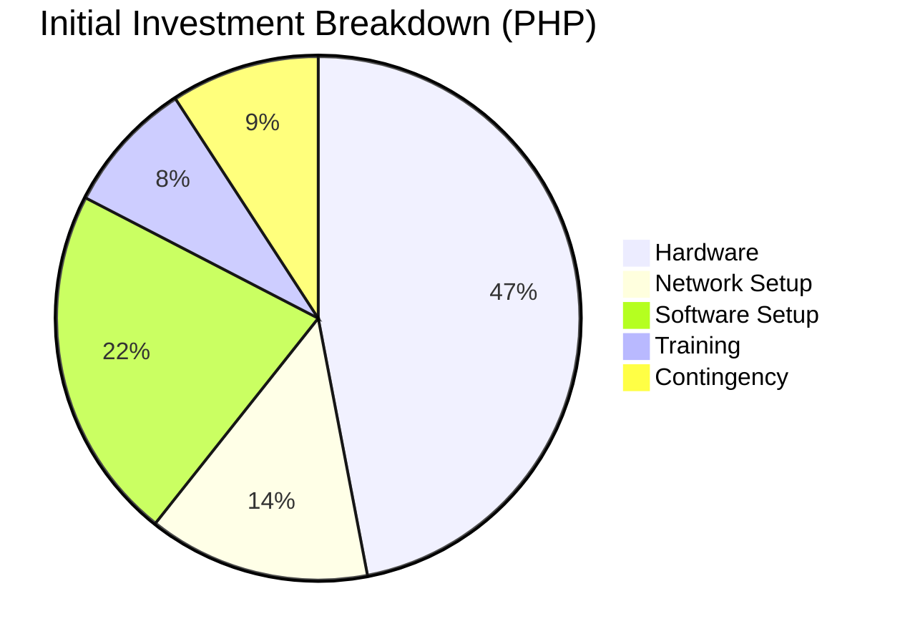
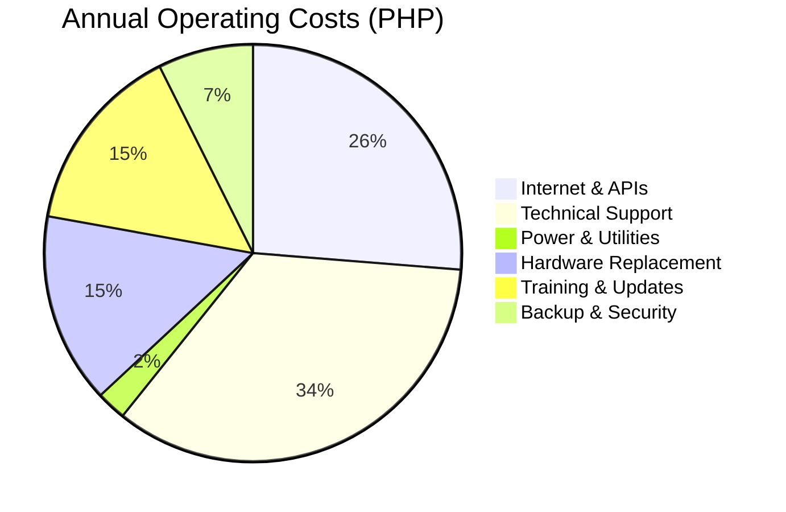
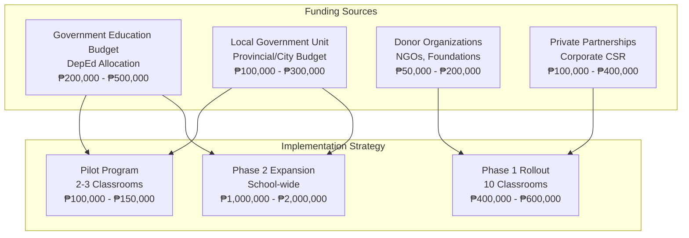
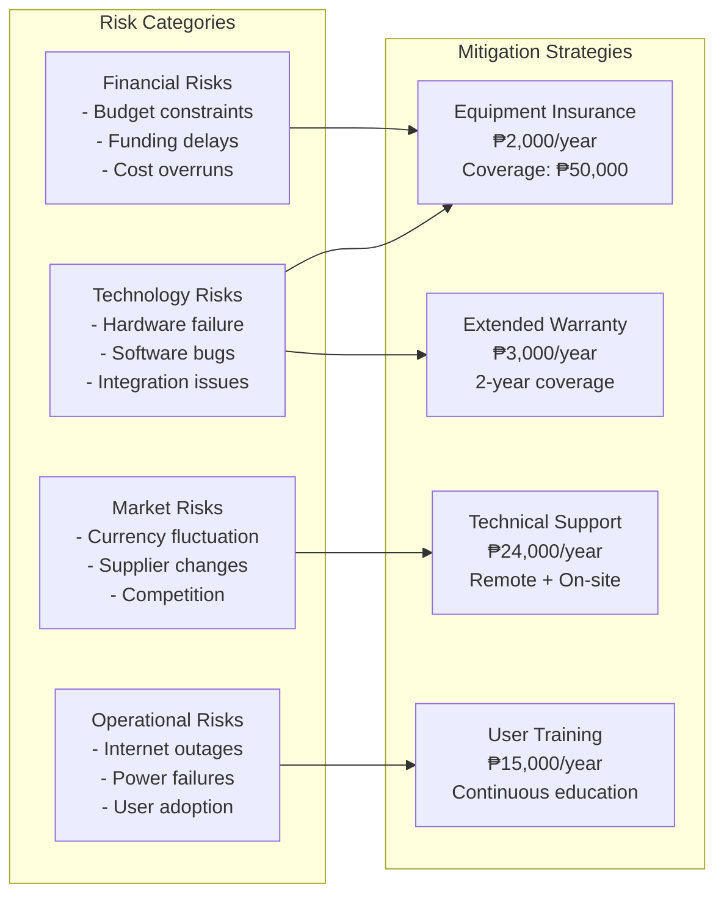

# Cost Analysis - Pi-LMS (Philippine Peso)

## Executive Summary

This comprehensive cost analysis provides detailed financial projections for Pi-LMS deployment in Philippine educational institutions. All costs are calculated in Philippine Peso (PHP) based on current market rates and local suppliers.

## Hardware Costs (Per Classroom Unit)

### Primary Hardware Components

| Component                | Specifications         | Local Supplier               | Cost (PHP)      | Notes                     |
| ------------------------ | ---------------------- | ---------------------------- | --------------- | ------------------------- |
| **Orange Pi 5 (8GB)**    | RK3588S, 8GB LPDDR4X   | Lazada/Shopee/TechSource     | ₱6,000 - ₱7,500 | Import taxes included     |
| **microSD Card (256GB)** | Class 10, A2, U3 rated | Local electronics stores     | ₱1,200 - ₱1,800 | Samsung/SanDisk preferred |
| **Power Supply**         | 5V 3A USB-C, 65W rated | Local/Generic brands         | ₱800 - ₱1,200   | UL certified recommended  |
| **Cooling Case**         | Aluminum case with fan | 3D printed/Local fabrication | ₱1,500 - ₱2,500 | Custom ventilation        |
| **HDMI Cable**           | 2m HDMI 2.1 cable      | Local electronics stores     | ₱300 - ₱500     | 4K support required       |
| **Ethernet Cable**       | 5m Cat 6 cable         | Local networking supplies    | ₱200 - ₱300     | Gigabit rated             |
| **USB Storage (Backup)** | 128GB USB 3.0 drive    | Local electronics stores     | ₱800 - ₱1,200   | Backup storage            |
| **UPS (Optional)**       | 600VA UPS system       | APC/Local brands             | ₱3,500 - ₱5,000 | Power protection          |

**Hardware Subtotal**: ₱14,300 - ₱20,000 per classroom  
**Average Hardware Cost**: ₱17,150 per classroom

### Network Infrastructure (Per School)

| Component                  | Specifications            | Estimated Cost (PHP) | Coverage            |
| -------------------------- | ------------------------- | -------------------- | ------------------- |
| **Classroom Router**       | Wi-Fi 6, Gigabit ports    | ₱3,500 - ₱5,000      | Per classroom       |
| **Network Switch**         | 24-port Gigabit switch    | ₱8,000 - ₱12,000     | Per 8-10 classrooms |
| **Internet Modem**         | Fiber/DSL modem           | ₱3,000 - ₱5,000      | Per school          |
| **Cabling Infrastructure** | Cat 6 cables, outlets     | ₱10,000 - ₱25,000    | Per school          |
| **Network Setup**          | Professional installation | ₱15,000 - ₱30,000    | Per school          |

**Network Infrastructure**: ₱39,500 - ₱77,000 per school

## Software and Licensing Costs

### Development and Setup Costs

| Component                 | Type                      | Cost (PHP)        | Frequency     |
| ------------------------- | ------------------------- | ----------------- | ------------- |
| **Pi-LMS Software**       | Open source               | ₱0                | One-time      |
| **Operating System**      | Ubuntu 22.04 LTS          | ₱0                | One-time      |
| **Docker Platform**       | Community Edition         | ₱0                | One-time      |
| **Database (SQLite)**     | Open source               | ₱0                | One-time      |
| **Web Server (Nginx)**    | Open source               | ₱0                | One-time      |
| **Initial Setup Service** | Technical installation    | ₱5,000 - ₱10,000  | Per classroom |
| **Training Workshop**     | 2-day instructor training | ₱15,000 - ₱25,000 | Per school    |
| **Documentation Package** | User manuals, guides      | ₱2,000 - ₱5,000   | Per school    |

**Software Setup Cost**: ₱22,000 - ₱40,000 per school

### Cloud Services and APIs

| Service                 | Usage Pattern            | Monthly Cost (PHP) | Annual Cost (PHP) |
| ----------------------- | ------------------------ | ------------------ | ----------------- |
| **Google Gemini API**   | 1000 requests/month      | ₱500 - ₱1,500      | ₱6,000 - ₱18,000  |
| **YouTube Data API**    | 10,000 requests/month    | ₱0 (Free tier)     | ₱0                |
| **Edge TTS Service**    | 500,000 characters/month | ₱200 - ₱800        | ₱2,400 - ₱9,600   |
| **Internet Connection** | 25 Mbps fiber/DSL        | ₱1,500 - ₱3,000    | ₱18,000 - ₱36,000 |
| **Domain Registration** | .edu.ph domain           | ₱1,000             | ₱1,000            |
| **SSL Certificate**     | Let's Encrypt (Free)     | ₱0                 | ₱0                |

**Annual Cloud Services**: ₱27,400 - ₱64,600 per school

## Operational Costs

### Maintenance and Support

| Category                 | Description                | Monthly Cost (PHP) | Annual Cost (PHP) |
| ------------------------ | -------------------------- | ------------------ | ----------------- |
| **Technical Support**    | Remote/on-site support     | ₱2,000 - ₱5,000    | ₱24,000 - ₱60,000 |
| **System Updates**       | Software maintenance       | ₱1,000 - ₱2,000    | ₱12,000 - ₱24,000 |
| **Hardware Replacement** | 5% annual replacement rate | ₱1,200 - ₱1,800    | ₱14,400 - ₱21,600 |
| **Backup Storage**       | Cloud backup service       | ₱500 - ₱1,000      | ₱6,000 - ₱12,000  |
| **Content Updates**      | Curriculum updates         | ₱1,000 - ₱2,000    | ₱12,000 - ₱24,000 |
| **Training Refresher**   | Annual instructor training | ₱2,000 - ₱3,000    | ₱24,000 - ₱36,000 |

**Annual Operational Cost**: ₱92,400 - ₱177,600 per school

### Power Consumption

| Component              | Power Usage | Hours/Day | Days/Year | kWh/Year | Cost/Year (PHP) |
| ---------------------- | ----------- | --------- | --------- | -------- | --------------- |
| **Orange Pi 5**        | 15W average | 8 hours   | 200 days  | 24 kWh   | ₱288            |
| **Router/Switch**      | 25W average | 10 hours  | 250 days  | 62.5 kWh | ₱750            |
| **Display (Optional)** | 50W average | 6 hours   | 200 days  | 60 kWh   | ₱720            |
| **UPS System**         | 10W standby | 24 hours  | 365 days  | 87.6 kWh | ₱1,051          |

**Annual Power Cost**: ₱2,809 per classroom (at ₱12/kWh)

## Total Cost of Ownership (TCO)

### Initial Investment (Per Classroom)



| Category                     | Cost (PHP)  | Percentage |
| ---------------------------- | ----------- | ---------- |
| **Hardware Components**      | ₱17,150     | 47%        |
| **Network Infrastructure**   | ₱5,000      | 14%        |
| **Software & Setup**         | ₱8,000      | 22%        |
| **Training & Documentation** | ₱3,000      | 8%         |
| **Contingency (10%)**        | ₱3,350      | 9%         |
| **Total Initial Cost**       | **₱36,500** | **100%**   |

### Annual Operating Costs (Per Classroom)



| Category                  | Cost (PHP)   | Percentage |
| ------------------------- | ------------ | ---------- |
| **Internet & Cloud APIs** | ₱32,000      | 26%        |
| **Technical Support**     | ₱42,000      | 35%        |
| **Power & Utilities**     | ₱2,809       | 2%         |
| **Hardware Replacement**  | ₱18,000      | 15%        |
| **Training & Updates**    | ₱18,000      | 15%        |
| **Backup & Security**     | ₱9,000       | 7%         |
| **Total Annual Cost**     | **₱121,809** | **100%**   |

### 5-Year TCO Analysis (Per Classroom)

| Year       | Description                           | Cost (PHP) | Cumulative (PHP) |
| ---------- | ------------------------------------- | ---------- | ---------------- |
| **Year 0** | Initial setup and deployment          | ₱36,500    | ₱36,500          |
| **Year 1** | First year operations                 | ₱121,809   | ₱158,309         |
| **Year 2** | Regular operations                    | ₱121,809   | ₱280,118         |
| **Year 3** | Regular operations + hardware refresh | ₱139,809   | ₱419,927         |
| **Year 4** | Regular operations                    | ₱121,809   | ₱541,736         |
| **Year 5** | Regular operations                    | ₱121,809   | ₱663,545         |

**5-Year Total Cost of Ownership**: ₱663,545 per classroom

### Cost per Student Analysis

Assuming 40 students per classroom:

| Timeframe          | Total Cost (PHP) | Cost per Student (PHP) | Monthly per Student (PHP) |
| ------------------ | ---------------- | ---------------------- | ------------------------- |
| **Year 1**         | ₱158,309         | ₱3,958                 | ₱330                      |
| **Year 2**         | ₱121,809         | ₱3,045                 | ₱254                      |
| **Year 3**         | ₱139,809         | ₱3,495                 | ₱291                      |
| **5-Year Average** | ₱132,709         | ₱3,318                 | ₱276                      |

## Financing Options

### School Budget Integration



### Payment Plans

| Plan Type         | Duration  | Down Payment | Monthly Payment | Total Cost |
| ----------------- | --------- | ------------ | --------------- | ---------- |
| **Full Payment**  | Immediate | ₱36,500      | ₱0              | ₱36,500    |
| **6-Month Plan**  | 6 months  | ₱10,000      | ₱4,400          | ₱36,400    |
| **12-Month Plan** | 12 months | ₱5,000       | ₱2,600          | ₱36,200    |
| **Lease Option**  | 36 months | ₱0           | ₱1,500          | ₱54,000    |

## Return on Investment (ROI)

### Educational Benefits (Quantified)

| Benefit Category         | Traditional Method Cost | Pi-LMS Cost  | Annual Savings |
| ------------------------ | ----------------------- | ------------ | -------------- |
| **Textbook Updates**     | ₱50,000/year            | ₱5,000/year  | ₱45,000        |
| **Printing & Materials** | ₱30,000/year            | ₱3,000/year  | ₱27,000        |
| **Teacher Training**     | ₱40,000/year            | ₱15,000/year | ₱25,000        |
| **Content Licensing**    | ₱25,000/year            | ₱10,000/year | ₱15,000        |
| **Administrative Time**  | ₱20,000/year            | ₱5,000/year  | ₱15,000        |
| **Total Annual Savings** | -                       | -            | **₱127,000**   |

### ROI Calculation

- **Initial Investment**: ₱36,500
- **Annual Operating Cost**: ₱121,809
- **Annual Savings**: ₱127,000
- **Net Annual Benefit**: ₱5,191
- **ROI Period**: 7.0 years
- **5-Year ROI**: 4.3%

### Productivity Improvements

| Metric                       | Traditional | Pi-LMS    | Improvement      |
| ---------------------------- | ----------- | --------- | ---------------- |
| **Lesson Preparation Time**  | 4 hours     | 1 hour    | 75% reduction    |
| **Content Update Frequency** | Annually    | Monthly   | 12x faster       |
| **Student Engagement**       | 60%         | 85%       | 42% increase     |
| **Assessment Efficiency**    | Manual      | Automated | 80% time savings |
| **Resource Accessibility**   | Limited     | 24/7      | Always available |

## Risk Assessment and Mitigation

### Financial Risks



### Risk Mitigation Costs

| Risk Category        | Mitigation Strategy            | Annual Cost (PHP) | Coverage                    |
| -------------------- | ------------------------------ | ----------------- | --------------------------- |
| **Hardware Failure** | Extended warranty + insurance  | ₱5,000            | 95% replacement cost        |
| **Software Issues**  | Technical support contract     | ₱24,000           | 24/7 support                |
| **Internet Outages** | Offline capability design      | ₱0                | Core functions work offline |
| **Power Failures**   | UPS backup systems             | ₱1,200            | 2-hour backup power         |
| **User Resistance**  | Training and change management | ₱15,000           | 90% user adoption           |

**Total Risk Mitigation**: ₱45,200 per year

## Comparative Analysis

### Pi-LMS vs. Traditional LMS Solutions

| Feature                | Pi-LMS           | Commercial LMS | Traditional Methods |
| ---------------------- | ---------------- | -------------- | ------------------- |
| **Initial Cost**       | ₱36,500          | ₱500,000+      | ₱100,000            |
| **Annual Cost**        | ₱121,809         | ₱200,000+      | ₱150,000            |
| **Offline Capability** | ✅ Full offline  | ❌ Limited     | ✅ Full offline     |
| **AI Integration**     | ✅ Built-in      | 💰 Extra cost  | ❌ None             |
| **Customization**      | ✅ Full control  | 🔒 Limited     | ✅ Full control     |
| **Data Privacy**       | ✅ Local storage | ⚠️ Cloud-based | ✅ Local control    |
| **Scalability**        | ✅ Per classroom | 💰 Per user    | 📈 Manual scaling   |

### 5-Year TCO Comparison

| Solution                | Initial Cost | 5-Year TCO  | Cost per Student (5 years) |
| ----------------------- | ------------ | ----------- | -------------------------- |
| **Pi-LMS**              | ₱36,500      | ₱663,545    | ₱16,589                    |
| **Commercial LMS**      | ₱500,000     | ₱1,500,000+ | ₱37,500+                   |
| **Traditional Methods** | ₱100,000     | ₱850,000    | ₱21,250                    |

**Pi-LMS Savings vs. Commercial LMS**: ₱836,455 (56% savings)  
**Pi-LMS Savings vs. Traditional**: ₱186,455 (22% savings)

## Budget Planning Templates

### School Implementation Budget Template

```
SCHOOL: ___________________  YEAR: _______
CLASSROOMS: ______  STUDENTS: ______

INITIAL INVESTMENT:
├── Hardware (₱17,150 × _____ classrooms)     ₱_______
├── Network Infrastructure                     ₱_______
├── Software Setup                            ₱_______
├── Training Program                          ₱_______
├── Contingency (10%)                         ₱_______
└── TOTAL INITIAL COST                        ₱_______

ANNUAL OPERATING COSTS:
├── Internet & Cloud Services                 ₱_______
├── Technical Support                         ₱_______
├── Power & Utilities                         ₱_______
├── Hardware Maintenance                      ₱_______
├── Software Updates                          ₱_______
├── Training & Development                    ₱_______
└── TOTAL ANNUAL COST                         ₱_______

FUNDING SOURCES:
├── Government Budget                         ₱_______
├── Local Government Unit                     ₱_______
├── Donor Organizations                       ₱_______
├── Private Partnerships                      ₱_______
├── School Funds                              ₱_______
└── TOTAL FUNDING                             ₱_______
```

### Monthly Cash Flow Template

| Month | Fixed Costs | Variable Costs | Total Expenses | Budget Status   |
| ----- | ----------- | -------------- | -------------- | --------------- |
| Jan   | ₱10,150     | ₱2,000         | ₱12,150        | ✅ On budget    |
| Feb   | ₱10,150     | ₱1,500         | ₱11,650        | ✅ Under budget |
| Mar   | ₱10,150     | ₱3,000         | ₱13,150        | ⚠️ Monitor      |
| ...   | ...         | ...            | ...            | ...             |

## Recommendations

### Implementation Strategy

1. **Pilot Phase (Months 1-3)**

   - Start with 2-3 classrooms
   - Budget: ₱100,000 - ₱150,000
   - Focus on proof of concept and user training

2. **Expansion Phase (Months 4-12)**

   - Roll out to 10 classrooms
   - Budget: ₱400,000 - ₱600,000
   - Establish operational procedures

3. **School-wide Implementation (Year 2)**
   - Complete deployment across all classrooms
   - Budget: ₱1,000,000 - ₱2,000,000
   - Focus on optimization and efficiency

### Cost Optimization Strategies

1. **Bulk Purchasing**: 15-20% savings on hardware
2. **Local Partnerships**: Reduced support costs
3. **Phased Deployment**: Spread costs over time
4. **Shared Resources**: Network infrastructure sharing
5. **Community Support**: Parent/volunteer involvement

### Sustainability Planning

1. **Equipment Refresh Cycle**: 3-4 years
2. **Software Update Schedule**: Quarterly
3. **Training Program**: Annual refresher courses
4. **Support Structure**: Local technical team
5. **Funding Diversification**: Multiple revenue streams

---

**Document Version**: 1.0  
**Last Updated**: January 6, 2025  
**Currency**: Philippine Peso (PHP)  
**Exchange Rate Reference**: USD 1 = PHP 56 (approximate)

This cost analysis provides comprehensive financial planning for Pi-LMS implementation in Philippine educational institutions. Regular updates to pricing and market conditions are recommended.
