# Monitoring & Maintenance - Pi-LMS

## Overview

This document outlines comprehensive monitoring, maintenance, and operational procedures for Pi-LMS deployments in educational environments. The strategies are specifically tailored for Orange Pi 5 hardware and classroom-scale operations supporting 40-50 concurrent users.

## Monitoring Architecture

```mermaid
graph TB
    subgraph "Monitoring Stack"
        subgraph "Data Collection"
            SYSTEM_METRICS[📊 System Metrics<br/>CPU, Memory, Disk<br/>Network, Temperature<br/>Hardware Health]

            APP_METRICS[📈 Application Metrics<br/>Response Times<br/>Error Rates<br/>User Sessions<br/>Feature Usage]

            BUSINESS_METRICS[💼 Business Metrics<br/>Course Completion<br/>User Engagement<br/>Learning Outcomes<br/>System Utilization]

            LOG_COLLECTION[📝 Log Collection<br/>Application Logs<br/>System Logs<br/>Error Logs<br/>Security Events]
        end

        subgraph "Processing & Storage"
            METRICS_DB[🗄️ Metrics Database<br/>Time Series Data<br/>Prometheus<br/>Local Storage]

            LOG_AGGREGATOR[📋 Log Aggregator<br/>Centralized Logging<br/>Log Parsing<br/>Search Indexing]

            ANALYTICS_ENGINE[🔍 Analytics Engine<br/>Data Processing<br/>Trend Analysis<br/>Pattern Recognition]

            ALERT_PROCESSOR[🚨 Alert Processor<br/>Threshold Monitoring<br/>Anomaly Detection<br/>Notification Engine]
        end

        subgraph "Visualization & Alerting"
            DASHBOARDS[📊 Monitoring Dashboards<br/>Real-time Metrics<br/>Historical Trends<br/>Custom Views]

            ALERTS[🔔 Alert System<br/>Email Notifications<br/>SMS Alerts<br/>Dashboard Alerts]

            REPORTS[📋 Automated Reports<br/>Daily Reports<br/>Weekly Summaries<br/>Monthly Analytics]

            MOBILE_APP[📱 Mobile Monitoring<br/>Admin Mobile App<br/>Push Notifications<br/>Remote Access]
        end
    end

    SYSTEM_METRICS --> METRICS_DB
    APP_METRICS --> METRICS_DB
    BUSINESS_METRICS --> ANALYTICS_ENGINE
    LOG_COLLECTION --> LOG_AGGREGATOR

    METRICS_DB --> DASHBOARDS
    LOG_AGGREGATOR --> DASHBOARDS
    ANALYTICS_ENGINE --> REPORTS
    ALERT_PROCESSOR --> ALERTS

    DASHBOARDS --> MOBILE_APP
    ALERTS --> MOBILE_APP
    REPORTS --> MOBILE_APP

    classDef collection fill:#e8f5e8,color:#000000,stroke:#4caf50,stroke-width:2px,color:#000000
    classDef processing fill:#e3f2fd,color:#000000,stroke:#2196f3,stroke-width:2px,color:#000000
    classDef visualization fill:#fff3e0,color:#000000,stroke:#ff9800,stroke-width:2px,color:#000000

    class SYSTEM_METRICS,APP_METRICS,BUSINESS_METRICS,LOG_COLLECTION collection
    class METRICS_DB,LOG_AGGREGATOR,ANALYTICS_ENGINE,ALERT_PROCESSOR processing
    class DASHBOARDS,ALERTS,REPORTS,MOBILE_APP visualization
```



## System Monitoring

### 1. Hardware Monitoring for Orange Pi 5

```python
# Hardware monitoring system for Orange Pi 5
import psutil
import subprocess
import json
from typing import Dict, Any
from datetime import datetime, timedelta

class HardwareMonitor:
    def __init__(self):
        self.alert_thresholds = {
            "cpu_temp": 80.0,      # Celsius
            "cpu_usage": 85.0,     # Percentage
            "memory_usage": 90.0,  # Percentage
            "disk_usage": 95.0,    # Percentage
            "load_average": 4.0    # 5-minute load average
        }

    async def collect_hardware_metrics(self) -> Dict[str, Any]:
        """Collect comprehensive hardware metrics"""

        return {
            "timestamp": datetime.utcnow().isoformat(),
            "cpu": await self.get_cpu_metrics(),
            "memory": await self.get_memory_metrics(),
            "disk": await self.get_disk_metrics(),
            "network": await self.get_network_metrics(),
            "temperature": await self.get_temperature_metrics(),
            "power": await self.get_power_metrics(),
            "gpu": await self.get_gpu_metrics()
        }

    async def get_cpu_metrics(self) -> Dict[str, Any]:
        """Get detailed CPU metrics"""

        cpu_percentages = psutil.cpu_percent(interval=1, percpu=True)
        load_avg = psutil.getloadavg()

        return {
            "usage_overall": psutil.cpu_percent(interval=1),
            "usage_per_core": cpu_percentages,
            "a76_cores": cpu_percentages[:4],  # Performance cores
            "a55_cores": cpu_percentages[4:],  # Efficiency cores
            "load_average": {
                "1min": load_avg[0],
                "5min": load_avg[1],
                "15min": load_avg[2]
            },
            "frequency": psutil.cpu_freq()._asdict() if psutil.cpu_freq() else None,
            "context_switches": psutil.cpu_stats().ctx_switches,
            "interrupts": psutil.cpu_stats().interrupts
        }

    async def get_temperature_metrics(self) -> Dict[str, Any]:
        """Get temperature readings from Orange Pi 5"""

        try:
            # Read from thermal zones
            temps = {}

            # CPU temperature
            with open('/sys/class/thermal/thermal_zone0/temp', 'r') as f:
                cpu_temp = int(f.read().strip()) / 1000.0
                temps['cpu'] = cpu_temp

            # GPU temperature (if available)
            try:
                with open('/sys/class/thermal/thermal_zone1/temp', 'r') as f:
                    gpu_temp = int(f.read().strip()) / 1000.0
                    temps['gpu'] = gpu_temp
            except FileNotFoundError:
                pass

            return temps

        except Exception as e:
            return {"error": str(e)}

    async def get_power_metrics(self) -> Dict[str, Any]:
        """Get power consumption metrics"""

        try:
            # Read power consumption (if available)
            power_data = {}

            # Try to read from power supply info
            try:
                with open('/sys/class/power_supply/axp20x-usb/voltage_now', 'r') as f:
                    voltage = int(f.read().strip()) / 1000000.0  # Convert to volts
                    power_data['voltage'] = voltage
            except FileNotFoundError:
                pass

            try:
                with open('/sys/class/power_supply/axp20x-usb/current_now', 'r') as f:
                    current = int(f.read().strip()) / 1000000.0  # Convert to amps
                    power_data['current'] = current
            except FileNotFoundError:
                pass

            if 'voltage' in power_data and 'current' in power_data:
                power_data['power'] = power_data['voltage'] * power_data['current']

            return power_data

        except Exception as e:
            return {"error": str(e)}

    async def get_gpu_metrics(self) -> Dict[str, Any]:
        """Get Mali GPU metrics"""

        try:
            # Try to get GPU utilization
            result = subprocess.run(['cat', '/sys/kernel/debug/mali0/gpu_utilization'],
                                  capture_output=True, text=True, timeout=5)

            if result.returncode == 0:
                utilization = int(result.stdout.strip())
                return {"utilization": utilization}
            else:
                return {"error": "GPU metrics not available"}

        except Exception as e:
            return {"error": str(e)}

    async def check_hardware_alerts(self, metrics: Dict[str, Any]) -> List[Dict[str, Any]]:
        """Check hardware metrics against alert thresholds"""

        alerts = []

        # CPU temperature alert
        if 'temperature' in metrics and 'cpu' in metrics['temperature']:
            cpu_temp = metrics['temperature']['cpu']
            if cpu_temp > self.alert_thresholds['cpu_temp']:
                alerts.append({
                    "type": "hardware_alert",
                    "severity": "warning" if cpu_temp < 85 else "critical",
                    "message": f"CPU temperature high: {cpu_temp}°C",
                    "metric": "cpu_temperature",
                    "value": cpu_temp,
                    "threshold": self.alert_thresholds['cpu_temp']
                })

        # CPU usage alert
        if 'cpu' in metrics and 'usage_overall' in metrics['cpu']:
            cpu_usage = metrics['cpu']['usage_overall']
            if cpu_usage > self.alert_thresholds['cpu_usage']:
                alerts.append({
                    "type": "hardware_alert",
                    "severity": "warning",
                    "message": f"High CPU usage: {cpu_usage}%",
                    "metric": "cpu_usage",
                    "value": cpu_usage,
                    "threshold": self.alert_thresholds['cpu_usage']
                })

        # Memory usage alert
        if 'memory' in metrics:
            memory_usage = metrics['memory']['percentage']
            if memory_usage > self.alert_thresholds['memory_usage']:
                alerts.append({
                    "type": "hardware_alert",
                    "severity": "critical" if memory_usage > 95 else "warning",
                    "message": f"High memory usage: {memory_usage}%",
                    "metric": "memory_usage",
                    "value": memory_usage,
                    "threshold": self.alert_thresholds['memory_usage']
                })

        return alerts

# Application monitoring
class ApplicationMonitor:
    def __init__(self):
        self.metrics_store = MetricsStore()

    async def collect_application_metrics(self) -> Dict[str, Any]:
        """Collect application performance metrics"""

        return {
            "timestamp": datetime.utcnow().isoformat(),
            "users": await self.get_user_metrics(),
            "performance": await self.get_performance_metrics(),
            "features": await self.get_feature_usage(),
            "errors": await self.get_error_metrics(),
            "ai_services": await self.get_ai_metrics()
        }

    async def get_user_metrics(self) -> Dict[str, Any]:
        """Get user activity and session metrics"""

        return {
            "active_sessions": await self.count_active_sessions(),
            "concurrent_users": await self.count_concurrent_users(),
            "new_logins_today": await self.count_new_logins_today(),
            "user_distribution": await self.get_user_role_distribution(),
            "session_duration_avg": await self.get_average_session_duration(),
            "bounce_rate": await self.calculate_bounce_rate()
        }

    async def get_performance_metrics(self) -> Dict[str, Any]:
        """Get application performance metrics"""

        return {
            "response_times": await self.get_response_time_stats(),
            "database_performance": await self.get_database_metrics(),
            "cache_performance": await self.get_cache_metrics(),
            "throughput": await self.get_request_throughput(),
            "availability": await self.calculate_uptime()
        }

    async def get_ai_metrics(self) -> Dict[str, Any]:
        """Get AI services metrics"""

        return {
            "ollama_status": await self.check_ollama_health(),
            "chat_requests": await self.count_chat_requests(),
            "lesson_generation": await self.get_lesson_generation_stats(),
            "ai_response_times": await self.get_ai_response_times(),
            "model_memory_usage": await self.get_model_memory_usage()
        }
```

### 2. Dashboard Configuration

```yaml
# Grafana dashboard configuration for Pi-LMS
apiVersion: 1

datasources:
  - name: Prometheus
    type: prometheus
    url: http://localhost:9090
    access: proxy
    isDefault: true

dashboards:
  - name: "Pi-LMS System Overview"
    panels:
      - title: "System Health"
        type: "stat"
        targets:
          - expr: "up{job='pi-lms'}"
            legendFormat: "System Status"
        fieldConfig:
          thresholds:
            steps:
              - color: "red"
                value: 0
              - color: "green"
                value: 1

      - title: "CPU Usage"
        type: "graph"
        targets:
          - expr: "100 - (avg(rate(node_cpu_seconds_total{mode='idle'}[5m])) * 100)"
            legendFormat: "CPU Usage %"
        yAxes:
          left:
            max: 100
            min: 0
            unit: "percent"

      - title: "Memory Usage"
        type: "graph"
        targets:
          - expr: "(1 - (node_memory_MemAvailable_bytes / node_memory_MemTotal_bytes)) * 100"
            legendFormat: "Memory Usage %"

      - title: "Temperature"
        type: "graph"
        targets:
          - expr: "node_hwmon_temp_celsius"
            legendFormat: "Temperature °C"
        yAxes:
          left:
            max: 100
            min: 0
            unit: "celsius"

      - title: "Active Users"
        type: "stat"
        targets:
          - expr: "pilms_active_users"
            legendFormat: "Active Users"

      - title: "Response Times"
        type: "graph"
        targets:
          - expr: "histogram_quantile(0.95, rate(http_request_duration_seconds_bucket[5m]))"
            legendFormat: "95th percentile"
          - expr: "histogram_quantile(0.50, rate(http_request_duration_seconds_bucket[5m]))"
            legendFormat: "50th percentile"

  - name: "Pi-LMS Educational Metrics"
    panels:
      - title: "Course Completion Rate"
        type: "stat"
        targets:
          - expr: "(pilms_courses_completed / pilms_courses_enrolled) * 100"
            legendFormat: "Completion Rate %"

      - title: "AI Chat Usage"
        type: "graph"
        targets:
          - expr: "rate(pilms_ai_chat_requests_total[5m])"
            legendFormat: "Chat Requests/sec"

      - title: "Lesson Generation Success Rate"
        type: "stat"
        targets:
          - expr: "(pilms_lesson_generation_success / pilms_lesson_generation_total) * 100"
            legendFormat: "Success Rate %"
```

## Maintenance Procedures

### 1. Automated Maintenance Tasks

```python
# Automated maintenance system
import asyncio
import logging
from datetime import datetime, timedelta
from typing import List, Dict, Any

class MaintenanceScheduler:
    def __init__(self):
        self.maintenance_tasks = self.define_maintenance_tasks()
        self.logger = logging.getLogger(__name__)

    def define_maintenance_tasks(self) -> List[Dict[str, Any]]:
        """Define scheduled maintenance tasks"""

        return [
            {
                "name": "database_optimization",
                "schedule": "daily",
                "time": "02:00",
                "function": self.optimize_database,
                "description": "Optimize SQLite database and rebuild indexes"
            },
            {
                "name": "log_rotation",
                "schedule": "daily",
                "time": "03:00",
                "function": self.rotate_logs,
                "description": "Rotate and compress log files"
            },
            {
                "name": "cache_cleanup",
                "schedule": "hourly",
                "function": self.cleanup_cache,
                "description": "Clean expired cache entries"
            },
            {
                "name": "temp_file_cleanup",
                "schedule": "hourly",
                "function": self.cleanup_temp_files,
                "description": "Remove temporary files older than 1 hour"
            },
            {
                "name": "system_backup",
                "schedule": "daily",
                "time": "01:00",
                "function": self.create_system_backup,
                "description": "Create full system backup"
            },
            {
                "name": "security_scan",
                "schedule": "weekly",
                "day": "sunday",
                "time": "04:00",
                "function": self.run_security_scan,
                "description": "Run security vulnerability scan"
            },
            {
                "name": "system_update_check",
                "schedule": "weekly",
                "day": "saturday",
                "time": "05:00",
                "function": self.check_system_updates,
                "description": "Check for system and software updates"
            },
            {
                "name": "performance_analysis",
                "schedule": "weekly",
                "day": "friday",
                "time": "23:00",
                "function": self.analyze_weekly_performance,
                "description": "Analyze weekly performance trends"
            }
        ]

    async def optimize_database(self):
        """Optimize SQLite database performance"""

        try:
            self.logger.info("Starting database optimization")

            # Vacuum database
            await self.execute_sql("VACUUM;")

            # Analyze tables for query optimization
            await self.execute_sql("ANALYZE;")

            # Rebuild indexes if needed
            await self.rebuild_database_indexes()

            # Check database integrity
            integrity_result = await self.execute_sql("PRAGMA integrity_check;")
            if integrity_result[0][0] != "ok":
                self.logger.error(f"Database integrity check failed: {integrity_result}")

            self.logger.info("Database optimization completed successfully")

        except Exception as e:
            self.logger.error(f"Database optimization failed: {e}")

    async def rotate_logs(self):
        """Rotate and compress log files"""

        try:
            import gzip
            import shutil
            from pathlib import Path

            log_directory = Path("/var/log/pi-lms")

            for log_file in log_directory.glob("*.log"):
                if log_file.stat().st_size > 10 * 1024 * 1024:  # 10MB
                    # Compress and rotate
                    timestamp = datetime.now().strftime("%Y%m%d_%H%M%S")
                    compressed_name = f"{log_file.stem}_{timestamp}.log.gz"

                    with open(log_file, 'rb') as f_in:
                        with gzip.open(log_directory / compressed_name, 'wb') as f_out:
                            shutil.copyfileobj(f_in, f_out)

                    # Clear original log file
                    log_file.write_text("")

            # Remove old compressed logs (older than 30 days)
            cutoff_date = datetime.now() - timedelta(days=30)
            for old_log in log_directory.glob("*.log.gz"):
                if datetime.fromtimestamp(old_log.stat().st_mtime) < cutoff_date:
                    old_log.unlink()

            self.logger.info("Log rotation completed successfully")

        except Exception as e:
            self.logger.error(f"Log rotation failed: {e}")

    async def cleanup_cache(self):
        """Clean expired cache entries"""

        try:
            import redis

            r = redis.Redis(host='localhost', port=6379, db=0)

            # Get all keys
            all_keys = r.keys("*")
            expired_count = 0

            for key in all_keys:
                ttl = r.ttl(key)
                if ttl == -1:  # No expiration set
                    # Set default expiration for old keys
                    r.expire(key, 3600)  # 1 hour
                elif ttl == -2:  # Key expired but not cleaned
                    r.delete(key)
                    expired_count += 1

            self.logger.info(f"Cache cleanup completed. Removed {expired_count} expired keys")

        except Exception as e:
            self.logger.error(f"Cache cleanup failed: {e}")

    async def create_system_backup(self):
        """Create comprehensive system backup"""

        try:
            from datetime import datetime
            import subprocess
            import os

            timestamp = datetime.now().strftime("%Y%m%d_%H%M%S")
            backup_dir = f"/opt/pi-lms-backups/backup_{timestamp}"

            os.makedirs(backup_dir, exist_ok=True)

            # Backup database
            database_backup = f"{backup_dir}/database_backup.db"
            subprocess.run([
                "sqlite3", "/opt/pi-lms/data/database/lms-payload.db",
                f".backup {database_backup}"
            ], check=True)

            # Backup media files
            media_backup = f"{backup_dir}/media_backup.tar.gz"
            subprocess.run([
                "tar", "-czf", media_backup,
                "-C", "/opt/pi-lms/data", "media"
            ], check=True)

            # Backup configuration
            config_backup = f"{backup_dir}/config_backup.tar.gz"
            subprocess.run([
                "tar", "-czf", config_backup,
                "-C", "/opt/pi-lms", ".env", "docker-compose.yml"
            ], check=True)

            # Create backup manifest
            manifest = {
                "timestamp": timestamp,
                "backup_type": "full",
                "files": {
                    "database": "database_backup.db",
                    "media": "media_backup.tar.gz",
                    "config": "config_backup.tar.gz"
                },
                "system_info": await self.get_system_info()
            }

            with open(f"{backup_dir}/manifest.json", "w") as f:
                json.dump(manifest, f, indent=2)

            # Compress entire backup
            subprocess.run([
                "tar", "-czf", f"{backup_dir}.tar.gz",
                "-C", "/opt/pi-lms-backups", f"backup_{timestamp}"
            ], check=True)

            # Remove uncompressed backup directory
            subprocess.run(["rm", "-rf", backup_dir], check=True)

            # Remove old backups (keep last 7 days)
            self.cleanup_old_backups(7)

            self.logger.info(f"System backup created successfully: backup_{timestamp}.tar.gz")

        except Exception as e:
            self.logger.error(f"System backup failed: {e}")

    async def run_security_scan(self):
        """Run automated security vulnerability scan"""

        try:
            import subprocess

            scan_results = {}

            # Check for system updates
            result = subprocess.run(
                ["apt", "list", "--upgradable"],
                capture_output=True, text=True
            )
            scan_results["system_updates"] = len(result.stdout.splitlines()) - 1

            # Check Python dependencies
            result = subprocess.run(
                ["pip", "list", "--outdated", "--format=json"],
                capture_output=True, text=True
            )
            if result.returncode == 0:
                outdated = json.loads(result.stdout)
                scan_results["python_updates"] = len(outdated)

            # Check Node.js dependencies
            result = subprocess.run(
                ["npm", "audit", "--json"],
                capture_output=True, text=True,
                cwd="/opt/pi-lms/pi-lms-backend"
            )
            if result.returncode == 0:
                audit_result = json.loads(result.stdout)
                scan_results["npm_vulnerabilities"] = audit_result.get("metadata", {}).get("vulnerabilities", {})

            # Check file permissions
            security_issues = await self.check_file_permissions()
            scan_results["permission_issues"] = len(security_issues)

            # Generate security report
            await self.generate_security_report(scan_results)

            self.logger.info("Security scan completed successfully")

        except Exception as e:
            self.logger.error(f"Security scan failed: {e}")
```

### 2. Disaster Recovery Procedures

```python
# Disaster recovery system
class DisasterRecoveryManager:
    def __init__(self):
        self.recovery_procedures = self.define_recovery_procedures()

    def define_recovery_procedures(self) -> Dict[str, Dict[str, Any]]:
        """Define disaster recovery procedures"""

        return {
            "hardware_failure": {
                "priority": "critical",
                "rto": "2 hours",  # Recovery Time Objective
                "rpo": "1 hour",   # Recovery Point Objective
                "procedure": self.recover_from_hardware_failure,
                "checklist": [
                    "Identify failed component",
                    "Source replacement hardware",
                    "Restore from latest backup",
                    "Verify system functionality",
                    "Update monitoring"
                ]
            },
            "data_corruption": {
                "priority": "high",
                "rto": "4 hours",
                "rpo": "24 hours",
                "procedure": self.recover_from_data_corruption,
                "checklist": [
                    "Assess corruption extent",
                    "Stop affected services",
                    "Restore from backup",
                    "Verify data integrity",
                    "Resume services"
                ]
            },
            "network_failure": {
                "priority": "medium",
                "rto": "1 hour",
                "rpo": "0 hours",
                "procedure": self.recover_from_network_failure,
                "checklist": [
                    "Identify network issue",
                    "Check hardware connections",
                    "Restart network services",
                    "Verify connectivity",
                    "Test system access"
                ]
            },
            "security_breach": {
                "priority": "critical",
                "rto": "1 hour",
                "rpo": "0 hours",
                "procedure": self.recover_from_security_breach,
                "checklist": [
                    "Isolate affected systems",
                    "Assess breach scope",
                    "Change all credentials",
                    "Apply security patches",
                    "Monitor for continued threats"
                ]
            }
        }

    async def execute_recovery_plan(self, incident_type: str, severity: str = "high"):
        """Execute appropriate recovery plan"""

        if incident_type not in self.recovery_procedures:
            raise ValueError(f"Unknown incident type: {incident_type}")

        procedure = self.recovery_procedures[incident_type]

        self.logger.critical(f"Executing disaster recovery for: {incident_type}")

        # Execute recovery procedure
        await procedure["procedure"](severity)

        # Verify recovery success
        recovery_success = await self.verify_recovery(incident_type)

        if recovery_success:
            self.logger.info(f"Disaster recovery completed successfully for: {incident_type}")
        else:
            self.logger.error(f"Disaster recovery failed for: {incident_type}")

        return recovery_success
```

## Operational Procedures

### 1. Routine Maintenance Checklist

#### Daily Tasks

- [ ] Check system status dashboard
- [ ] Review error logs for critical issues
- [ ] Verify backup completion
- [ ] Monitor user activity and performance
- [ ] Check disk space and clean if needed
- [ ] Verify AI services are responding

#### Weekly Tasks

- [ ] Review weekly performance report
- [ ] Check for security updates
- [ ] Analyze user feedback and issues
- [ ] Review and update monitoring alerts
- [ ] Test backup restoration process
- [ ] Update system documentation

#### Monthly Tasks

- [ ] Comprehensive security audit
- [ ] Hardware health assessment
- [ ] Performance optimization review
- [ ] User training needs assessment
- [ ] Capacity planning review
- [ ] Update disaster recovery plans

### 2. Support and Troubleshooting

#### Common Issues and Solutions

| Issue                    | Symptoms                                     | Solution                                            | Prevention                                  |
| ------------------------ | -------------------------------------------- | --------------------------------------------------- | ------------------------------------------- |
| **High CPU Usage**       | Slow response times, high temperature        | Identify resource-heavy processes, restart services | Monitor CPU usage, optimize code            |
| **Memory Exhaustion**    | System freezing, out of memory errors        | Restart services, clear cache                       | Monitor memory usage, optimize applications |
| **Database Corruption**  | Data access errors, slow queries             | Restore from backup, rebuild indexes                | Regular backups, integrity checks           |
| **AI Service Failure**   | Chat not responding, lesson generation fails | Restart Ollama service, check model files           | Monitor AI service health, update models    |
| **Network Connectivity** | Cannot access system remotely                | Check network configuration, restart router         | Monitor network status, backup connectivity |

#### Emergency Contacts

```yaml
# Emergency contact configuration
emergency_contacts:
  primary_admin:
    name: "System Administrator"
    email: "admin@school.edu.ph"
    phone: "+63-XXX-XXX-XXXX"
    role: "Primary technical contact"

  backup_admin:
    name: "IT Support Lead"
    email: "itsupport@school.edu.ph"
    phone: "+63-XXX-XXX-XXXX"
    role: "Secondary technical contact"

  vendor_support:
    name: "Pi-LMS Support Team"
    email: "support@pilms.local"
    phone: "+63-XXX-XXX-XXXX"
    role: "Software vendor support"

  hardware_vendor:
    name: "Orange Pi Support"
    email: "support@orangepi.org"
    role: "Hardware vendor support"

notification_escalation:
  level_1:
    - primary_admin
    threshold: "critical alerts"

  level_2:
    - primary_admin
    - backup_admin
    threshold: "system down > 30 minutes"

  level_3:
    - primary_admin
    - backup_admin
    - vendor_support
    threshold: "system down > 2 hours"
```

This comprehensive monitoring and maintenance framework ensures reliable operation of Pi-LMS in educational environments while providing clear procedures for issue resolution and system optimization.
