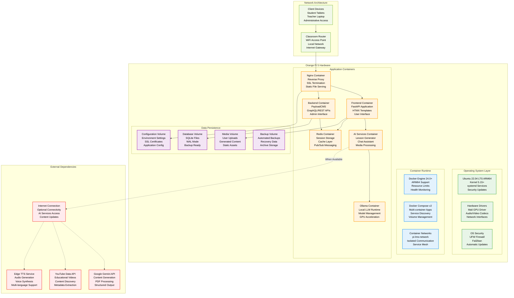

# Deployment Architecture - Pi-LMS

## Overview

Pi-LMS is designed for deployment on Orange Pi 5 single-board computers using a containerized architecture. This document provides comprehensive deployment strategies, container configurations, and production setup procedures optimized for educational environments.

## Deployment Architecture Overview



## Docker Compose Configuration

### Production Docker Compose

```yaml
version: "3.8"

services:
  # Reverse Proxy and Load Balancer
  nginx:
    image: nginx:1.25-alpine
    container_name: pi-lms-nginx
    ports:
      - "80:80"
      - "443:443"
    volumes:
      - ./nginx/nginx.conf:/etc/nginx/nginx.conf:ro
      - ./nginx/conf.d:/etc/nginx/conf.d:ro
      - ./data/ssl:/etc/ssl/certs:ro
      - ./data/logs/nginx:/var/log/nginx
      - media_volume:/var/www/media:ro
    depends_on:
      - frontend
      - backend
    restart: unless-stopped
    healthcheck:
      test: ["CMD", "nginx", "-t"]
      interval: 30s
      timeout: 10s
      retries: 3
    deploy:
      resources:
        limits:
          memory: 128M
          cpus: "0.5"
    networks:
      - pi-lms-network

  # Frontend Application
  frontend:
    build:
      context: ./pi-frontend
      dockerfile: Dockerfile
      target: production
    container_name: pi-lms-frontend
    environment:
      - ENVIRONMENT=production
      - PAYLOAD_CMS_URL=http://backend:3000
      - AI_SERVICE_URL=http://ai-services:8000
      - REDIS_URL=redis://redis:6379/0
      - SESSION_SECRET=${SESSION_SECRET}
      - JWT_SECRET=${JWT_SECRET}
      - LOG_LEVEL=info
    volumes:
      - media_volume:/app/media
      - ./data/logs/frontend:/app/logs
      - ./data/temp:/app/temp
    depends_on:
      - backend
      - redis
    restart: unless-stopped
    healthcheck:
      test: ["CMD", "curl", "-f", "http://localhost:8080/health"]
      interval: 30s
      timeout: 10s
      retries: 3
      start_period: 40s
    deploy:
      resources:
        limits:
          memory: 512M
          cpus: "1.0"
    networks:
      - pi-lms-network

  # Backend CMS
  backend:
    build:
      context: ./pi-lms-backend
      dockerfile: Dockerfile
      target: production
    container_name: pi-lms-backend
    environment:
      - NODE_ENV=production
      - DATABASE_URI=sqlite:///app/data/lms-payload.db
      - PAYLOAD_SECRET=${PAYLOAD_SECRET}
      - PAYLOAD_PORT=3000
      - PAYLOAD_PUBLIC_SERVER_URL=https://pilms.local
      - REDIS_URL=redis://redis:6379/1
    volumes:
      - db_volume:/app/data
      - media_volume:/app/media
      - ./data/logs/backend:/app/logs
      - ./data/backups:/app/backups
    depends_on:
      - redis
    restart: unless-stopped
    healthcheck:
      test: ["CMD", "curl", "-f", "http://localhost:3000/api/health"]
      interval: 30s
      timeout: 15s
      retries: 3
      start_period: 60s
    deploy:
      resources:
        limits:
          memory: 1G
          cpus: "2.0"
    networks:
      - pi-lms-network

  # AI Services
  ai-services:
    build:
      context: ./pi-ai
      dockerfile: Dockerfile
      target: production
    container_name: pi-lms-ai
    environment:
      - ENVIRONMENT=production
      - GEMINI_API_KEY=${GEMINI_API_KEY}
      - OLLAMA_HOST=http://ollama:11434
      - PAYLOAD_BASE_URL=http://backend:3000
      - REDIS_URL=redis://redis:6379/2
      - YOUTUBE_API_KEY=${YOUTUBE_API_KEY}
      - LOG_LEVEL=info
    volumes:
      - media_volume:/app/media
      - ./data/ai-temp:/app/temp
      - ./data/ai-models:/app/models
      - ./data/logs/ai:/app/logs
    depends_on:
      - ollama
      - redis
    restart: unless-stopped
    healthcheck:
      test: ["CMD", "curl", "-f", "http://localhost:8000/health"]
      interval: 30s
      timeout: 15s
      retries: 3
      start_period: 45s
    deploy:
      resources:
        limits:
          memory: 2G
          cpus: "3.0"
    networks:
      - pi-lms-network

  # Local LLM Runtime
  ollama:
    image: ollama/ollama:latest
    container_name: pi-lms-ollama
    ports:
      - "11434:11434"
    environment:
      - OLLAMA_MODELS=/root/.ollama/models
      - OLLAMA_NUM_PARALLEL=2
      - OLLAMA_MAX_LOADED_MODELS=2
      - OLLAMA_FLASH_ATTENTION=1
    volumes:
      - ollama_volume:/root/.ollama
      - ./data/logs/ollama:/var/log/ollama
    devices:
      - /dev/mali0:/dev/mali0 # GPU access for ARM Mali
    restart: unless-stopped
    healthcheck:
      test: ["CMD", "curl", "-f", "http://localhost:11434/api/version"]
      interval: 60s
      timeout: 30s
      retries: 3
      start_period: 120s
    deploy:
      resources:
        limits:
          memory: 4G
          cpus: "4.0"
        reservations:
          memory: 2G
    networks:
      - pi-lms-network

  # Redis Cache and Session Store
  redis:
    image: redis:7-alpine
    container_name: pi-lms-redis
    command: redis-server /usr/local/etc/redis/redis.conf
    volumes:
      - redis_volume:/data
      - ./redis/redis.conf:/usr/local/etc/redis/redis.conf:ro
      - ./data/logs/redis:/var/log/redis
    restart: unless-stopped
    healthcheck:
      test: ["CMD", "redis-cli", "ping"]
      interval: 30s
      timeout: 10s
      retries: 3
    deploy:
      resources:
        limits:
          memory: 512M
          cpus: "0.5"
    networks:
      - pi-lms-network

  # System Monitoring (Optional)
  monitoring:
    build:
      context: ./monitoring
      dockerfile: Dockerfile
    container_name: pi-lms-monitoring
    environment:
      - GRAFANA_ADMIN_PASSWORD=${GRAFANA_PASSWORD}
      - PROMETHEUS_CONFIG=/etc/prometheus/prometheus.yml
    volumes:
      - ./monitoring/prometheus:/etc/prometheus
      - ./monitoring/grafana:/var/lib/grafana
      - ./data/logs:/var/log/pi-lms:ro
    ports:
      - "3001:3000" # Grafana
      - "9090:9090" # Prometheus
    restart: unless-stopped
    deploy:
      resources:
        limits:
          memory: 512M
          cpus: "1.0"
    networks:
      - pi-lms-network

volumes:
  db_volume:
    driver: local
    driver_opts:
      type: none
      o: bind
      device: ./data/database

  media_volume:
    driver: local
    driver_opts:
      type: none
      o: bind
      device: ./data/media

  redis_volume:
    driver: local
    driver_opts:
      type: none
      o: bind
      device: ./data/redis

  ollama_volume:
    driver: local
    driver_opts:
      type: none
      o: bind
      device: ./data/ollama

networks:
  pi-lms-network:
    driver: bridge
    driver_opts:
      com.docker.network.bridge.name: pi-lms-br0
    ipam:
      config:
        - subnet: 172.20.0.0/16
          gateway: 172.20.0.1
```

### Development Docker Compose

```yaml
version: "3.8"

services:
  frontend:
    build:
      context: ./pi-frontend
      dockerfile: Dockerfile
      target: development
    ports:
      - "8080:8080"
    environment:
      - ENVIRONMENT=development
      - DEBUG=true
      - HOT_RELOAD=true
    volumes:
      - ./pi-frontend:/app
      - /app/node_modules
      - ./data/dev-logs:/app/logs
    command:
      ["uvicorn", "main:app", "--host", "0.0.0.0", "--port", "8080", "--reload"]
    networks:
      - pi-lms-dev

  backend:
    build:
      context: ./pi-lms-backend
      dockerfile: Dockerfile
      target: development
    ports:
      - "3000:3000"
    environment:
      - NODE_ENV=development
      - PAYLOAD_SECRET=dev-secret-key
    volumes:
      - ./pi-lms-backend:/app
      - /app/node_modules
      - ./data/dev-database:/app/data
    command: ["npm", "run", "dev"]
    networks:
      - pi-lms-dev

  ai-services:
    build:
      context: ./pi-ai
      dockerfile: Dockerfile
      target: development
    ports:
      - "8000:8000"
    environment:
      - ENVIRONMENT=development
      - DEBUG=true
    volumes:
      - ./pi-ai:/app
      - ./data/dev-ai:/app/data
    command:
      ["uvicorn", "api:app", "--host", "0.0.0.0", "--port", "8000", "--reload"]
    networks:
      - pi-lms-dev

  redis:
    image: redis:7-alpine
    ports:
      - "6379:6379"
    command: redis-server --appendonly yes
    volumes:
      - ./data/dev-redis:/data
    networks:
      - pi-lms-dev

networks:
  pi-lms-dev:
    driver: bridge
```

## Nginx Configuration

### Main Nginx Configuration

```nginx
# /nginx/nginx.conf
user nginx;
worker_processes auto;
error_log /var/log/nginx/error.log warn;
pid /var/run/nginx.pid;

# Optimize for Orange Pi 5
worker_rlimit_nofile 8192;

events {
    worker_connections 1024;
    use epoll;
    multi_accept on;
}

http {
    include /etc/nginx/mime.types;
    default_type application/octet-stream;

    # Logging format
    log_format main '$remote_addr - $remote_user [$time_local] "$request" '
                    '$status $body_bytes_sent "$http_referer" '
                    '"$http_user_agent" "$http_x_forwarded_for" '
                    'rt=$request_time uct="$upstream_connect_time" '
                    'uht="$upstream_header_time" urt="$upstream_response_time"';

    access_log /var/log/nginx/access.log main;

    # Performance optimizations
    sendfile on;
    tcp_nopush on;
    tcp_nodelay on;
    keepalive_timeout 65;
    types_hash_max_size 2048;
    client_max_body_size 50M;

    # Gzip compression
    gzip on;
    gzip_vary on;
    gzip_min_length 1024;
    gzip_proxied any;
    gzip_comp_level 6;
    gzip_types
        text/plain
        text/css
        text/xml
        text/javascript
        application/json
        application/javascript
        application/xml+rss
        application/atom+xml
        image/svg+xml;

    # Security headers
    add_header X-Frame-Options DENY always;
    add_header X-Content-Type-Options nosniff always;
    add_header X-XSS-Protection "1; mode=block" always;
    add_header Referrer-Policy "strict-origin-when-cross-origin" always;

    # Rate limiting
    limit_req_zone $binary_remote_addr zone=login:10m rate=5r/m;
    limit_req_zone $binary_remote_addr zone=api:10m rate=30r/m;
    limit_req_zone $binary_remote_addr zone=media:10m rate=10r/m;

    # Upstream definitions
    upstream frontend {
        server frontend:8080 max_fails=3 fail_timeout=30s;
        keepalive 32;
    }

    upstream backend {
        server backend:3000 max_fails=3 fail_timeout=30s;
        keepalive 32;
    }

    upstream ai_services {
        server ai-services:8000 max_fails=3 fail_timeout=30s;
        keepalive 16;
    }

    # Include site configurations
    include /etc/nginx/conf.d/*.conf;
}
```

### Site Configuration

```nginx
# /nginx/conf.d/pilms.conf
server {
    listen 80;
    server_name pilms.local *.pilms.local;

    # Redirect HTTP to HTTPS
    return 301 https://$server_name$request_uri;
}

server {
    listen 443 ssl http2;
    server_name pilms.local;

    # SSL Configuration
    ssl_certificate /etc/ssl/certs/pilms.local.crt;
    ssl_certificate_key /etc/ssl/certs/pilms.local.key;
    ssl_protocols TLSv1.2 TLSv1.3;
    ssl_ciphers ECDHE-RSA-AES128-GCM-SHA256:ECDHE-RSA-AES256-GCM-SHA384;
    ssl_prefer_server_ciphers off;
    ssl_session_cache shared:SSL:10m;
    ssl_session_timeout 10m;

    # Security headers
    add_header Strict-Transport-Security "max-age=31536000; includeSubDomains" always;
    add_header Content-Security-Policy "default-src 'self'; script-src 'self' 'unsafe-inline' 'unsafe-eval'; style-src 'self' 'unsafe-inline'; img-src 'self' data: blob:; font-src 'self'; connect-src 'self' ws: wss:; media-src 'self' blob:;" always;

    # Main application routes
    location / {
        proxy_pass http://frontend;
        proxy_set_header Host $host;
        proxy_set_header X-Real-IP $remote_addr;
        proxy_set_header X-Forwarded-For $proxy_add_x_forwarded_for;
        proxy_set_header X-Forwarded-Proto $scheme;

        # Timeouts
        proxy_connect_timeout 30s;
        proxy_send_timeout 30s;
        proxy_read_timeout 30s;

        # WebSocket support
        proxy_http_version 1.1;
        proxy_set_header Upgrade $http_upgrade;
        proxy_set_header Connection "upgrade";
    }

    # Backend API routes
    location /api/ {
        limit_req zone=api burst=10 nodelay;

        proxy_pass http://backend;
        proxy_set_header Host $host;
        proxy_set_header X-Real-IP $remote_addr;
        proxy_set_header X-Forwarded-For $proxy_add_x_forwarded_for;
        proxy_set_header X-Forwarded-Proto $scheme;

        # Increased timeouts for API operations
        proxy_connect_timeout 60s;
        proxy_send_timeout 60s;
        proxy_read_timeout 60s;
    }

    # AI services routes
    location /ai/ {
        limit_req zone=api burst=5 nodelay;

        proxy_pass http://ai_services/;
        proxy_set_header Host $host;
        proxy_set_header X-Real-IP $remote_addr;
        proxy_set_header X-Forwarded-For $proxy_add_x_forwarded_for;
        proxy_set_header X-Forwarded-Proto $scheme;

        # Extended timeouts for AI processing
        proxy_connect_timeout 120s;
        proxy_send_timeout 300s;
        proxy_read_timeout 300s;

        # WebSocket support for AI chat
        proxy_http_version 1.1;
        proxy_set_header Upgrade $http_upgrade;
        proxy_set_header Connection "upgrade";
    }

    # Authentication endpoints with rate limiting
    location /api/auth/login {
        limit_req zone=login burst=3 nodelay;

        proxy_pass http://frontend;
        proxy_set_header Host $host;
        proxy_set_header X-Real-IP $remote_addr;
        proxy_set_header X-Forwarded-For $proxy_add_x_forwarded_for;
        proxy_set_header X-Forwarded-Proto $scheme;
    }

    # Static media files
    location /media/ {
        limit_req zone=media burst=20 nodelay;

        alias /var/www/media/;
        expires 30d;
        add_header Cache-Control "public, immutable";

        # Security for uploaded files
        location ~* \.(php|pl|py|jsp|asp|sh|cgi)$ {
            deny all;
        }
    }

    # Static assets with long cache
    location /static/ {
        proxy_pass http://frontend;
        expires 1y;
        add_header Cache-Control "public, immutable";
    }

    # Health check endpoint
    location /health {
        access_log off;
        proxy_pass http://frontend;
        proxy_set_header Host $host;
    }

    # Deny access to sensitive files
    location ~ /\. {
        deny all;
        access_log off;
        log_not_found off;
    }

    location ~ \.(sql|conf|config)$ {
        deny all;
        access_log off;
        log_not_found off;
    }
}
```

## Production Deployment Scripts

### Deployment Script

```bash
#!/bin/bash
# deploy.sh - Production deployment script for Pi-LMS

set -euo pipefail

# Configuration
DEPLOY_DIR="/opt/pi-lms"
BACKUP_DIR="/opt/pi-lms-backups"
LOG_FILE="/var/log/pi-lms-deploy.log"
ENV_FILE="${DEPLOY_DIR}/.env"

# Colors for output
RED='\033[0;31m'
GREEN='\033[0;32m'
YELLOW='\033[1;33m'
NC='\033[0m' # No Color

# Logging function
log() {
    echo -e "${GREEN}[$(date +'%Y-%m-%d %H:%M:%S')]${NC} $1" | tee -a "${LOG_FILE}"
}

error() {
    echo -e "${RED}[$(date +'%Y-%m-%d %H:%M:%S')] ERROR:${NC} $1" | tee -a "${LOG_FILE}"
    exit 1
}

warning() {
    echo -e "${YELLOW}[$(date +'%Y-%m-%d %H:%M:%S')] WARNING:${NC} $1" | tee -a "${LOG_FILE}"
}

# Check requirements
check_requirements() {
    log "Checking system requirements..."

    # Check if running as root
    if [[ $EUID -eq 0 ]]; then
        error "This script should not be run as root"
    fi

    # Check Docker
    if ! command -v docker &> /dev/null; then
        error "Docker is not installed"
    fi

    # Check Docker Compose
    if ! command -v docker-compose &> /dev/null; then
        error "Docker Compose is not installed"
    fi

    # Check available memory
    AVAILABLE_MEMORY=$(free -m | awk 'NR==2{printf "%.0f", $7}')
    if [[ $AVAILABLE_MEMORY -lt 2048 ]]; then
        warning "Available memory is low (${AVAILABLE_MEMORY}MB). Consider closing other applications."
    fi

    # Check disk space
    AVAILABLE_SPACE=$(df -BG "${DEPLOY_DIR}" | awk 'NR==2{print $4}' | sed 's/G//')
    if [[ $AVAILABLE_SPACE -lt 10 ]]; then
        error "Insufficient disk space. At least 10GB required."
    fi

    log "System requirements check passed"
}

# Create backup
create_backup() {
    log "Creating backup..."

    BACKUP_TIMESTAMP=$(date +%Y%m%d_%H%M%S)
    BACKUP_PATH="${BACKUP_DIR}/backup_${BACKUP_TIMESTAMP}"

    mkdir -p "${BACKUP_PATH}"

    # Backup database
    if [[ -f "${DEPLOY_DIR}/data/database/lms-payload.db" ]]; then
        cp "${DEPLOY_DIR}/data/database/lms-payload.db" "${BACKUP_PATH}/"
        log "Database backed up"
    fi

    # Backup media files
    if [[ -d "${DEPLOY_DIR}/data/media" ]]; then
        cp -r "${DEPLOY_DIR}/data/media" "${BACKUP_PATH}/"
        log "Media files backed up"
    fi

    # Backup configuration
    if [[ -f "${ENV_FILE}" ]]; then
        cp "${ENV_FILE}" "${BACKUP_PATH}/"
        log "Configuration backed up"
    fi

    # Compress backup
    tar -czf "${BACKUP_PATH}.tar.gz" -C "${BACKUP_DIR}" "backup_${BACKUP_TIMESTAMP}"
    rm -rf "${BACKUP_PATH}"

    log "Backup created: ${BACKUP_PATH}.tar.gz"

    # Keep only last 7 backups
    cd "${BACKUP_DIR}"
    ls -t backup_*.tar.gz | tail -n +8 | xargs -r rm --

    log "Old backups cleaned up"
}

# Deploy application
deploy_application() {
    log "Deploying Pi-LMS..."

    cd "${DEPLOY_DIR}"

    # Pull latest images
    log "Pulling latest Docker images..."
    docker-compose pull

    # Build custom images
    log "Building application images..."
    docker-compose build --no-cache

    # Stop existing services
    log "Stopping existing services..."
    docker-compose down --remove-orphans

    # Start services
    log "Starting services..."
    docker-compose up -d

    # Wait for services to be ready
    log "Waiting for services to start..."
    sleep 30

    # Health check
    health_check

    log "Deployment completed successfully"
}

# Health check
health_check() {
    log "Performing health check..."

    local max_attempts=10
    local attempt=1

    while [[ $attempt -le $max_attempts ]]; do
        log "Health check attempt ${attempt}/${max_attempts}"

        # Check frontend
        if curl -f -s http://localhost:80/health > /dev/null; then
            log "Frontend is healthy"
            break
        fi

        if [[ $attempt -eq $max_attempts ]]; then
            error "Health check failed after ${max_attempts} attempts"
        fi

        sleep 10
        ((attempt++))
    done

    # Check individual services
    check_service_health "frontend" "http://localhost:8080/health"
    check_service_health "backend" "http://localhost:3000/api/health"
    check_service_health "ai-services" "http://localhost:8000/health"
    check_service_health "ollama" "http://localhost:11434/api/version"

    log "All services are healthy"
}

check_service_health() {
    local service_name=$1
    local health_url=$2

    if docker-compose exec -T "${service_name}" curl -f -s "${health_url}" > /dev/null; then
        log "${service_name} service is healthy"
    else
        warning "${service_name} service health check failed"
    fi
}

# Rollback function
rollback() {
    log "Rolling back to previous version..."

    # Find latest backup
    LATEST_BACKUP=$(ls -t "${BACKUP_DIR}"/backup_*.tar.gz | head -n1)

    if [[ -z "${LATEST_BACKUP}" ]]; then
        error "No backup found for rollback"
    fi

    log "Using backup: ${LATEST_BACKUP}"

    # Extract backup
    TEMP_DIR=$(mktemp -d)
    tar -xzf "${LATEST_BACKUP}" -C "${TEMP_DIR}"

    # Stop services
    docker-compose down

    # Restore database
    if [[ -f "${TEMP_DIR}/backup_*/lms-payload.db" ]]; then
        cp "${TEMP_DIR}"/backup_*/lms-payload.db "${DEPLOY_DIR}/data/database/"
        log "Database restored"
    fi

    # Restore media
    if [[ -d "${TEMP_DIR}/backup_*/media" ]]; then
        rm -rf "${DEPLOY_DIR}/data/media"
        cp -r "${TEMP_DIR}"/backup_*/media "${DEPLOY_DIR}/data/"
        log "Media files restored"
    fi

    # Start services
    docker-compose up -d

    # Cleanup
    rm -rf "${TEMP_DIR}"

    log "Rollback completed"
}

# Main deployment flow
main() {
    log "Starting Pi-LMS deployment"

    case "${1:-deploy}" in
        "deploy")
            check_requirements
            create_backup
            deploy_application
            ;;
        "rollback")
            rollback
            ;;
        "health")
            health_check
            ;;
        *)
            echo "Usage: $0 {deploy|rollback|health}"
            exit 1
            ;;
    esac

    log "Pi-LMS deployment script completed"
}

# Run main function with all arguments
main "$@"
```

### System Service Configuration

```ini
# /etc/systemd/system/pi-lms.service
[Unit]
Description=Pi-LMS Learning Management System
Requires=docker.service
After=docker.service
StartLimitIntervalSec=0

[Service]
Type=oneshot
RemainAfterExit=yes
WorkingDirectory=/opt/pi-lms
ExecStart=/usr/local/bin/docker-compose up -d
ExecStop=/usr/local/bin/docker-compose down
TimeoutStartSec=300
TimeoutStopSec=120
Restart=on-failure
RestartSec=30s
User=pi-lms
Group=pi-lms

[Install]
WantedBy=multi-user.target
```

### Environment Configuration Template

```bash
# .env.template - Environment configuration template
# Copy to .env and configure for your deployment

# System Configuration
ENVIRONMENT=production
DEBUG=false
LOG_LEVEL=info

# Database Configuration
DATABASE_URI=sqlite:///app/data/lms-payload.db

# Security Secrets (CHANGE THESE!)
SESSION_SECRET=your-session-secret-here-change-this
JWT_SECRET=your-jwt-secret-here-change-this
PAYLOAD_SECRET=your-payload-secret-here-change-this

# External API Keys
GEMINI_API_KEY=your-gemini-api-key-here
YOUTUBE_API_KEY=your-youtube-api-key-here

# Redis Configuration
REDIS_URL=redis://redis:6379

# SSL Configuration
SSL_CERT_PATH=/etc/ssl/certs/pilms.local.crt
SSL_KEY_PATH=/etc/ssl/certs/pilms.local.key

# Application URLs
PAYLOAD_PUBLIC_SERVER_URL=https://pilms.local
FRONTEND_URL=https://pilms.local

# Monitoring (Optional)
GRAFANA_PASSWORD=admin-password-change-this

# Orange Pi 5 Optimizations
OLLAMA_NUM_PARALLEL=2
OLLAMA_MAX_LOADED_MODELS=2
OLLAMA_FLASH_ATTENTION=1

# Resource Limits
MAX_UPLOAD_SIZE=50M
MAX_CONCURRENT_USERS=50
SESSION_TIMEOUT=86400
```

This comprehensive deployment architecture documentation provides everything needed to successfully deploy and maintain Pi-LMS on Orange Pi 5 hardware in production classroom environments.
