# Development Roadmap - Pi-LMS

## Overview

This comprehensive development roadmap outlines the complete implementation strategy for Pi-LMS, from initial setup through production deployment. The plan is structured in 5 phases over 20 weeks, with each phase building upon the previous one while maintaining agile development principles.

## Project Timeline Overview

## Phase 1: Core Infrastructure (Weeks 1-4)

### Week 1: Project Setup & Development Environment

```mermaid
graph TB
    subgraph "Development Setup"
        REPO[📂 Repository Setup<br/>Git Configuration<br/>Branch Strategy<br/>CI/CD Pipeline]

        DEV_ENV[💻 Development Environment<br/>Orange Pi 5 Setup<br/>Ubuntu 22.04 LTS<br/>Docker Installation]

        TOOLS[🔧 Development Tools<br/>VS Code Setup<br/>Python Environment<br/>Node.js Environment]

        DOCS[📚 Documentation Setup<br/>Project Wiki<br/>API Documentation<br/>Architecture Docs]
    end

    subgraph "Infrastructure Foundation"
        DOCKER_BASE[🐳 Base Docker Setup<br/>Multi-stage Builds<br/>ARM64 Optimization<br/>Network Configuration]

        DB_SETUP[🗄️ Database Setup<br/>SQLite Configuration<br/>Schema Design<br/>Migration Scripts]

        MONITORING[📊 Monitoring Setup<br/>Logging Framework<br/>Metrics Collection<br/>Health Checks]

        SECURITY_BASE[🔒 Security Foundation<br/>SSL Certificates<br/>Firewall Rules<br/>Access Controls]
    end

    REPO --> DEV_ENV
    DEV_ENV --> TOOLS
    TOOLS --> DOCS

    DOCS --> DOCKER_BASE
    DOCKER_BASE --> DB_SETUP
    DB_SETUP --> MONITORING
    MONITORING --> SECURITY_BASE
```

**Deliverables:**

- [ ] Complete development environment on Orange Pi 5
- [ ] Docker containerization framework
- [ ] Database schema and migrations
- [ ] Basic monitoring and logging
- [ ] Development documentation

**Acceptance Criteria:**

- All services run in Docker containers
- Database migrations execute successfully
- Monitoring dashboard shows system metrics
- SSL certificates configured for HTTPS
- Development team can access all tools

### Week 2-3: Core Infrastructure Development

```mermaid
graph LR
    subgraph "Backend Services"
        FASTAPI[🚀 FastAPI Backend<br/>API Routes<br/>Middleware Setup<br/>Error Handling]

        PAYLOAD[📦 PayloadCMS<br/>Collection Setup<br/>Admin Interface<br/>GraphQL API]

        NGINX[🔀 Nginx Proxy<br/>Load Balancing<br/>SSL Termination<br/>Static Serving]
    end

    subgraph "Data Layer"
        SQLITE[💾 SQLite Database<br/>Schema Implementation<br/>Index Optimization<br/>Backup System]

        REDIS[⚡ Redis Cache<br/>Session Storage<br/>Cache Strategies<br/>Performance Tuning]

        MEDIA[📁 Media Storage<br/>File Management<br/>Upload Handling<br/>Access Control]
    end

    subgraph "Integration Layer"
        API_GATEWAY[🌐 API Gateway<br/>Request Routing<br/>Rate Limiting<br/>Authentication]

        VALIDATION[✅ Data Validation<br/>Input Sanitization<br/>Schema Validation<br/>Error Responses]

        LOGGING[📝 Logging System<br/>Structured Logging<br/>Log Aggregation<br/>Debug Tools]
    end

    FASTAPI --> SQLITE
    PAYLOAD --> SQLITE
    NGINX --> FASTAPI
    NGINX --> PAYLOAD

    FASTAPI --> REDIS
    PAYLOAD --> REDIS
    FASTAPI --> MEDIA

    API_GATEWAY --> FASTAPI
    API_GATEWAY --> VALIDATION
    VALIDATION --> LOGGING
```

### Week 4: Basic Authentication System

**Authentication Features:**

- [ ] User registration and login
- [ ] JWT token generation and validation
- [ ] Session management with Redis
- [ ] Role-based access control (Admin, Instructor, Student)
- [ ] Password hashing with bcrypt
- [ ] Session timeout and renewal
- [ ] Multi-factor authentication (optional)

## Phase 2: Content Management (Weeks 5-8)

### Week 5-6: User Management System

```mermaid
graph TB
    subgraph "User Management Features"
        USER_CRUD[👥 User CRUD Operations<br/>Create, Read, Update, Delete<br/>Profile Management<br/>Bulk Operations]

        ROLE_MGMT[🎭 Role Management<br/>Role Assignment<br/>Permission Matrix<br/>Access Control]

        USER_PROFILE[👤 User Profiles<br/>Personal Information<br/>Preferences<br/>Learning History]

        USER_ADMIN[⚙️ User Administration<br/>Admin Dashboard<br/>User Analytics<br/>Activity Monitoring]
    end

    subgraph "User Interface Components"
        USER_LIST[📋 User List View<br/>Searchable Table<br/>Filters & Sorting<br/>Pagination]

        USER_FORM[📝 User Forms<br/>Registration Form<br/>Profile Editor<br/>Validation]

        USER_DASHBOARD[📊 User Dashboard<br/>Personal Dashboard<br/>Activity Summary<br/>Quick Actions]

        ADMIN_PANEL[🛠️ Admin Panel<br/>User Management<br/>System Configuration<br/>Reports]
    end

    USER_CRUD --> USER_LIST
    ROLE_MGMT --> USER_FORM
    USER_PROFILE --> USER_DASHBOARD
    USER_ADMIN --> ADMIN_PANEL
```

**User Management Deliverables:**

- [ ] Complete user registration and profile management
- [ ] Role-based access control implementation
- [ ] User administration interface for admins
- [ ] User dashboard for students and instructors
- [ ] Bulk user import/export functionality
- [ ] User activity tracking and analytics

### Week 7-8: Course Management System

```mermaid
graph TB
    subgraph "Course Management Core"
        COURSE_CRUD[📚 Course Operations<br/>Create, Edit, Delete<br/>Course Information<br/>Publication Control]

        LESSON_MGMT[📄 Lesson Management<br/>Lesson Creation<br/>Content Editor<br/>Media Integration]

        ENROLLMENT[📝 Enrollment System<br/>Student Registration<br/>Course Access<br/>Capacity Management]

        COURSE_STRUCTURE[🏗️ Course Structure<br/>Lesson Ordering<br/>Prerequisites<br/>Learning Paths]
    end

    subgraph "Content Creation Tools"
        RICH_EDITOR[✏️ Rich Text Editor<br/>Lexical.js Integration<br/>Media Embedding<br/>Interactive Elements]

        MEDIA_UPLOAD[📤 Media Upload<br/>Image, Audio, Video<br/>Format Validation<br/>Storage Management]

        CONTENT_PREVIEW[👁️ Content Preview<br/>Live Preview<br/>Mobile Responsive<br/>Accessibility Check]

        VERSION_CONTROL[📊 Version Control<br/>Content Versioning<br/>Change Tracking<br/>Rollback Support]
    end

    COURSE_CRUD --> RICH_EDITOR
    LESSON_MGMT --> MEDIA_UPLOAD
    ENROLLMENT --> CONTENT_PREVIEW
    COURSE_STRUCTURE --> VERSION_CONTROL
```

**Course Management Deliverables:**

- [ ] Complete course creation and management interface
- [ ] Rich text lesson editor with Lexical.js
- [ ] Media upload and management system
- [ ] Student enrollment and access control
- [ ] Course publishing and visibility controls
- [ ] Lesson ordering and prerequisite system

## Phase 3: AI Integration (Weeks 9-12)

### Week 9-10: AI Lesson Generator

### Week 11: Local LLM Setup

```mermaid
graph TB
    subgraph "Ollama Installation"
        OLLAMA_INSTALL[🦙 Ollama Installation<br/>ARM64 Binary<br/>Service Setup<br/>GPU Configuration]

        MODEL_DOWNLOAD[📥 Model Download<br/>Llama 3.2 3B<br/>Phi-3 Mini<br/>Quantized Models]

        PERFORMANCE_TUNE[⚡ Performance Tuning<br/>Memory Optimization<br/>GPU Acceleration<br/>Batch Processing]

        HEALTH_MONITOR[📊 Health Monitoring<br/>Model Status<br/>Resource Usage<br/>Error Tracking]
    end

    subgraph "Integration Layer"
        OLLAMA_CLIENT[🔌 Ollama Client<br/>HTTP API Client<br/>Connection Pool<br/>Error Handling]

        MODEL_MANAGER[🎛️ Model Manager<br/>Model Loading<br/>Hot Swapping<br/>Resource Management]

        RESPONSE_STREAM[🌊 Response Streaming<br/>Token Streaming<br/>Real-time Updates<br/>Connection Management]

        CONTEXT_CACHE[💾 Context Caching<br/>Session Context<br/>Conversation Memory<br/>Performance Optimization]
    end

    OLLAMA_INSTALL --> OLLAMA_CLIENT
    MODEL_DOWNLOAD --> MODEL_MANAGER
    PERFORMANCE_TUNE --> RESPONSE_STREAM
    HEALTH_MONITOR --> CONTEXT_CACHE
```

### Week 12: Chat Assistant Implementation

**AI Integration Deliverables:**

- [ ] Complete PDF to lesson generation pipeline
- [ ] Local Ollama LLM integration
- [ ] Real-time chat assistant with streaming
- [ ] Context-aware conversation management
- [ ] Multi-modal AI responses (text, suggestions, questions)
- [ ] Performance optimization for Orange Pi 5

## Phase 4: Advanced Features (Weeks 13-16)

### Week 13-14: Assessment System

```mermaid
graph TB
    subgraph "Assessment Creation"
        QUIZ_BUILDER[❓ Quiz Builder<br/>Question Types<br/>Multiple Choice<br/>True/False, Essay]

        ASSIGNMENT_CREATOR[📝 Assignment Creator<br/>Task Description<br/>Rubric Design<br/>Due Dates]

        AUTO_GRADING[🤖 Auto Grading<br/>Objective Questions<br/>Scoring Rules<br/>Feedback Generation]

        MANUAL_GRADING[👩‍🏫 Manual Grading<br/>Subjective Assessments<br/>Rubric Application<br/>Feedback Tools]
    end

    subgraph "Student Experience"
        TAKE_QUIZ[📋 Take Quiz<br/>Timed Assessments<br/>Progress Saving<br/>Submission Tracking]

        SUBMIT_WORK[📤 Submit Assignment<br/>File Upload<br/>Text Submission<br/>Late Submission]

        VIEW_RESULTS[📊 View Results<br/>Grades Display<br/>Feedback Review<br/>Progress Tracking]

        RETAKE_OPTION[🔄 Retake Options<br/>Multiple Attempts<br/>Best Score<br/>Learning Focus]
    end

    subgraph "Analytics & Reporting"
        GRADE_ANALYTICS[📈 Grade Analytics<br/>Performance Trends<br/>Class Statistics<br/>Individual Progress]

        FEEDBACK_SYSTEM[💬 Feedback System<br/>Detailed Comments<br/>Improvement Suggestions<br/>Resource Links]

        PROGRESS_REPORTS[📋 Progress Reports<br/>Student Reports<br/>Parent Reports<br/>Administrator Reports]

        EXPORT_GRADES[📊 Grade Export<br/>CSV Export<br/>PDF Reports<br/>Integration APIs]
    end

    QUIZ_BUILDER --> TAKE_QUIZ
    ASSIGNMENT_CREATOR --> SUBMIT_WORK
    AUTO_GRADING --> VIEW_RESULTS
    MANUAL_GRADING --> RETAKE_OPTION

    TAKE_QUIZ --> GRADE_ANALYTICS
    VIEW_RESULTS --> FEEDBACK_SYSTEM
    RETAKE_OPTION --> PROGRESS_REPORTS
    SUBMIT_WORK --> EXPORT_GRADES
```

### Week 15: Progress Tracking System

```mermaid
graph LR
    subgraph "Data Collection"
        USER_ACTIVITY[👤 User Activity<br/>Page Views<br/>Time Spent<br/>Interaction Patterns]

        LEARNING_EVENTS[📚 Learning Events<br/>Lesson Completion<br/>Quiz Attempts<br/>Assignment Submissions]

        ENGAGEMENT_METRICS[📊 Engagement Metrics<br/>Chat Interactions<br/>Resource Access<br/>Help Requests]

        PERFORMANCE_DATA[🎯 Performance Data<br/>Scores & Grades<br/>Response Times<br/>Error Patterns]
    end

    subgraph "Analytics Engine"
        DATA_PROCESSING[⚙️ Data Processing<br/>Real-time Analytics<br/>Batch Processing<br/>Data Aggregation]

        PATTERN_RECOGNITION[🔍 Pattern Recognition<br/>Learning Patterns<br/>Difficulty Areas<br/>Engagement Trends]

        PREDICTIVE_ANALYTICS[🔮 Predictive Analytics<br/>Risk Assessment<br/>Success Prediction<br/>Intervention Alerts]

        RECOMMENDATION_ENGINE[💡 Recommendations<br/>Personalized Content<br/>Study Suggestions<br/>Resource Recommendations]
    end

    USER_ACTIVITY --> DATA_PROCESSING
    LEARNING_EVENTS --> PATTERN_RECOGNITION
    ENGAGEMENT_METRICS --> PREDICTIVE_ANALYTICS
    PERFORMANCE_DATA --> RECOMMENDATION_ENGINE
```

### Week 16: Analytics Dashboard

```mermaid
graph TB
    subgraph "Student Dashboard"
        PERSONAL_PROGRESS[📈 Personal Progress<br/>Completion Rates<br/>Grade Trends<br/>Time Analytics]

        LEARNING_PATH[🛤️ Learning Path<br/>Current Position<br/>Next Steps<br/>Recommendations]

        ACHIEVEMENT_BADGES[🏆 Achievements<br/>Completion Badges<br/>Performance Awards<br/>Milestone Tracking]

        STUDY_INSIGHTS[💡 Study Insights<br/>Optimal Study Times<br/>Effective Methods<br/>Improvement Areas]
    end

    subgraph "Instructor Dashboard"
        CLASS_OVERVIEW[👥 Class Overview<br/>Student Progress<br/>Engagement Levels<br/>Performance Distribution]

        CONTENT_ANALYTICS[📊 Content Analytics<br/>Lesson Effectiveness<br/>Difficulty Assessment<br/>Engagement Metrics]

        INTERVENTION_ALERTS[🚨 Intervention Alerts<br/>At-risk Students<br/>Performance Issues<br/>Engagement Drops]

        TEACHING_INSIGHTS[🎯 Teaching Insights<br/>Effective Content<br/>Common Difficulties<br/>Success Patterns]
    end

    subgraph "Administrator Dashboard"
        SYSTEM_METRICS[📊 System Metrics<br/>Platform Usage<br/>Performance Statistics<br/>Resource Utilization]

        INSTITUTIONAL_ANALYTICS[🏫 Institutional Analytics<br/>Multi-class Insights<br/>Curriculum Effectiveness<br/>ROI Metrics]

        COMPLIANCE_REPORTING[📋 Compliance Reports<br/>Usage Reports<br/>Privacy Compliance<br/>Audit Trails]

        STRATEGIC_INSIGHTS[🎯 Strategic Insights<br/>Platform Growth<br/>Feature Usage<br/>Success Metrics]
    end

    PERSONAL_PROGRESS --> CLASS_OVERVIEW
    LEARNING_PATH --> CONTENT_ANALYTICS
    ACHIEVEMENT_BADGES --> INTERVENTION_ALERTS
    STUDY_INSIGHTS --> TEACHING_INSIGHTS

    CLASS_OVERVIEW --> SYSTEM_METRICS
    CONTENT_ANALYTICS --> INSTITUTIONAL_ANALYTICS
    INTERVENTION_ALERTS --> COMPLIANCE_REPORTING
    TEACHING_INSIGHTS --> STRATEGIC_INSIGHTS
```

## Phase 5: Production Readiness (Weeks 17-20)

### Week 17: Performance Optimization

```mermaid
graph TB
    subgraph "Database Optimization"
        QUERY_OPT[🔍 Query Optimization<br/>Index Analysis<br/>Query Planning<br/>Performance Tuning]

        CACHE_STRATEGY[⚡ Cache Strategy<br/>Redis Implementation<br/>Cache Warming<br/>Invalidation Rules]

        CONNECTION_POOL[🔌 Connection Pooling<br/>Pool Sizing<br/>Connection Reuse<br/>Resource Management]

        DATA_ARCHIVING[📦 Data Archiving<br/>Old Data Movement<br/>Performance Maintenance<br/>Storage Optimization]
    end

    subgraph "Application Optimization"
        CODE_PROFILING[📊 Code Profiling<br/>Performance Analysis<br/>Bottleneck Identification<br/>Memory Optimization]

        ASYNC_PROCESSING[⚡ Async Processing<br/>Non-blocking Operations<br/>Background Tasks<br/>Queue Management]

        RESOURCE_OPTIMIZATION[💾 Resource Optimization<br/>Memory Management<br/>CPU Optimization<br/>I/O Efficiency]

        LOAD_BALANCING[⚖️ Load Balancing<br/>Request Distribution<br/>Service Scaling<br/>Failover Handling]
    end

    subgraph "Infrastructure Optimization"
        CONTAINER_OPT[🐳 Container Optimization<br/>Image Optimization<br/>Resource Limits<br/>Startup Time]

        NETWORK_OPT[🌐 Network Optimization<br/>Connection Optimization<br/>Bandwidth Management<br/>Latency Reduction]

        STORAGE_OPT[💾 Storage Optimization<br/>Disk I/O Optimization<br/>File System Tuning<br/>Backup Optimization]

        MONITORING_OPT[📊 Monitoring Setup<br/>Real-time Metrics<br/>Alert Configuration<br/>Performance Dashboards]
    end

    QUERY_OPT --> CODE_PROFILING
    CACHE_STRATEGY --> ASYNC_PROCESSING
    CONNECTION_POOL --> RESOURCE_OPTIMIZATION
    DATA_ARCHIVING --> LOAD_BALANCING

    CODE_PROFILING --> CONTAINER_OPT
    ASYNC_PROCESSING --> NETWORK_OPT
    RESOURCE_OPTIMIZATION --> STORAGE_OPT
    LOAD_BALANCING --> MONITORING_OPT
```

### Week 18: Security Hardening

```mermaid
graph TB
    subgraph "Authentication Security"
        MFA_IMPL[🔐 Multi-Factor Auth<br/>TOTP Implementation<br/>Backup Codes<br/>Recovery Options]

        SESSION_SECURITY[🛡️ Session Security<br/>Secure Cookies<br/>Session Rotation<br/>Timeout Management]

        PASSWORD_POLICY[🔒 Password Policy<br/>Complexity Rules<br/>History Tracking<br/>Breach Detection]

        AUDIT_LOGGING[📋 Audit Logging<br/>Access Logging<br/>Action Tracking<br/>Security Events]
    end

    subgraph "Data Protection"
        ENCRYPTION[🔐 Data Encryption<br/>Data at Rest<br/>Data in Transit<br/>Key Management]

        DATA_SANITIZATION[🧹 Data Sanitization<br/>Input Validation<br/>Output Encoding<br/>SQL Injection Prevention]

        PRIVACY_CONTROLS[👤 Privacy Controls<br/>Data Minimization<br/>Access Controls<br/>Consent Management]

        BACKUP_SECURITY[💾 Backup Security<br/>Encrypted Backups<br/>Secure Storage<br/>Recovery Testing]
    end

    subgraph "Infrastructure Security"
        FIREWALL_CONFIG[🔥 Firewall Configuration<br/>Port Management<br/>IP Filtering<br/>DDoS Protection]

        SSL_HARDENING[🔒 SSL Hardening<br/>Certificate Management<br/>Protocol Security<br/>Cipher Suites]

        CONTAINER_SECURITY[🐳 Container Security<br/>Image Scanning<br/>Runtime Security<br/>Isolation]

        MONITORING_SECURITY[👁️ Security Monitoring<br/>Intrusion Detection<br/>Anomaly Detection<br/>Incident Response]
    end

    MFA_IMPL --> ENCRYPTION
    SESSION_SECURITY --> DATA_SANITIZATION
    PASSWORD_POLICY --> PRIVACY_CONTROLS
    AUDIT_LOGGING --> BACKUP_SECURITY

    ENCRYPTION --> FIREWALL_CONFIG
    DATA_SANITIZATION --> SSL_HARDENING
    PRIVACY_CONTROLS --> CONTAINER_SECURITY
    BACKUP_SECURITY --> MONITORING_SECURITY
```

### Week 19-20: Final Testing & Deployment

```mermaid
graph LR
    subgraph "Testing Strategy"
        UNIT_TESTS[🧪 Unit Testing<br/>Component Testing<br/>Function Testing<br/>Edge Cases]

        INTEGRATION_TESTS[🔗 Integration Testing<br/>API Testing<br/>Database Testing<br/>Service Integration]

        E2E_TESTS[🎭 End-to-End Testing<br/>User Workflows<br/>Browser Testing<br/>Mobile Testing]

        PERFORMANCE_TESTS[⚡ Performance Testing<br/>Load Testing<br/>Stress Testing<br/>Scalability Testing]
    end

    subgraph "Production Deployment"
        STAGING_DEPLOY[🎪 Staging Deployment<br/>Staging Environment<br/>Data Migration<br/>Testing Validation]

        PROD_DEPLOY[🚀 Production Deployment<br/>Blue-Green Deployment<br/>Rollback Planning<br/>Monitoring Setup]

        USER_TRAINING[👥 User Training<br/>Admin Training<br/>Instructor Training<br/>Student Onboarding]

        DOCUMENTATION[📚 Documentation<br/>User Manuals<br/>Admin Guides<br/>Technical Documentation]
    end

    UNIT_TESTS --> STAGING_DEPLOY
    INTEGRATION_TESTS --> STAGING_DEPLOY
    E2E_TESTS --> PROD_DEPLOY
    PERFORMANCE_TESTS --> PROD_DEPLOY

    STAGING_DEPLOY --> USER_TRAINING
    PROD_DEPLOY --> USER_TRAINING
    USER_TRAINING --> DOCUMENTATION
```

## Development Methodology

### Agile Development Process

```mermaid
graph TB
    subgraph "Sprint Planning (2-week sprints)"
        BACKLOG[📋 Product Backlog<br/>Feature Stories<br/>Bug Reports<br/>Technical Debt]

        SPRINT_PLAN[📅 Sprint Planning<br/>Story Selection<br/>Effort Estimation<br/>Capacity Planning]

        DAILY_STANDUP[👥 Daily Standups<br/>Progress Updates<br/>Blocker Discussion<br/>Help Requests]

        SPRINT_REVIEW[👁️ Sprint Review<br/>Demo Features<br/>Stakeholder Feedback<br/>Acceptance Criteria]
    end

    subgraph "Development Workflow"
        FEATURE_BRANCH[🌿 Feature Branch<br/>Isolated Development<br/>Clean History<br/>Code Review]

        CODE_REVIEW[👀 Code Review<br/>Peer Review<br/>Quality Check<br/>Knowledge Sharing]

        AUTOMATED_TESTING[🤖 Automated Testing<br/>Unit Tests<br/>Integration Tests<br/>Quality Gates]

        CONTINUOUS_INTEGRATION[🔄 CI/CD Pipeline<br/>Automated Builds<br/>Test Automation<br/>Deployment Pipeline]
    end

    BACKLOG --> SPRINT_PLAN
    SPRINT_PLAN --> DAILY_STANDUP
    DAILY_STANDUP --> SPRINT_REVIEW
    SPRINT_REVIEW --> BACKLOG

    SPRINT_PLAN --> FEATURE_BRANCH
    FEATURE_BRANCH --> CODE_REVIEW
    CODE_REVIEW --> AUTOMATED_TESTING
    AUTOMATED_TESTING --> CONTINUOUS_INTEGRATION
```

### Quality Assurance Framework

| Testing Type            | Coverage Target | Tools               | Frequency     |
| ----------------------- | --------------- | ------------------- | ------------- |
| **Unit Tests**          | >80%            | pytest, jest        | Every commit  |
| **Integration Tests**   | >70%            | pytest, supertest   | Every PR      |
| **End-to-End Tests**    | Critical paths  | Playwright, Cypress | Daily builds  |
| **Performance Tests**   | Load scenarios  | Artillery, k6       | Weekly        |
| **Security Tests**      | Security scan   | OWASP ZAP, Snyk     | Every release |
| **Accessibility Tests** | WCAG 2.1 AA     | axe-core, WAVE      | Every feature |

### Risk Management

```mermaid
graph TB
    subgraph "Technical Risks"
        PERF_RISK[⚡ Performance Risk<br/>Orange Pi 5 Limitations<br/>Memory Constraints<br/>Processing Power]

        INTEGRATION_RISK[🔗 Integration Risk<br/>API Dependencies<br/>Service Coupling<br/>Version Conflicts]

        SECURITY_RISK[🔒 Security Risk<br/>Data Protection<br/>Access Control<br/>Privacy Compliance]

        SCALABILITY_RISK[📈 Scalability Risk<br/>User Growth<br/>Data Volume<br/>Resource Scaling]
    end

    subgraph "Mitigation Strategies"
        PERF_MITIGATION[🛠️ Performance Mitigation<br/>Code Optimization<br/>Resource Monitoring<br/>Fallback Options]

        INTEGRATION_MITIGATION[🔧 Integration Mitigation<br/>API Versioning<br/>Circuit Breakers<br/>Graceful Degradation]

        SECURITY_MITIGATION[🛡️ Security Mitigation<br/>Security Audits<br/>Penetration Testing<br/>Compliance Checks]

        SCALABILITY_MITIGATION[📊 Scalability Mitigation<br/>Performance Testing<br/>Resource Planning<br/>Architecture Review]
    end

    PERF_RISK --> PERF_MITIGATION
    INTEGRATION_RISK --> INTEGRATION_MITIGATION
    SECURITY_RISK --> SECURITY_MITIGATION
    SCALABILITY_RISK --> SCALABILITY_MITIGATION
```

## Success Metrics & KPIs

### Development Metrics

| Category            | Metric              | Target     | Measurement            |
| ------------------- | ------------------- | ---------- | ---------------------- |
| **Code Quality**    | Test Coverage       | >80%       | Automated reporting    |
| **Performance**     | Build Time          | <5 minutes | CI/CD metrics          |
| **Security**        | Vulnerability Score | 0 critical | Security scans         |
| **Documentation**   | API Coverage        | 100%       | OpenAPI specs          |
| **User Experience** | Page Load Time      | <2 seconds | Performance monitoring |
| **Reliability**     | System Uptime       | >99%       | Health monitoring      |

### Business Metrics

| Metric            | Target               | Timeline | Success Criteria    |
| ----------------- | -------------------- | -------- | ------------------- |
| **User Adoption** | 80% active users     | Month 3  | Daily active users  |
| **Feature Usage** | 70% feature adoption | Month 6  | Feature analytics   |
| **Performance**   | <500ms response time | Month 1  | Response monitoring |
| **Satisfaction**  | 4.5/5 user rating    | Month 6  | User surveys        |
| **ROI**           | 20% cost reduction   | Year 1   | Cost analysis       |
| **Scalability**   | 50 concurrent users  | Month 3  | Load testing        |

## Post-Launch Support Plan

### Maintenance Schedule

### Support Structure

- **Level 1 Support**: Basic user support, documentation, FAQs
- **Level 2 Support**: Technical troubleshooting, configuration help
- **Level 3 Support**: Development team escalation, bug fixes
- **Emergency Support**: Critical system issues, security incidents

---

This comprehensive development roadmap provides a detailed implementation strategy for Pi-LMS, ensuring systematic progress from foundation to production deployment while maintaining high quality standards and meeting educational requirements.
