# Testing Strategy - Pi-LMS

## Overview

The Pi-LMS testing strategy ensures comprehensive quality assurance across all system components, with special focus on Orange Pi 5 hardware optimization, educational workflows, and AI service reliability. This multi-layered approach guarantees robust performance in classroom environments.

## Testing Architecture

```mermaid
graph TB
    subgraph "Testing Pyramid"
        UNIT_TESTS[🧪 Unit Tests<br/>Component Testing<br/>Function Validation<br/>80% Coverage Target]

        INTEGRATION_TESTS[🔗 Integration Tests<br/>Service Integration<br/>API Testing<br/>Database Testing]

        E2E_TESTS[🎭 End-to-End Tests<br/>User Workflows<br/>Browser Automation<br/>Complete Scenarios]

        PERFORMANCE_TESTS[⚡ Performance Tests<br/>Load Testing<br/>Stress Testing<br/>Scalability Testing]
    end

    subgraph "Specialized Testing"
        AI_TESTING[🤖 AI Service Testing<br/>Model Performance<br/>Response Quality<br/>Edge Cases]

        SECURITY_TESTING[🔒 Security Testing<br/>Penetration Testing<br/>Vulnerability Scanning<br/>Auth Testing]

        ACCESSIBILITY_TESTING[♿ Accessibility Testing<br/>WCAG Compliance<br/>Screen Readers<br/>Keyboard Navigation]

        MOBILE_TESTING[📱 Mobile Testing<br/>Responsive Design<br/>Touch Interactions<br/>Device Compatibility]
    end

    subgraph "Hardware-Specific Testing"
        ARM64_TESTING[🔧 ARM64 Testing<br/>Architecture Compatibility<br/>Performance Validation<br/>Resource Constraints]

        CONCURRENCY_TESTING[👥 Concurrency Testing<br/>50 User Simulation<br/>Session Management<br/>Resource Sharing]

        OFFLINE_TESTING[📡 Offline Testing<br/>Network Disconnection<br/>Local Functionality<br/>Sync Testing]

        THERMAL_TESTING[🌡️ Thermal Testing<br/>Temperature Monitoring<br/>Performance Throttling<br/>Stability Testing]
    end

    UNIT_TESTS --> INTEGRATION_TESTS
    INTEGRATION_TESTS --> E2E_TESTS
    E2E_TESTS --> PERFORMANCE_TESTS

    PERFORMANCE_TESTS --> AI_TESTING
    PERFORMANCE_TESTS --> SECURITY_TESTING
    PERFORMANCE_TESTS --> ACCESSIBILITY_TESTING
    PERFORMANCE_TESTS --> MOBILE_TESTING

    AI_TESTING --> ARM64_TESTING
    SECURITY_TESTING --> CONCURRENCY_TESTING
    ACCESSIBILITY_TESTING --> OFFLINE_TESTING
    MOBILE_TESTING --> THERMAL_TESTING

    classDef pyramid fill:#e8f5e8,color:#000000,stroke:#4caf50,stroke-width:2px,color:#000000
    classDef specialized fill:#e3f2fd,color:#000000,stroke:#2196f3,stroke-width:2px,color:#000000
    classDef hardware fill:#fff3e0,color:#000000,stroke:#ff9800,stroke-width:2px,color:#000000

    class UNIT_TESTS,INTEGRATION_TESTS,E2E_TESTS,PERFORMANCE_TESTS pyramid
    class AI_TESTING,SECURITY_TESTING,ACCESSIBILITY_TESTING,MOBILE_TESTING specialized
    class ARM64_TESTING,CONCURRENCY_TESTING,OFFLINE_TESTING,THERMAL_TESTING hardware
```



## Unit Testing Framework

### 1. Python Backend Testing

```python
# Unit testing framework for Pi-LMS backend
import pytest
import asyncio
from unittest.mock import Mock, patch, AsyncMock
from fastapi.testclient import TestClient
from sqlalchemy import create_engine
from sqlalchemy.orm import sessionmaker
import tempfile
import os

class TestConfiguration:
    """Test configuration for Pi-LMS"""

    def __init__(self):
        self.test_db_url = "sqlite:///./test.db"
        self.test_redis_url = "redis://localhost:6379/15"  # Test database
        self.test_media_dir = tempfile.mkdtemp()

    def setup_test_environment(self):
        """Setup isolated test environment"""

        # Create test database
        engine = create_engine(self.test_db_url)
        TestingSessionLocal = sessionmaker(autocommit=False, autoflush=False, bind=engine)

        # Setup test Redis
        import redis
        test_redis = redis.Redis.from_url(self.test_redis_url)
        test_redis.flushdb()

        return engine, TestingSessionLocal, test_redis

# Authentication testing
class TestAuthentication:
    """Test authentication and authorization"""

    @pytest.fixture
    def auth_service(self):
        return AuthenticationService()

    @pytest.fixture
    def mock_user(self):
        return {
            "id": 1,
            "email": "test@example.com",
            "role": "instructor",
            "isActive": True,
            "passwordHash": "$2b$12$test_hash"
        }

    async def test_login_success(self, auth_service, mock_user):
        """Test successful login"""

        with patch.object(auth_service, 'get_user_by_email', return_value=mock_user):
            with patch.object(auth_service, 'verify_password', return_value=True):
                result = await auth_service.authenticate_user("test@example.com", "password")

                assert result is not None
                assert result["email"] == "test@example.com"
                assert result["role"] == "instructor"

    async def test_login_invalid_credentials(self, auth_service):
        """Test login with invalid credentials"""

        with patch.object(auth_service, 'get_user_by_email', return_value=None):
            result = await auth_service.authenticate_user("invalid@example.com", "password")
            assert result is None

    async def test_mfa_verification(self, auth_service, mock_user):
        """Test MFA token verification"""

        mfa_service = Mock()
        mfa_service.verify_mfa_token = AsyncMock(return_value=True)

        with patch.object(auth_service, 'mfa_service', mfa_service):
            result = await mfa_service.verify_mfa_token(1, "123456")
            assert result is True

    def test_password_hashing(self, auth_service):
        """Test password hashing and verification"""

        password = "test_password_123"
        hashed = auth_service.hash_password(password)

        assert hashed != password
        assert auth_service.verify_password(password, hashed)
        assert not auth_service.verify_password("wrong_password", hashed)

# Course management testing
class TestCourseManagement:
    """Test course creation and management"""

    @pytest.fixture
    def course_service(self):
        return CourseService()

    @pytest.fixture
    def sample_course_data(self):
        return {
            "title": "Test Course",
            "description": "A test course for unit testing",
            "instructor": 1,
            "startDate": "2025-02-01",
            "difficulty": "beginner",
            "maxStudents": 30
        }

    async def test_create_course(self, course_service, sample_course_data):
        """Test course creation"""

        with patch.object(course_service, 'check_instructor_permissions', return_value=True):
            with patch.object(course_service.database, 'create_course') as mock_create:
                mock_create.return_value = {**sample_course_data, "id": 1}

                course = await course_service.create_course(
                    CourseModel(**sample_course_data),
                    instructor_id=1
                )

                assert course.title == "Test Course"
                assert course.instructor == 1
                mock_create.assert_called_once()

    async def test_course_enrollment(self, course_service):
        """Test student enrollment"""

        with patch.object(course_service, 'check_enrollment_capacity', return_value=True):
            with patch.object(course_service.database, 'create_enrollment') as mock_enroll:
                mock_enroll.return_value = {"id": 1, "user": 2, "course": 1, "status": "active"}

                enrollment = await course_service.enroll_student(user_id=2, course_id=1)

                assert enrollment["status"] == "active"
                mock_enroll.assert_called_once()

# AI services testing
class TestAIServices:
    """Test AI integration and services"""

    @pytest.fixture
    def ai_service(self):
        return AIService()

    @pytest.fixture
    def mock_gemini_response(self):
        return {
            "content": {
                "root": {
                    "children": [
                        {"type": "heading", "tag": "h1", "children": [{"type": "text", "text": "Generated Lesson"}]},
                        {"type": "paragraph", "children": [{"type": "text", "text": "This is generated content."}]}
                    ]
                }
            },
            "keywords": ["test", "lesson", "ai"],
            "narration": "This is a test lesson generated by AI."
        }

    async def test_pdf_processing(self, ai_service, mock_gemini_response):
        """Test PDF to lesson conversion"""

        pdf_content = b"Mock PDF content for testing"
        custom_prompt = "Create a lesson about testing"

        with patch.object(ai_service, 'process_with_gemini', return_value=mock_gemini_response):
            result = await ai_service.process_pdf_to_lesson(pdf_content, custom_prompt)

            assert "content" in result
            assert "keywords" in result
            assert "narration" in result

    async def test_chat_response(self, ai_service):
        """Test AI chat assistant"""

        mock_response = "This is a helpful explanation about the lesson topic."

        with patch.object(ai_service, 'generate_chat_response', return_value=mock_response):
            response = await ai_service.generate_chat_response(
                message="Explain this concept",
                lesson_context={"title": "Test Lesson"},
                conversation_history=[]
            )

            assert isinstance(response, str)
            assert len(response) > 0

    def test_keyword_extraction(self, ai_service):
        """Test keyword extraction from content"""

        content = "This is a lesson about machine learning and artificial intelligence in education."

        with patch.object(ai_service, 'extract_keywords') as mock_extract:
            mock_extract.return_value = ["machine learning", "artificial intelligence", "education"]

            keywords = ai_service.extract_keywords(content)

            assert len(keywords) == 3
            assert "machine learning" in keywords

# Performance testing utilities
class PerformanceTestSuite:
    """Performance testing utilities"""

    def __init__(self):
        self.response_time_threshold = 2.0  # seconds
        self.memory_threshold = 100 * 1024 * 1024  # 100MB

    def measure_response_time(self, func):
        """Decorator to measure function response time"""

        import time
        import functools

        @functools.wraps(func)
        async def wrapper(*args, **kwargs):
            start_time = time.time()
            result = await func(*args, **kwargs)
            end_time = time.time()

            response_time = end_time - start_time
            assert response_time < self.response_time_threshold, f"Response time {response_time}s exceeds threshold"

            return result

        return wrapper

    def measure_memory_usage(self, func):
        """Decorator to measure memory usage"""

        import tracemalloc
        import functools

        @functools.wraps(func)
        async def wrapper(*args, **kwargs):
            tracemalloc.start()

            result = await func(*args, **kwargs)

            current, peak = tracemalloc.get_traced_memory()
            tracemalloc.stop()

            assert peak < self.memory_threshold, f"Memory usage {peak} bytes exceeds threshold"

            return result

        return wrapper

# Test configuration
@pytest.fixture(scope="session")
def event_loop():
    """Create event loop for async tests"""
    loop = asyncio.get_event_loop_policy().new_event_loop()
    yield loop
    loop.close()

@pytest.fixture
def client():
    """Create test client"""
    from main import app
    return TestClient(app)

# Run specific tests
def test_database_connection():
    """Test database connectivity"""

    from database import get_database_connection

    conn = get_database_connection()
    assert conn is not None

    # Test basic query
    cursor = conn.execute("SELECT 1")
    result = cursor.fetchone()
    assert result[0] == 1

def test_redis_connection():
    """Test Redis connectivity"""

    import redis

    r = redis.Redis(host='localhost', port=6379, db=0)
    r.ping()

    # Test basic operations
    r.set("test_key", "test_value")
    value = r.get("test_key")
    assert value.decode() == "test_value"
```

### 2. Frontend Testing

```javascript
// Frontend testing framework
const { test, expect } = require("@playwright/test");

// Authentication tests
test.describe("Authentication Flow", () => {
  test("should login successfully with valid credentials", async ({ page }) => {
    await page.goto("/login");

    await page.fill("#email", "instructor@test.com");
    await page.fill("#password", "password123");
    await page.click("#login-button");

    await expect(page).toHaveURL("/dashboard");
    await expect(page.locator(".welcome-message")).toContainText("Welcome");
  });

  test("should show error with invalid credentials", async ({ page }) => {
    await page.goto("/login");

    await page.fill("#email", "invalid@test.com");
    await page.fill("#password", "wrongpassword");
    await page.click("#login-button");

    await expect(page.locator(".error-message")).toBeVisible();
    await expect(page.locator(".error-message")).toContainText(
      "Invalid credentials"
    );
  });

  test("should require MFA when enabled", async ({ page }) => {
    // Mock user with MFA enabled
    await page.route("/api/auth/login", async (route) => {
      await route.fulfill({
        status: 200,
        contentType: "application/json",
        body: JSON.stringify({
          success: true,
          data: { status: "mfa_required", user_id: 1 },
        }),
      });
    });

    await page.goto("/login");
    await page.fill("#email", "mfa-user@test.com");
    await page.fill("#password", "password123");
    await page.click("#login-button");

    await expect(page.locator("#mfa-form")).toBeVisible();
    await expect(page.locator("#mfa-token")).toBeFocused();
  });
});

// Course management tests
test.describe("Course Management", () => {
  test.beforeEach(async ({ page }) => {
    // Login as instructor
    await page.goto("/login");
    await page.fill("#email", "instructor@test.com");
    await page.fill("#password", "password123");
    await page.click("#login-button");
    await page.waitForURL("/dashboard");
  });

  test("should create new course", async ({ page }) => {
    await page.goto("/courses/create");

    await page.fill("#course-title", "Test Course");
    await page.fill("#course-description", "This is a test course");
    await page.selectOption("#difficulty", "beginner");
    await page.fill("#max-students", "30");

    await page.click("#create-course-button");

    await expect(page).toHaveURL("/courses");
    await expect(page.locator(".success-message")).toContainText(
      "Course created successfully"
    );
  });

  test("should edit existing course", async ({ page }) => {
    await page.goto("/courses/1/edit");

    await page.fill("#course-title", "Updated Course Title");
    await page.click("#save-course-button");

    await expect(page.locator(".success-message")).toContainText(
      "Course updated successfully"
    );
  });
});

// AI services tests
test.describe("AI Services", () => {
  test("should generate lesson from PDF", async ({ page }) => {
    await page.goto("/lessons/generate");

    // Upload PDF file
    await page.setInputFiles("#pdf-upload", "test-files/sample.pdf");
    await page.fill("#custom-prompt", "Create a beginner-friendly lesson");
    await page.click("#generate-button");

    // Wait for processing
    await expect(page.locator(".progress-bar")).toBeVisible();
    await page.waitForSelector(".generation-complete", { timeout: 300000 });

    // Verify generated content
    await expect(page.locator(".lesson-preview")).toBeVisible();
    await expect(page.locator(".lesson-title")).not.toBeEmpty();
  });

  test("should chat with AI assistant", async ({ page }) => {
    await page.goto("/lessons/1");

    // Open chat
    await page.click("#ai-chat-button");
    await expect(page.locator("#chat-container")).toBeVisible();

    // Send message
    await page.fill("#chat-input", "Explain this concept in simple terms");
    await page.click("#send-button");

    // Wait for response
    await expect(page.locator(".ai-response")).toBeVisible({ timeout: 15000 });
    await expect(page.locator(".ai-response")).not.toBeEmpty();
  });
});

// Performance tests
test.describe("Performance Tests", () => {
  test("should load dashboard within 2 seconds", async ({ page }) => {
    const startTime = Date.now();

    await page.goto("/dashboard");
    await page.waitForLoadState("networkidle");

    const loadTime = Date.now() - startTime;
    expect(loadTime).toBeLessThan(2000);
  });

  test("should handle concurrent users", async ({ browser }) => {
    const contexts = await Promise.all(
      Array.from({ length: 10 }, () => browser.newContext())
    );

    const pages = await Promise.all(
      contexts.map((context) => context.newPage())
    );

    // Simulate concurrent login
    await Promise.all(
      pages.map(async (page, index) => {
        await page.goto("/login");
        await page.fill("#email", `user${index}@test.com`);
        await page.fill("#password", "password123");
        await page.click("#login-button");
        await page.waitForURL("/dashboard");
      })
    );

    // Verify all users logged in successfully
    for (const page of pages) {
      await expect(page.locator(".welcome-message")).toBeVisible();
    }

    // Cleanup
    await Promise.all(contexts.map((context) => context.close()));
  });
});

// Accessibility tests
test.describe("Accessibility Tests", () => {
  test("should pass WCAG AA compliance", async ({ page }) => {
    await page.goto("/dashboard");

    // Check for accessibility violations
    const accessibilityScanResults = await page.evaluate(() => {
      return new Promise((resolve) => {
        axe.run((err, results) => {
          if (err) throw err;
          resolve(results);
        });
      });
    });

    expect(accessibilityScanResults.violations).toHaveLength(0);
  });

  test("should support keyboard navigation", async ({ page }) => {
    await page.goto("/courses");

    // Test tab navigation
    await page.keyboard.press("Tab");
    await expect(page.locator(":focus")).toBeVisible();

    // Test enter key on focused element
    await page.keyboard.press("Enter");
    await expect(page).toHaveURL(/\/courses\/\d+/);
  });
});
```

## Integration Testing

### 1. API Integration Tests

```python
# API integration testing
class APIIntegrationTests:
    """Test API integration between services"""

    def __init__(self):
        self.client = TestClient(app)
        self.auth_headers = {}

    async def setup_authentication(self):
        """Setup authentication for tests"""

        response = self.client.post("/api/auth/login", json={
            "email": "test@example.com",
            "password": "password123"
        })

        assert response.status_code == 200
        token = response.json()["data"]["token"]
        self.auth_headers = {"Authorization": f"Bearer {token}"}

    def test_course_lesson_integration(self):
        """Test course and lesson integration"""

        # Create course
        course_data = {
            "title": "Integration Test Course",
            "description": "Testing course-lesson integration",
            "startDate": "2025-02-01",
            "difficulty": "beginner"
        }

        course_response = self.client.post(
            "/api/courses",
            json=course_data,
            headers=self.auth_headers
        )

        assert course_response.status_code == 201
        course_id = course_response.json()["data"]["id"]

        # Create lesson for course
        lesson_data = {
            "title": "Integration Test Lesson",
            "summary": "Testing lesson creation",
            "course": course_id,
            "content": {"root": {"children": []}}
        }

        lesson_response = self.client.post(
            "/api/lessons",
            json=lesson_data,
            headers=self.auth_headers
        )

        assert lesson_response.status_code == 201
        lesson_id = lesson_response.json()["data"]["id"]

        # Verify lesson belongs to course
        course_lessons = self.client.get(
            f"/api/courses/{course_id}/lessons",
            headers=self.auth_headers
        )

        assert course_lessons.status_code == 200
        lesson_ids = [lesson["id"] for lesson in course_lessons.json()["data"]]
        assert lesson_id in lesson_ids

    def test_ai_service_integration(self):
        """Test AI service integration"""

        # Test PDF processing
        with open("test-files/sample.pdf", "rb") as pdf_file:
            response = self.client.post(
                "/api/ai/process-pdf",
                files={"file": pdf_file},
                data={"title": "Test Lesson", "prompt": "Create test content"},
                headers=self.auth_headers
            )

        assert response.status_code == 200
        session_id = response.json()["data"]["sessionId"]

        # Check processing progress
        progress_response = self.client.get(
            f"/api/ai/progress/{session_id}",
            headers=self.auth_headers
        )

        assert progress_response.status_code == 200
        assert "progress" in progress_response.json()["data"]
```

## Load Testing

### 1. Orange Pi 5 Load Testing

```python
# Load testing for Orange Pi 5 constraints
import asyncio
import aiohttp
import time
from concurrent.futures import ThreadPoolExecutor

class LoadTestSuite:
    """Load testing suite for Pi-LMS on Orange Pi 5"""

    def __init__(self):
        self.base_url = "http://localhost:8080"
        self.max_concurrent_users = 50
        self.test_duration = 300  # 5 minutes

    async def simulate_user_session(self, session: aiohttp.ClientSession, user_id: int):
        """Simulate realistic user session"""

        try:
            # Login
            login_response = await session.post(f"{self.base_url}/api/auth/login", json={
                "email": f"loadtest{user_id}@example.com",
                "password": "password123"
            })

            if login_response.status != 200:
                return {"user_id": user_id, "status": "login_failed"}

            # Browse courses
            await session.get(f"{self.base_url}/api/courses")
            await asyncio.sleep(2)  # Simulate reading time

            # View lesson
            await session.get(f"{self.base_url}/api/lessons/1")
            await asyncio.sleep(5)  # Simulate lesson viewing

            # Chat with AI
            await session.post(f"{self.base_url}/api/ai/chat", json={
                "message": "Explain this concept",
                "lessonId": 1
            })
            await asyncio.sleep(3)  # Wait for AI response

            # Submit assignment (if applicable)
            await session.post(f"{self.base_url}/api/assignments/1/submit", json={
                "content": "This is a test submission"
            })

            return {"user_id": user_id, "status": "success"}

        except Exception as e:
            return {"user_id": user_id, "status": "error", "error": str(e)}

    async def run_load_test(self):
        """Run comprehensive load test"""

        print(f"Starting load test with {self.max_concurrent_users} concurrent users")

        # Create session pool
        connector = aiohttp.TCPConnector(limit=100, limit_per_host=50)
        timeout = aiohttp.ClientTimeout(total=30)

        async with aiohttp.ClientSession(connector=connector, timeout=timeout) as session:

            # Create user tasks
            tasks = []
            for user_id in range(self.max_concurrent_users):
                task = asyncio.create_task(self.simulate_user_session(session, user_id))
                tasks.append(task)

                # Stagger user connections
                await asyncio.sleep(0.1)

            # Wait for all tasks to complete
            start_time = time.time()
            results = await asyncio.gather(*tasks, return_exceptions=True)
            end_time = time.time()

            # Analyze results
            successful = sum(1 for r in results if isinstance(r, dict) and r.get("status") == "success")
            failed = len(results) - successful
            duration = end_time - start_time

            print(f"Load test completed in {duration:.2f} seconds")
            print(f"Successful sessions: {successful}/{len(results)}")
            print(f"Failed sessions: {failed}/{len(results)}")
            print(f"Success rate: {(successful/len(results))*100:.1f}%")

            return {
                "duration": duration,
                "total_users": len(results),
                "successful": successful,
                "failed": failed,
                "success_rate": (successful/len(results))*100
            }

    async def stress_test_ai_services(self):
        """Stress test AI services specifically"""

        async def ai_request(session, request_id):
            try:
                response = await session.post(f"{self.base_url}/api/ai/chat", json={
                    "message": f"Test message {request_id}",
                    "lessonId": 1
                })
                return {"id": request_id, "status": response.status, "duration": 0}
            except Exception as e:
                return {"id": request_id, "status": "error", "error": str(e)}

        connector = aiohttp.TCPConnector(limit=20)
        async with aiohttp.ClientSession(connector=connector) as session:

            # Send 100 concurrent AI requests
            tasks = [ai_request(session, i) for i in range(100)]
            results = await asyncio.gather(*tasks)

            # Analyze AI performance
            successful = sum(1 for r in results if r.get("status") == 200)
            print(f"AI Stress Test - Success rate: {successful}/100 ({successful}%)")
```

## Continuous Integration Setup

### 1. GitHub Actions Workflow

```yaml
# .github/workflows/test.yml
name: Pi-LMS Test Suite

on:
  push:
    branches: [main, develop]
  pull_request:
    branches: [main]

jobs:
  unit-tests:
    runs-on: ubuntu-latest
    strategy:
      matrix:
        python-version: [3.11]
        node-version: [18]

    services:
      redis:
        image: redis:7-alpine
        ports:
          - 6379:6379
        options: >-
          --health-cmd "redis-cli ping"
          --health-interval 10s
          --health-timeout 5s
          --health-retries 5

    steps:
      - uses: actions/checkout@v4

      - name: Set up Python
        uses: actions/setup-python@v4
        with:
          python-version: ${{ matrix.python-version }}

      - name: Set up Node.js
        uses: actions/setup-node@v4
        with:
          node-version: ${{ matrix.node-version }}

      - name: Install Python dependencies
        run: |
          python -m pip install --upgrade pip
          pip install -r requirements.txt
          pip install -r requirements-test.txt

      - name: Install Node.js dependencies
        run: |
          cd pi-lms-backend
          npm ci

      - name: Run Python unit tests
        run: |
          pytest pi-frontend/tests/ -v --cov=pi-frontend --cov-report=xml
          pytest pi-ai/tests/ -v --cov=pi-ai --cov-report=xml

      - name: Run Node.js unit tests
        run: |
          cd pi-lms-backend
          npm test

      - name: Upload coverage reports
        uses: codecov/codecov-action@v3
        with:
          files: ./coverage.xml
          fail_ci_if_error: true

  integration-tests:
    runs-on: ubuntu-latest
    needs: unit-tests

    steps:
      - uses: actions/checkout@v4

      - name: Start services with Docker Compose
        run: |
          docker-compose -f docker-compose.test.yml up -d
          sleep 30  # Wait for services to start

      - name: Run integration tests
        run: |
          pytest tests/integration/ -v

      - name: Run API tests
        run: |
          npm run test:api

      - name: Stop services
        run: |
          docker-compose -f docker-compose.test.yml down

  e2e-tests:
    runs-on: ubuntu-latest
    needs: integration-tests

    steps:
      - uses: actions/checkout@v4

      - name: Setup Playwright
        run: |
          npm install -g @playwright/test
          playwright install chromium

      - name: Start application
        run: |
          docker-compose up -d
          sleep 60

      - name: Run E2E tests
        run: |
          playwright test

      - name: Upload test results
        uses: actions/upload-artifact@v3
        if: always()
        with:
          name: playwright-report
          path: playwright-report/

  security-tests:
    runs-on: ubuntu-latest
    needs: unit-tests

    steps:
      - uses: actions/checkout@v4

      - name: Run security scan
        uses: securecodewarrior/github-action-add-sarif@v1
        with:
          sarif-file: security-scan-results.sarif

      - name: Run dependency check
        run: |
          pip install safety
          safety check
          npm audit
```

This comprehensive testing strategy ensures Pi-LMS maintains high quality and reliability across all deployment scenarios, with special attention to Orange Pi 5 hardware constraints and educational use cases.
