# AI Services Integration - Pi-LMS

## Overview

Pi-LMS integrates advanced AI capabilities through a hybrid approach: cloud-based content generation for lesson creation and local AI for real-time student assistance. This design ensures powerful AI features while maintaining offline functionality for core educational activities.

## AI Architecture Overview

```mermaid
graph TB
    subgraph "AI Services Ecosystem"
        subgraph "Cloud AI Services (Internet Required)"
            GEMINI[🧠 Google Gemini 2.0 Flash<br/>PDF Processing<br/>Content Generation<br/>Structured Output]
            YOUTUBE[📺 YouTube Data API v3<br/>Educational Video Search<br/>Content Recommendation<br/>Metadata Extraction]
            TTS[🔊 Edge TTS Service<br/>Text-to-Speech<br/>Natural Voice Synthesis<br/>Multiple Languages]
        end

        subgraph "Local AI Services (Offline Capable)"
            OLLAMA[🦙 Ollama Runtime<br/>Local LLM Server<br/>Model Management<br/>GPU Acceleration]
            LLAMA[🤖 Llama 3.2 3B Model<br/>Instruction Following<br/>Context Understanding<br/>Conversation Memory]
            PHI[⚡ Phi-3 Mini Optional<br/>Lightweight Model<br/>Fast Inference<br/>Educational Focused]
        end

        subgraph "AI Processing Pipeline"
            CONTENT_PROC[📄 Content Processor<br/>PDF Text Extraction<br/>Structure Analysis<br/>Keyword Generation]
            CHAT_ENGINE[💬 Chat Engine<br/>Context Management<br/>Session Handling<br/>Response Generation]
            MEDIA_PROC[🎬 Media Processor<br/>Video Download<br/>Audio Generation<br/>Format Optimization]
        end
    end

    subgraph "Integration Layer"
        AI_GATEWAY[🚪 AI Gateway API<br/>Request Routing<br/>Load Balancing<br/>Error Handling]
        TASK_QUEUE[📋 Task Queue<br/>Background Processing<br/>Job Management<br/>Progress Tracking]
        CACHE_LAYER[⚡ Cache Layer<br/>Response Caching<br/>Model Caching<br/>Session Storage]
    end

    subgraph "Frontend Integration"
        LESSON_GEN_UI[🎨 Lesson Generator UI<br/>PDF Upload<br/>Progress Tracking<br/>Content Review]
        CHAT_UI[💭 Chat Interface<br/>Real-time Messaging<br/>Context Display<br/>Suggestions]
        ADMIN_UI[⚙️ AI Admin Panel<br/>Model Management<br/>Usage Analytics<br/>Configuration]
    end

    %% Cloud AI connections
    AI_GATEWAY --> GEMINI
    AI_GATEWAY --> YOUTUBE
    AI_GATEWAY --> TTS

    %% Local AI connections
    AI_GATEWAY --> OLLAMA
    OLLAMA --> LLAMA
    OLLAMA --> PHI

    %% Processing pipeline
    CONTENT_PROC --> GEMINI
    CHAT_ENGINE --> OLLAMA
    MEDIA_PROC --> YOUTUBE
    MEDIA_PROC --> TTS

    %% Integration layer
    AI_GATEWAY --> TASK_QUEUE
    AI_GATEWAY --> CACHE_LAYER
    TASK_QUEUE --> CONTENT_PROC
    TASK_QUEUE --> CHAT_ENGINE
    TASK_QUEUE --> MEDIA_PROC

    %% Frontend connections
    LESSON_GEN_UI --> AI_GATEWAY
    CHAT_UI --> AI_GATEWAY
    ADMIN_UI --> AI_GATEWAY

    classDef cloud fill:#e3f2fd,color:#000000,stroke:#1976d2,stroke-width:2px,color:#000000
    classDef local fill:#e8f5e8,color:#000000,stroke:#388e3c,stroke-width:2px,color:#000000
    classDef processing fill:#fff3e0,color:#000000,stroke:#f57c00,stroke-width:2px,color:#000000
    classDef integration fill:#f3e5f5,color:#000000,stroke:#7b1fa2,stroke-width:2px,color:#000000
    classDef frontend fill:#ffebee,color:#000000,stroke:#d32f2f,stroke-width:2px,color:#000000

    class GEMINI,YOUTUBE,TTS cloud
    class OLLAMA,LLAMA,PHI local
    class CONTENT_PROC,CHAT_ENGINE,MEDIA_PROC processing
    class AI_GATEWAY,TASK_QUEUE,CACHE_LAYER integration
    class LESSON_GEN_UI,CHAT_UI,ADMIN_UI frontend
```



## 1. AI Lesson Generator

### Architecture & Flow

```mermaid
sequenceDiagram
    participant I as 👩‍🏫 Instructor
    participant UI as 🖥️ Frontend
    participant API as 🔌 AI Gateway
    participant QUEUE as 📋 Task Queue
    participant GEMINI as 🧠 Gemini API
    participant TTS as 🔊 Edge TTS
    participant YT as 📺 YouTube API
    participant DB as 💾 Database
    participant WS as 🔄 WebSocket

    Note over I,WS: Lesson Generation Workflow

    I->>UI: Upload PDF + Custom Prompt
    UI->>API: POST /api/ai/process-pdf
    API->>QUEUE: Queue lesson generation task
    API->>WS: Establish progress WebSocket
    WS-->>UI: Connection established

    Note over QUEUE,GEMINI: Stage 1: Content Analysis (10-40%)
    QUEUE->>GEMINI: PDF + Foundation Prompt
    GEMINI-->>QUEUE: Raw content analysis
    QUEUE->>GEMINI: Structure content as Lexical JSON
    GEMINI-->>QUEUE: Structured lesson content
    WS-->>UI: Progress: 40% - Content analyzed

    Note over QUEUE,GEMINI: Stage 2: Narration Generation (40-55%)
    QUEUE->>GEMINI: Generate audio narration script
    GEMINI-->>QUEUE: Optimized narration text
    WS-->>UI: Progress: 55% - Narration ready

    Note over QUEUE,TTS: Stage 3: Audio Generation (55-70%)
    QUEUE->>TTS: Convert narration to speech
    TTS-->>QUEUE: MP3 audio file
    WS-->>UI: Progress: 70% - Audio generated

    Note over QUEUE,YT: Stage 4: Video Discovery (70-90%)
    QUEUE->>GEMINI: Extract keywords from content
    GEMINI-->>QUEUE: Relevant keywords list
    QUEUE->>YT: Search educational videos
    YT-->>QUEUE: Video suggestions with metadata
    WS-->>UI: Progress: 90% - Videos found

    Note over QUEUE,DB: Stage 5: Content Assembly (90-100%)
    QUEUE->>DB: Prepare lesson data structure
    DB-->>QUEUE: Validation successful
    WS-->>UI: Progress: 100% - Ready for review

    UI-->>I: Present generated content + video options
    I->>UI: Select videos and approve content
    UI->>API: POST /api/ai/finish
    API->>DB: Save complete lesson
    DB-->>API: Lesson created successfully
    API-->>UI: Success response
    UI-->>I: Lesson published successfully
```



### Content Processing Pipeline

```mermaid
graph LR
    subgraph "Input Processing"
        PDF[📄 PDF Document]
        PROMPT[📝 Custom Prompt]
        FOUNDATION[⚓ Foundation Prompt]
    end

    subgraph "Content Analysis"
        EXTRACT[🔍 Text Extraction<br/>OCR + Text Parsing<br/>Structure Recognition]
        ANALYZE[🧠 Content Analysis<br/>Topic Identification<br/>Concept Mapping<br/>Difficulty Assessment]
        STRUCTURE[🏗️ Content Structuring<br/>Heading Hierarchy<br/>Section Organization<br/>Flow Optimization]
    end

    subgraph "Content Generation"
        LEXICAL[📋 Lexical JSON<br/>Rich Text Structure<br/>Interactive Elements<br/>Media Placeholders]
        NARRATION[🗣️ Narration Script<br/>Natural Language<br/>Engagement Hooks<br/>Pacing Optimization]
        KEYWORDS[🔑 Keyword Extraction<br/>Search Terms<br/>Topic Tags<br/>Difficulty Indicators]
    end

    subgraph "Media Integration"
        VIDEO_SEARCH[🔍 Video Search<br/>Educational Content<br/>Age Appropriate<br/>High Quality]
        AUDIO_GEN[🎵 Audio Generation<br/>Natural Voice<br/>Multiple Languages<br/>Speed Control]
        MEDIA_OPT[⚙️ Media Optimization<br/>Format Conversion<br/>Size Optimization<br/>Quality Control]
    end

    subgraph "Final Assembly"
        LESSON_BUILD[🔨 Lesson Assembly<br/>Content Integration<br/>Media Embedding<br/>Interactive Features]
        VALIDATION[✅ Quality Validation<br/>Content Verification<br/>Error Checking<br/>Accessibility]
        PUBLISH[📤 Publishing<br/>Database Storage<br/>Index Updates<br/>Cache Warming]
    end

    PDF --> EXTRACT
    PROMPT --> ANALYZE
    FOUNDATION --> ANALYZE

    EXTRACT --> ANALYZE
    ANALYZE --> STRUCTURE
    STRUCTURE --> LEXICAL

    LEXICAL --> NARRATION
    LEXICAL --> KEYWORDS
    NARRATION --> AUDIO_GEN
    KEYWORDS --> VIDEO_SEARCH

    AUDIO_GEN --> MEDIA_OPT
    VIDEO_SEARCH --> MEDIA_OPT
    MEDIA_OPT --> LESSON_BUILD

    LESSON_BUILD --> VALIDATION
    VALIDATION --> PUBLISH

    classDef input fill:#e8f5e8,color:#000000,stroke:#4caf50,stroke-width:2px,color:#000000
    classDef analysis fill:#e3f2fd,color:#000000,stroke:#2196f3,stroke-width:2px,color:#000000
    classDef generation fill:#fff3e0,color:#000000,stroke:#ff9800,stroke-width:2px,color:#000000
    classDef media fill:#f3e5f5,color:#000000,stroke:#9c27b0,stroke-width:2px,color:#000000
    classDef final fill:#ffebee,color:#000000,stroke:#f44336,stroke-width:2px,color:#000000

    class PDF,PROMPT,FOUNDATION input
    class EXTRACT,ANALYZE,STRUCTURE analysis
    class LEXICAL,NARRATION,KEYWORDS generation
    class VIDEO_SEARCH,AUDIO_GEN,MEDIA_OPT media
    class LESSON_BUILD,VALIDATION,PUBLISH final
```



### AI Prompt Engineering

#### Foundation Prompt Structure

```
SYSTEM ROLE:
You are an expert educational content creator specializing in converting
academic documents into structured, engaging lessons for diverse learners.

TASK DESCRIPTION:
Convert the provided PDF content into a comprehensive educational lesson
using Lexical JSON format with proper semantic structure.

OUTPUT REQUIREMENTS:
1. Valid Lexical JSON array with proper node structure
2. Hierarchical content organization (headings, paragraphs, lists)
3. Educational flow with clear learning progression
4. Interactive elements and engagement points
5. Age-appropriate language and complexity

QUALITY CRITERIA:
- Content accuracy and educational value
- Proper JSON structure and validation
- Engaging and accessible presentation
- Clear learning objectives
- Appropriate pacing and difficulty
```

#### Custom Prompt Integration

```
USER CUSTOMIZATIONS:
{custom_prompt}

INTEGRATION RULES:
1. Merge custom requirements with foundation prompt
2. Maintain structural requirements
3. Adapt tone and complexity as requested
4. Preserve educational effectiveness
5. Ensure technical compatibility
```

### Content Validation & Quality Control

```mermaid
graph TB
    subgraph "Validation Pipeline"
        INPUT_VAL[📥 Input Validation<br/>PDF Format Check<br/>Size Limits<br/>Content Scanning]

        STRUCT_VAL[🏗️ Structure Validation<br/>JSON Schema Check<br/>Lexical Node Validation<br/>Hierarchy Verification]

        CONTENT_VAL[📋 Content Validation<br/>Educational Value Check<br/>Age Appropriateness<br/>Language Quality]

        TECH_VAL[⚙️ Technical Validation<br/>Performance Impact<br/>Security Scanning<br/>Compatibility Check]
    end

    subgraph "Quality Metrics"
        READABILITY[📖 Readability Score<br/>Flesch-Kincaid<br/>Grade Level<br/>Complexity Analysis]

        ENGAGEMENT[🎯 Engagement Factors<br/>Interactive Elements<br/>Media Integration<br/>Pacing Analysis]

        COMPLETENESS[✅ Completeness Check<br/>Learning Objectives<br/>Content Coverage<br/>Assessment Points]

        ACCESSIBILITY[♿ Accessibility<br/>Screen Reader Support<br/>Color Contrast<br/>Navigation Clarity]
    end

    INPUT_VAL --> STRUCT_VAL
    STRUCT_VAL --> CONTENT_VAL
    CONTENT_VAL --> TECH_VAL

    TECH_VAL --> READABILITY
    TECH_VAL --> ENGAGEMENT
    TECH_VAL --> COMPLETENESS
    TECH_VAL --> ACCESSIBILITY

    READABILITY --> PASS{Quality Gate}
    ENGAGEMENT --> PASS
    COMPLETENESS --> PASS
    ACCESSIBILITY --> PASS

    PASS -->|✅ Pass| PUBLISH[📤 Publish Lesson]
    PASS -->|❌ Fail| REVIEW[🔍 Manual Review]
    REVIEW --> EDIT[✏️ Content Edit]
    EDIT --> STRUCT_VAL
```



## 2. AI Chat Assistant

### Local LLM Architecture

```mermaid
graph TB
    subgraph "Ollama Runtime Environment"
        OLLAMA_SERVER[🦙 Ollama Server<br/>Model Management<br/>GPU Acceleration<br/>Memory Optimization]

        subgraph "Model Repository"
            LLAMA_3_2[🤖 Llama 3.2 3B<br/>Primary Model<br/>Instruction Tuned<br/>Quantized (Q4_K_M)]
            PHI_3[⚡ Phi-3 Mini<br/>Fallback Model<br/>Lightweight<br/>Fast Inference]
            CUSTOM_MODEL[🎓 Custom Educational Model<br/>Fine-tuned<br/>Domain Specific<br/>Optional]
        end

        subgraph "Runtime Configuration"
            CONTEXT_SIZE[📏 Context Window<br/>4096 tokens<br/>Conversation Memory<br/>Dynamic Sizing]
            TEMPERATURE[🌡️ Temperature Control<br/>0.7 Default<br/>Mode-specific<br/>User Adjustable]
            INFERENCE[⚡ Inference Engine<br/>Optimized for ARM64<br/>Memory Mapping<br/>Batch Processing]
        end
    end

    subgraph "Chat Service Layer"
        CHAT_MANAGER[💬 Chat Manager<br/>Session Management<br/>Context Loading<br/>Response Coordination]

        CONTEXT_PROCESSOR[🧠 Context Processor<br/>Lesson Content Extraction<br/>Relevance Scoring<br/>Summary Generation]

        RESPONSE_ENHANCER[✨ Response Enhancer<br/>Educational Formatting<br/>Suggestion Generation<br/>Follow-up Questions]
    end

    subgraph "Conversation Modes"
        DEFAULT_MODE[📚 Default Mode<br/>General Q&A<br/>Explanation Focus<br/>Encouraging Tone]

        QUIZ_MODE[❓ Quiz Mode<br/>Question Generation<br/>Answer Validation<br/>Hint Provision]

        EXPLAIN_MODE[🔍 Explanation Mode<br/>Concept Breakdown<br/>Example Generation<br/>Analogy Creation]

        STUDY_MODE[📖 Study Guide Mode<br/>Summary Creation<br/>Key Points<br/>Review Questions]
    end

    OLLAMA_SERVER --> LLAMA_3_2
    OLLAMA_SERVER --> PHI_3
    OLLAMA_SERVER --> CUSTOM_MODEL

    OLLAMA_SERVER --> CONTEXT_SIZE
    OLLAMA_SERVER --> TEMPERATURE
    OLLAMA_SERVER --> INFERENCE

    CHAT_MANAGER --> CONTEXT_PROCESSOR
    CHAT_MANAGER --> RESPONSE_ENHANCER
    CHAT_MANAGER --> OLLAMA_SERVER

    CHAT_MANAGER --> DEFAULT_MODE
    CHAT_MANAGER --> QUIZ_MODE
    CHAT_MANAGER --> EXPLAIN_MODE
    CHAT_MANAGER --> STUDY_MODE

    classDef runtime fill:#e8f5e8,color:#000000,stroke:#4caf50,stroke-width:2px,color:#000000
    classDef models fill:#e3f2fd,color:#000000,stroke:#2196f3,stroke-width:2px,color:#000000
    classDef config fill:#fff3e0,color:#000000,stroke:#ff9800,stroke-width:2px,color:#000000
    classDef service fill:#f3e5f5,color:#000000,stroke:#9c27b0,stroke-width:2px,color:#000000
    classDef modes fill:#ffebee,color:#000000,stroke:#f44336,stroke-width:2px,color:#000000

    class OLLAMA_SERVER runtime
    class LLAMA_3_2,PHI_3,CUSTOM_MODEL models
    class CONTEXT_SIZE,TEMPERATURE,INFERENCE config
    class CHAT_MANAGER,CONTEXT_PROCESSOR,RESPONSE_ENHANCER service
    class DEFAULT_MODE,QUIZ_MODE,EXPLAIN_MODE,STUDY_MODE modes
```

### Chat Conversation Flow


### Context Management System

```mermaid
graph TB
    subgraph "Context Sources"
        LESSON_CONTENT[📄 Current Lesson<br/>Rich Text Content<br/>Learning Objectives<br/>Key Concepts]

        COURSE_INFO[📚 Course Context<br/>Course Description<br/>Prerequisites<br/>Learning Path]

        USER_PROFILE[👤 Student Profile<br/>Learning History<br/>Preferences<br/>Performance Data]

        CHAT_HISTORY[💭 Conversation History<br/>Recent Messages<br/>Topic Progression<br/>User Questions]
    end

    subgraph "Context Processing"
        CONTENT_EXTRACTION[🔍 Content Extraction<br/>Key Concept Identification<br/>Topic Mapping<br/>Difficulty Analysis]

        RELEVANCE_SCORING[📊 Relevance Scoring<br/>Context Relevance<br/>Recency Weighting<br/>Importance Ranking]

        CONTEXT_SUMMARIZATION[📝 Context Summarization<br/>Key Points Summary<br/>Concept Relationships<br/>Learning Gaps]
    end

    subgraph "Context Assembly"
        PROMPT_BUILDER[🔨 Prompt Builder<br/>System Prompt<br/>Context Integration<br/>Conversation History]

        TOKEN_OPTIMIZER[⚡ Token Optimizer<br/>Context Trimming<br/>Priority Retention<br/>Memory Management]

        CONTEXT_CACHE[💾 Context Cache<br/>Session Storage<br/>Quick Retrieval<br/>Memory Efficiency]
    end

    LESSON_CONTENT --> CONTENT_EXTRACTION
    COURSE_INFO --> CONTENT_EXTRACTION
    USER_PROFILE --> RELEVANCE_SCORING
    CHAT_HISTORY --> RELEVANCE_SCORING

    CONTENT_EXTRACTION --> CONTEXT_SUMMARIZATION
    RELEVANCE_SCORING --> CONTEXT_SUMMARIZATION

    CONTEXT_SUMMARIZATION --> PROMPT_BUILDER
    PROMPT_BUILDER --> TOKEN_OPTIMIZER
    TOKEN_OPTIMIZER --> CONTEXT_CACHE

    CONTEXT_CACHE --> LLM[🤖 Local LLM<br/>Response Generation]

    classDef sources fill:#e8f5e8,color:#000000,stroke:#4caf50,stroke-width:2px,color:#000000
    classDef processing fill:#e3f2fd,color:#000000,stroke:#2196f3,stroke-width:2px,color:#000000
    classDef assembly fill:#fff3e0,color:#000000,stroke:#ff9800,stroke-width:2px,color:#000000
    classDef output fill:#f3e5f5,color:#000000,stroke:#9c27b0,stroke-width:2px,color:#000000

    class LESSON_CONTENT,COURSE_INFO,USER_PROFILE,CHAT_HISTORY sources
    class CONTENT_EXTRACTION,RELEVANCE_SCORING,CONTEXT_SUMMARIZATION processing
    class PROMPT_BUILDER,TOKEN_OPTIMIZER,CONTEXT_CACHE assembly
    class LLM output
```



## 3. Performance Optimization

### Orange Pi 5 AI Optimization

```mermaid
graph TB
    subgraph "Hardware Optimization"
        CPU_OPT[🏃 CPU Optimization<br/>Process Affinity<br/>Core Assignment<br/>Load Balancing]

        GPU_OPT[🎮 GPU Acceleration<br/>Mali-G610 MP4<br/>OpenCL Support<br/>Memory Mapping]

        MEMORY_OPT[💾 Memory Optimization<br/>Model Quantization<br/>Batch Size Tuning<br/>Cache Management]

        THERMAL_OPT[🌡️ Thermal Management<br/>Temperature Monitoring<br/>Dynamic Throttling<br/>Cooling Control]
    end

    subgraph "Model Optimization"
        QUANTIZATION[📏 Model Quantization<br/>Q4_K_M Format<br/>4-bit Weights<br/>GGUF Compression]

        PRUNING[✂️ Model Pruning<br/>Weight Reduction<br/>Structured Pruning<br/>Accuracy Preservation]

        DISTILLATION[🧪 Knowledge Distillation<br/>Smaller Models<br/>Teacher-Student<br/>Performance Retention]

        CACHING[⚡ Model Caching<br/>Memory Mapping<br/>Persistent Loading<br/>Warm Starts]
    end

    subgraph "Inference Optimization"
        BATCH_PROC[📦 Batch Processing<br/>Request Batching<br/>Parallel Inference<br/>Throughput Optimization]

        STREAMING[🌊 Response Streaming<br/>Token Streaming<br/>Real-time Delivery<br/>Latency Reduction]

        CONTEXT_OPT[🧠 Context Optimization<br/>Sliding Window<br/>Context Compression<br/>Memory Efficiency]

        PRECOMPUTE[⚡ Precomputation<br/>Common Responses<br/>Template Caching<br/>Fast Retrieval]
    end

    CPU_OPT --> QUANTIZATION
    GPU_OPT --> PRUNING
    MEMORY_OPT --> DISTILLATION
    THERMAL_OPT --> CACHING

    QUANTIZATION --> BATCH_PROC
    PRUNING --> STREAMING
    DISTILLATION --> CONTEXT_OPT
    CACHING --> PRECOMPUTE

    classDef hardware fill:#ffecb3,color:#000000,stroke:#ff8f00,stroke-width:2px,color:#000000
    classDef model fill:#e8f5e8,color:#000000,stroke:#4caf50,stroke-width:2px,color:#000000
    classDef inference fill:#e3f2fd,color:#000000,stroke:#2196f3,stroke-width:2px,color:#000000

    class CPU_OPT,GPU_OPT,MEMORY_OPT,THERMAL_OPT hardware
    class QUANTIZATION,PRUNING,DISTILLATION,CACHING model
    class BATCH_PROC,STREAMING,CONTEXT_OPT,PRECOMPUTE inference
```



### Performance Metrics & Monitoring

| Metric Category         | Target Performance | Monitoring Method    | Alert Threshold |
| ----------------------- | ------------------ | -------------------- | --------------- |
| **Response Latency**    | <10 seconds        | Real-time monitoring | >15 seconds     |
| **Memory Usage**        | <3GB per model     | System monitoring    | >4GB            |
| **CPU Utilization**     | <80% sustained     | Process monitoring   | >90% for 5min   |
| **GPU Temperature**     | <75°C              | Hardware monitoring  | >80°C           |
| **Context Processing**  | <2 seconds         | Application metrics  | >5 seconds      |
| **Model Loading**       | <30 seconds        | Startup metrics      | >60 seconds     |
| **Concurrent Sessions** | 20+ simultaneous   | Session tracking     | >25 sessions    |
| **Cache Hit Rate**      | >80%               | Cache analytics      | <70%            |

## 4. Security & Privacy

### Data Privacy Framework

```mermaid
graph TB
    subgraph "Data Classification"
        PUBLIC[🌐 Public Data<br/>Course Descriptions<br/>General Content<br/>System Information]

        INTERNAL[🏢 Internal Data<br/>Student Progress<br/>Course Materials<br/>Assessment Results]

        CONFIDENTIAL[🔒 Confidential Data<br/>Personal Information<br/>Chat Conversations<br/>Learning Analytics]

        RESTRICTED[🛡️ Restricted Data<br/>Authentication Tokens<br/>API Keys<br/>System Secrets]
    end

    subgraph "Privacy Controls"
        DATA_MINIMIZATION[📉 Data Minimization<br/>Collect Only Necessary<br/>Purpose Limitation<br/>Retention Policies]

        ANONYMIZATION[🎭 Data Anonymization<br/>PII Removal<br/>Pseudonymization<br/>Aggregation]

        ENCRYPTION[🔐 Encryption<br/>Data at Rest<br/>Data in Transit<br/>Key Management]

        ACCESS_CONTROL[🚪 Access Control<br/>Role-based Access<br/>Audit Logging<br/>Consent Management]
    end

    subgraph "AI-Specific Privacy"
        LOCAL_PROCESSING[🏠 Local Processing<br/>No Cloud Upload<br/>On-device Inference<br/>Data Locality]

        CONTEXT_ISOLATION[🔒 Context Isolation<br/>Session Boundaries<br/>User Separation<br/>Memory Clearing]

        MODEL_PRIVACY[🤖 Model Privacy<br/>No Training Data Exposure<br/>Inference Only<br/>Memory Protection]

        AUDIT_TRAIL[📋 Audit Trail<br/>AI Interactions<br/>Decision Logging<br/>Compliance Tracking]
    end

    PUBLIC --> DATA_MINIMIZATION
    INTERNAL --> ANONYMIZATION
    CONFIDENTIAL --> ENCRYPTION
    RESTRICTED --> ACCESS_CONTROL

    DATA_MINIMIZATION --> LOCAL_PROCESSING
    ANONYMIZATION --> CONTEXT_ISOLATION
    ENCRYPTION --> MODEL_PRIVACY
    ACCESS_CONTROL --> AUDIT_TRAIL

    classDef classification fill:#e8f5e8,color:#000000,stroke:#4caf50,stroke-width:2px,color:#000000
    classDef controls fill:#e3f2fd,color:#000000,stroke:#2196f3,stroke-width:2px,color:#000000
    classDef ai_privacy fill:#fff3e0,color:#000000,stroke:#ff9800,stroke-width:2px,color:#000000

    class PUBLIC,INTERNAL,CONFIDENTIAL,RESTRICTED classification
    class DATA_MINIMIZATION,ANONYMIZATION,ENCRYPTION,ACCESS_CONTROL controls
    class LOCAL_PROCESSING,CONTEXT_ISOLATION,MODEL_PRIVACY,AUDIT_TRAIL ai_privacy
```



## 5. Deployment & Configuration

### AI Services Deployment

```yaml
# Docker Compose Configuration for AI Services
version: "3.8"

services:
  ai-gateway:
    build: ./pi-ai
    ports:
      - "8000:8000"
    environment:
      - GEMINI_API_KEY=${GEMINI_API_KEY}
      - OLLAMA_HOST=http://ollama:11434
      - REDIS_URL=redis://redis:6379
    volumes:
      - ./data/ai-media:/app/media
      - ./data/ai-temp:/app/temp
      - ./data/ai-models:/app/models
    depends_on:
      - ollama
      - redis
    restart: unless-stopped
    deploy:
      resources:
        limits:
          memory: 2G
          cpus: "2.0"

  ollama:
    image: ollama/ollama:latest
    ports:
      - "11434:11434"
    environment:
      - OLLAMA_MODELS=/root/.ollama/models
      - OLLAMA_NUM_PARALLEL=2
      - OLLAMA_MAX_LOADED_MODELS=2
    volumes:
      - ./data/ollama:/root/.ollama
      - /dev/mali0:/dev/mali0 # GPU access
    restart: unless-stopped
    deploy:
      resources:
        limits:
          memory: 4G
          cpus: "4.0"

  redis:
    image: redis:7-alpine
    ports:
      - "6379:6379"
    volumes:
      - ./data/redis:/data
    command: redis-server --appendonly yes --maxmemory 512mb
    restart: unless-stopped
```

### Model Management Configuration

```bash
#!/bin/bash
# Model Setup Script for Orange Pi 5

# Download and install Ollama models
echo "Setting up AI models for Pi-LMS..."

# Primary model - Llama 3.2 3B (Quantized)
ollama pull llama3.2:3b-instruct-q4_K_M

# Fallback model - Phi-3 Mini (Lightweight)
ollama pull phi3:3.8b-mini-instruct-4k-q4_K_M

# Verify models
ollama list

# Configure model parameters
cat > /root/.ollama/config.json << EOF
{
  "default_model": "llama3.2:3b-instruct-q4_K_M",
  "fallback_model": "phi3:3.8b-mini-instruct-4k-q4_K_M",
  "max_concurrent_requests": 5,
  "context_size": 4096,
  "temperature": 0.7,
  "gpu_layers": 20
}
EOF

echo "AI models configured successfully!"
```

---

This comprehensive AI services documentation provides detailed technical specifications for implementing advanced AI capabilities in Pi-LMS while maintaining optimal performance on Orange Pi 5 hardware and ensuring data privacy and security.
