# Assessment System - Pi-LMS

## Overview

The Pi-LMS Assessment System provides comprehensive tools for creating, managing, and evaluating student learning through assignments, quizzes, and various assessment methods. The system is designed to support diverse educational needs while leveraging AI assistance for enhanced assessment capabilities.

## Assessment Architecture

```mermaid
graph TB
    subgraph "Assessment Creation"
        ASSIGNMENT_BUILDER[📝 Assignment Builder<br/>Task Creation<br/>Rubric Design<br/>Deadline Management]

        QUIZ_BUILDER[❓ Quiz Builder<br/>Question Types<br/>Auto-grading<br/>Randomization]

        PROJECT_MANAGER[📚 Project Manager<br/>Long-term Projects<br/>Milestone Tracking<br/>Collaboration Support]

        AI_GENERATOR[🤖 AI Assessment Generator<br/>Question Generation<br/>Rubric Creation<br/>Content Analysis]
    end

    subgraph "Assessment Types"
        FORMATIVE[📊 Formative Assessment<br/>Knowledge Checks<br/>Progress Monitoring<br/>Immediate Feedback]

        SUMMATIVE[📋 Summative Assessment<br/>Final Evaluations<br/>Comprehensive Tests<br/>Grade Recording]

        PEER_ASSESSMENT[👥 Peer Assessment<br/>Student Reviews<br/>Collaborative Evaluation<br/>Learning Through Teaching]

        SELF_ASSESSMENT[🪞 Self Assessment<br/>Reflection Tools<br/>Goal Setting<br/>Learning Awareness]
    end

    subgraph "Submission & Grading"
        SUBMISSION_PORTAL[📤 Submission Portal<br/>File Upload<br/>Text Submission<br/>Version Control]

        AUTO_GRADING[⚙️ Auto Grading<br/>Objective Questions<br/>Pattern Recognition<br/>Instant Feedback]

        MANUAL_GRADING[👩‍🏫 Manual Grading<br/>Subjective Assessment<br/>Detailed Feedback<br/>Rubric Application]

        FEEDBACK_SYSTEM[💬 Feedback System<br/>Constructive Comments<br/>Improvement Suggestions<br/>Audio/Video Feedback]
    end

    ASSIGNMENT_BUILDER --> FORMATIVE
    QUIZ_BUILDER --> SUMMATIVE
    PROJECT_MANAGER --> PEER_ASSESSMENT
    AI_GENERATOR --> SELF_ASSESSMENT

    FORMATIVE --> SUBMISSION_PORTAL
    SUMMATIVE --> AUTO_GRADING
    PEER_ASSESSMENT --> MANUAL_GRADING
    SELF_ASSESSMENT --> FEEDBACK_SYSTEM

    classDef creation fill:#e8f5e8,color:#000000,stroke:#4caf50,stroke-width:2px,color:#000000
    classDef types fill:#e3f2fd,color:#000000,stroke:#2196f3,stroke-width:2px,color:#000000
    classDef grading fill:#fff3e0,color:#000000,stroke:#ff9800,stroke-width:2px,color:#000000

    class ASSIGNMENT_BUILDER,QUIZ_BUILDER,PROJECT_MANAGER,AI_GENERATOR creation
    class FORMATIVE,SUMMATIVE,PEER_ASSESSMENT,SELF_ASSESSMENT types
    class SUBMISSION_PORTAL,AUTO_GRADING,MANUAL_GRADING,FEEDBACK_SYSTEM grading
```



## Assessment Creation Tools

### 1. Assignment Builder

#### Assignment Data Model

```python
# Assignment management models
from pydantic import BaseModel, validator
from typing import Optional, List, Dict, Any, Union
from datetime import datetime, date
from enum import Enum

class SubmissionType(str, Enum):
    TEXT = "text"
    FILE = "file"
    BOTH = "both"
    QUIZ = "quiz"
    PROJECT = "project"

class AssignmentStatus(str, Enum):
    DRAFT = "draft"
    PUBLISHED = "published"
    CLOSED = "closed"
    ARCHIVED = "archived"

class GradingMethod(str, Enum):
    POINTS = "points"
    PERCENTAGE = "percentage"
    LETTER_GRADE = "letter_grade"
    PASS_FAIL = "pass_fail"
    RUBRIC = "rubric"

class RubricCriterion(BaseModel):
    id: str
    name: str
    description: str
    maxPoints: int
    levels: List[Dict[str, Union[str, int]]]  # Performance levels

class Assignment(BaseModel):
    # Basic Information
    id: Optional[int] = None
    title: str
    description: str
    instructions: str
    lesson: int  # Associated lesson ID

    # Scheduling
    availableFrom: datetime
    dueDate: datetime
    availableUntil: Optional[datetime] = None

    # Submission Settings
    submissionType: SubmissionType
    allowLateSubmission: bool = True
    latePenaltyPercent: int = 0
    maxAttempts: int = 1
    timeLimit: Optional[int] = None  # Minutes

    # Grading Configuration
    maxPoints: int
    gradingMethod: GradingMethod = GradingMethod.POINTS
    rubric: Optional[List[RubricCriterion]] = None
    autoGrading: bool = False

    # Group Work
    isGroupAssignment: bool = False
    groupSize: Optional[int] = None
    groupFormation: Optional[str] = "instructor"  # instructor, student, random

    # Additional Settings
    requirePlagiarismCheck: bool = False
    allowPeerReview: bool = False
    anonymousGrading: bool = False

    # Resources and Attachments
    attachments: List[str] = []  # File IDs
    resources: List[Dict[str, str]] = []  # Reference materials

    # Status and Metadata
    status: AssignmentStatus = AssignmentStatus.DRAFT
    published: bool = False
    createdAt: Optional[datetime] = None
    updatedAt: Optional[datetime] = None

    @validator('dueDate')
    def validate_due_date(cls, v, values):
        if 'availableFrom' in values and v <= values['availableFrom']:
            raise ValueError('Due date must be after available from date')
        return v

    @validator('rubric')
    def validate_rubric(cls, v, values):
        if values.get('gradingMethod') == GradingMethod.RUBRIC and not v:
            raise ValueError('Rubric is required when using rubric grading method')
        return v

# Assignment service implementation
class AssignmentService:
    def __init__(self):
        self.ai_service = AIService()
        self.plagiarism_service = PlagiarismService()
        self.notification_service = NotificationService()

    async def create_assignment(self, assignment_data: Assignment, instructor_id: int) -> Assignment:
        """Create new assignment with validation"""

        # Validate instructor permissions
        if not await self.check_lesson_access(assignment_data.lesson, instructor_id):
            raise PermissionError("Insufficient permissions for this lesson")

        # Generate rubric if needed
        if assignment_data.gradingMethod == GradingMethod.RUBRIC and not assignment_data.rubric:
            assignment_data.rubric = await self.ai_service.generate_rubric(
                assignment_data.title,
                assignment_data.description,
                assignment_data.maxPoints
            )

        # Create assignment record
        assignment = await self.database.create_assignment(assignment_data.dict())

        # Setup auto-grading if applicable
        if assignment_data.autoGrading:
            await self.setup_auto_grading(assignment.id)

        # Schedule notifications
        await self.schedule_assignment_notifications(assignment)

        return Assignment(**assignment)

    async def generate_ai_questions(self, lesson_content: str, question_count: int = 5) -> List[Dict[str, Any]]:
        """Generate quiz questions using AI based on lesson content"""

        prompt = f"""
        Based on the following lesson content, generate {question_count} educational quiz questions.
        Create a mix of multiple choice, true/false, and short answer questions.

        Requirements:
        - Questions should test understanding, not just memorization
        - Include clear, unambiguous wording
        - Provide explanation for correct answers
        - Vary difficulty levels

        Lesson Content:
        {lesson_content}

        Return as JSON array with this structure:
        {{
            "type": "multiple_choice|true_false|short_answer",
            "question": "Question text",
            "options": ["Option A", "Option B", "Option C", "Option D"] (for MC),
            "correct_answer": "Answer or option index",
            "explanation": "Why this is correct",
            "difficulty": "easy|medium|hard",
            "points": 1-5
        }}
        """

        response = await self.ai_service.generate_content(prompt)
        questions = self.parse_ai_questions(response)

        return questions

    async def setup_auto_grading(self, assignment_id: int):
        """Configure automatic grading for objective questions"""

        assignment = await self.get_assignment(assignment_id)

        if assignment.submissionType == SubmissionType.QUIZ:
            # Setup quiz auto-grading
            await self.setup_quiz_grading(assignment_id)
        elif assignment.submissionType == SubmissionType.TEXT:
            # Setup AI-assisted text grading (basic)
            await self.setup_text_analysis(assignment_id)

    async def calculate_grade(self, submission_id: int) -> Dict[str, Any]:
        """Calculate grade for a submission"""

        submission = await self.get_submission(submission_id)
        assignment = await self.get_assignment(submission.assignment)

        if assignment.autoGrading:
            return await self.auto_calculate_grade(submission, assignment)
        else:
            return await self.prepare_manual_grading(submission, assignment)
```

### 2. Quiz Builder System

#### Quiz Question Types and Management

```python
# Quiz system implementation
class QuizQuestion(BaseModel):
    id: Optional[int] = None
    type: str  # multiple_choice, true_false, short_answer, essay, matching
    question: str
    options: Optional[List[str]] = None
    correctAnswer: Union[str, int, List[str]]
    explanation: Optional[str] = None
    points: int = 1
    difficulty: str = "medium"
    tags: List[str] = []

class Quiz(BaseModel):
    id: Optional[int] = None
    title: str
    description: str
    lesson: int
    questions: List[QuizQuestion]
    timeLimit: Optional[int] = None  # Minutes
    allowRetakes: bool = True
    maxAttempts: int = 3
    shuffleQuestions: bool = True
    shuffleOptions: bool = True
    showCorrectAnswers: bool = True
    showExplanations: bool = True
    passingScore: Optional[float] = None  # Percentage

class QuizService:
    async def create_quiz(self, quiz_data: Quiz, instructor_id: int) -> Quiz:
        """Create interactive quiz with various question types"""

        # Validate quiz structure
        self.validate_quiz_structure(quiz_data)

        # Process questions
        processed_questions = []
        for question in quiz_data.questions:
            processed_question = await self.process_question(question)
            processed_questions.append(processed_question)

        quiz_data.questions = processed_questions

        # Create quiz record
        quiz = await self.database.create_quiz(quiz_data.dict())

        return Quiz(**quiz)

    async def process_question(self, question: QuizQuestion) -> QuizQuestion:
        """Process and validate individual quiz questions"""

        if question.type == "multiple_choice":
            return self.process_multiple_choice(question)
        elif question.type == "true_false":
            return self.process_true_false(question)
        elif question.type == "short_answer":
            return self.process_short_answer(question)
        elif question.type == "essay":
            return self.process_essay(question)
        elif question.type == "matching":
            return self.process_matching(question)
        else:
            raise ValueError(f"Unsupported question type: {question.type}")

    def process_multiple_choice(self, question: QuizQuestion) -> QuizQuestion:
        """Process multiple choice questions"""

        if not question.options or len(question.options) < 2:
            raise ValueError("Multiple choice questions need at least 2 options")

        if isinstance(question.correctAnswer, int):
            if question.correctAnswer >= len(question.options):
                raise ValueError("Correct answer index out of range")

        return question

    async def take_quiz(self, quiz_id: int, user_id: int) -> Dict[str, Any]:
        """Initialize quiz attempt for student"""

        quiz = await self.get_quiz(quiz_id)

        # Check if user can take quiz
        if not await self.can_take_quiz(quiz_id, user_id):
            raise PermissionError("Cannot take this quiz")

        # Create quiz attempt
        attempt = await self.create_quiz_attempt(quiz_id, user_id)

        # Prepare quiz questions (shuffle if enabled)
        questions = await self.prepare_quiz_questions(quiz, attempt.id)

        return {
            "attemptId": attempt.id,
            "quiz": quiz.dict(exclude={"questions"}),
            "questions": questions,
            "timeLimit": quiz.timeLimit,
            "startTime": datetime.utcnow()
        }

    async def submit_quiz(self, attempt_id: int, answers: Dict[str, Any]) -> Dict[str, Any]:
        """Submit quiz answers and calculate score"""

        attempt = await self.get_quiz_attempt(attempt_id)
        quiz = await self.get_quiz(attempt.quiz)

        # Validate submission
        if attempt.status != "in_progress":
            raise ValueError("Quiz attempt is not in progress")

        # Calculate score
        score_result = await self.calculate_quiz_score(quiz, answers)

        # Update attempt
        await self.complete_quiz_attempt(attempt_id, answers, score_result)

        # Generate feedback
        feedback = await self.generate_quiz_feedback(quiz, answers, score_result)

        return {
            "score": score_result["score"],
            "maxScore": score_result["maxScore"],
            "percentage": score_result["percentage"],
            "passed": score_result["passed"],
            "feedback": feedback,
            "correctAnswers": score_result["correctAnswers"] if quiz.showCorrectAnswers else None
        }
```

### 3. Grading and Feedback System

#### Rubric-Based Assessment

```mermaid
graph TB
    subgraph "Grading Workflow"
        SUBMISSION[📤 Student Submission<br/>Content Received<br/>Timestamp Recorded<br/>Initial Processing]

        AUTO_CHECK[🤖 Automated Checks<br/>Plagiarism Detection<br/>Format Validation<br/>Basic Analysis]

        RUBRIC_APPLY[📋 Rubric Application<br/>Criteria Assessment<br/>Performance Levels<br/>Point Allocation]

        MANUAL_REVIEW[👩‍🏫 Manual Review<br/>Detailed Assessment<br/>Qualitative Feedback<br/>Final Scoring]
    end

    subgraph "Feedback Generation"
        CRITERION_FEEDBACK[📝 Criterion Feedback<br/>Specific Comments<br/>Improvement Areas<br/>Strengths Recognition]

        OVERALL_FEEDBACK[📊 Overall Assessment<br/>Summary Comments<br/>Grade Justification<br/>Next Steps]

        AI_SUGGESTIONS[🤖 AI Suggestions<br/>Learning Resources<br/>Practice Activities<br/>Skill Development]

        PEER_INSIGHTS[👥 Peer Comparisons<br/>Anonymous Benchmarks<br/>Class Performance<br/>Relative Standings]
    end

    subgraph "Grade Management"
        GRADE_CALCULATION[🧮 Grade Calculation<br/>Weighted Scoring<br/>Extra Credit<br/>Late Penalties]

        GRADE_BOOK[📚 Grade Book<br/>Record Keeping<br/>Progress Tracking<br/>Report Generation]

        PARENT_REPORTS[👨‍👩‍👧 Parent Reports<br/>Progress Updates<br/>Performance Summaries<br/>Communication Tools]

        ANALYTICS[📈 Performance Analytics<br/>Trend Analysis<br/>Predictive Insights<br/>Intervention Alerts]
    end

    SUBMISSION --> AUTO_CHECK
    AUTO_CHECK --> RUBRIC_APPLY
    RUBRIC_APPLY --> MANUAL_REVIEW

    MANUAL_REVIEW --> CRITERION_FEEDBACK
    CRITERION_FEEDBACK --> OVERALL_FEEDBACK
    OVERALL_FEEDBACK --> AI_SUGGESTIONS
    AI_SUGGESTIONS --> PEER_INSIGHTS

    MANUAL_REVIEW --> GRADE_CALCULATION
    GRADE_CALCULATION --> GRADE_BOOK
    GRADE_BOOK --> PARENT_REPORTS
    PARENT_REPORTS --> ANALYTICS

    classDef workflow fill:#e8f5e8,color:#000000,stroke:#4caf50,stroke-width:2px,color:#000000
    classDef feedback fill:#e3f2fd,color:#000000,stroke:#2196f3,stroke-width:2px,color:#000000
    classDef management fill:#fff3e0,color:#000000,stroke:#ff9800,stroke-width:2px,color:#000000

    class SUBMISSION,AUTO_CHECK,RUBRIC_APPLY,MANUAL_REVIEW workflow
    class CRITERION_FEEDBACK,OVERALL_FEEDBACK,AI_SUGGESTIONS,PEER_INSIGHTS feedback
    class GRADE_CALCULATION,GRADE_BOOK,PARENT_REPORTS,ANALYTICS management
```



#### Grading Service Implementation

```python
# Grading and feedback system
class GradingService:
    def __init__(self):
        self.ai_service = AIService()
        self.analytics_service = AnalyticsService()

    async def grade_submission(self, submission_id: int, instructor_id: int, grading_data: Dict[str, Any]) -> Dict[str, Any]:
        """Grade student submission with rubric and feedback"""

        submission = await self.get_submission(submission_id)
        assignment = await self.get_assignment(submission.assignment)

        # Validate grading permissions
        if not await self.can_grade_submission(submission_id, instructor_id):
            raise PermissionError("Insufficient permissions to grade this submission")

        # Apply rubric grading
        if assignment.gradingMethod == GradingMethod.RUBRIC:
            rubric_scores = await self.apply_rubric_grading(submission, assignment.rubric, grading_data)
            total_score = sum(score["points"] for score in rubric_scores.values())
        else:
            total_score = grading_data.get("score", 0)
            rubric_scores = None

        # Generate AI-assisted feedback
        ai_feedback = await self.generate_ai_feedback(submission, assignment, total_score)

        # Combine instructor and AI feedback
        comprehensive_feedback = {
            "instructorFeedback": grading_data.get("feedback", ""),
            "aiFeedback": ai_feedback,
            "rubricScores": rubric_scores,
            "suggestions": await self.generate_improvement_suggestions(submission, assignment),
            "resources": await self.recommend_learning_resources(submission, assignment)
        }

        # Update submission record
        graded_submission = await self.update_submission_grade(
            submission_id,
            total_score,
            comprehensive_feedback,
            instructor_id
        )

        # Update student progress
        await self.update_student_progress(submission.student, assignment.lesson, total_score)

        # Send notification to student
        await self.notify_grade_available(submission.student, assignment)

        # Record grading analytics
        await self.record_grading_analytics(submission_id, total_score, instructor_id)

        return graded_submission

    async def apply_rubric_grading(self, submission: Dict[str, Any], rubric: List[RubricCriterion], grading_data: Dict[str, Any]) -> Dict[str, Any]:
        """Apply rubric-based grading"""

        rubric_scores = {}

        for criterion in rubric:
            criterion_id = criterion.id
            selected_level = grading_data.get(f"rubric_{criterion_id}")

            if selected_level is not None:
                level_info = criterion.levels[selected_level]
                rubric_scores[criterion_id] = {
                    "criterion": criterion.name,
                    "level": selected_level,
                    "points": level_info["points"],
                    "description": level_info["description"],
                    "feedback": grading_data.get(f"feedback_{criterion_id}", "")
                }

        return rubric_scores

    async def generate_ai_feedback(self, submission: Dict[str, Any], assignment: Dict[str, Any], score: float) -> str:
        """Generate AI-assisted feedback for student submission"""

        prompt = f"""
        Generate constructive feedback for a student submission.

        Assignment: {assignment['title']}
        Description: {assignment['description']}
        Student's work: {submission['content']}
        Score: {score}/{assignment['maxPoints']}

        Provide:
        1. Specific strengths in the work
        2. Areas for improvement
        3. Actionable suggestions
        4. Encouragement for continued learning

        Keep feedback constructive, specific, and encouraging.
        """

        feedback = await self.ai_service.generate_content(prompt)
        return feedback

    async def generate_improvement_suggestions(self, submission: Dict[str, Any], assignment: Dict[str, Any]) -> List[str]:
        """Generate specific improvement suggestions"""

        suggestions = []

        # Analyze submission quality
        quality_analysis = await self.analyze_submission_quality(submission)

        if quality_analysis["clarity_score"] < 0.7:
            suggestions.append("Focus on clearer expression of ideas")

        if quality_analysis["depth_score"] < 0.6:
            suggestions.append("Provide more detailed analysis and examples")

        if quality_analysis["organization_score"] < 0.7:
            suggestions.append("Improve logical flow and structure")

        # Add subject-specific suggestions
        subject_suggestions = await self.get_subject_specific_suggestions(assignment, submission)
        suggestions.extend(subject_suggestions)

        return suggestions[:5]  # Limit to top 5 suggestions

    async def calculate_class_statistics(self, assignment_id: int) -> Dict[str, Any]:
        """Calculate assignment statistics for the class"""

        submissions = await self.get_assignment_submissions(assignment_id)
        scores = [s["grade"] for s in submissions if s["grade"] is not None]

        if not scores:
            return {"message": "No graded submissions yet"}

        return {
            "count": len(scores),
            "average": sum(scores) / len(scores),
            "median": sorted(scores)[len(scores) // 2],
            "min": min(scores),
            "max": max(scores),
            "std_deviation": self.calculate_std_deviation(scores),
            "distribution": self.calculate_grade_distribution(scores)
        }
```

### 4. Assessment Analytics

#### Performance Tracking and Insights

```python
# Assessment analytics service
class AssessmentAnalyticsService:
    async def get_student_performance_report(self, student_id: int, course_id: int) -> Dict[str, Any]:
        """Generate comprehensive student performance report"""

        return {
            "overview": await self.get_performance_overview(student_id, course_id),
            "assignments": await self.get_assignment_performance(student_id, course_id),
            "quizzes": await self.get_quiz_performance(student_id, course_id),
            "trends": await self.get_performance_trends(student_id, course_id),
            "strengths": await self.identify_strengths(student_id, course_id),
            "improvement_areas": await self.identify_improvement_areas(student_id, course_id),
            "recommendations": await self.generate_learning_recommendations(student_id, course_id)
        }

    async def get_class_performance_analytics(self, course_id: int, instructor_id: int) -> Dict[str, Any]:
        """Generate class-wide performance analytics"""

        return {
            "class_overview": await self.get_class_overview(course_id),
            "assignment_analytics": await self.get_assignment_analytics(course_id),
            "engagement_metrics": await self.get_engagement_metrics(course_id),
            "learning_outcomes": await self.assess_learning_outcomes(course_id),
            "at_risk_students": await self.identify_at_risk_students(course_id),
            "high_performers": await self.identify_high_performers(course_id),
            "content_effectiveness": await self.analyze_content_effectiveness(course_id)
        }

    async def generate_predictive_insights(self, student_id: int, course_id: int) -> Dict[str, Any]:
        """Generate predictive insights for student success"""

        historical_data = await self.get_student_historical_data(student_id, course_id)

        predictions = {
            "success_probability": await self.predict_course_success(historical_data),
            "at_risk_factors": await self.identify_risk_factors(historical_data),
            "intervention_suggestions": await self.suggest_interventions(historical_data),
            "optimal_study_schedule": await self.generate_study_schedule(student_id, course_id)
        }

        return predictions
```

This comprehensive assessment system provides robust tools for creating, managing, and evaluating student learning while leveraging AI assistance to enhance the assessment experience and provide meaningful feedback for both students and instructors.
