# Course & Lesson Management - Pi-LMS

## Overview

The Course & Lesson Management system in Pi-LMS provides comprehensive tools for educational content creation, organization, and delivery. This system is designed to support instructors in creating engaging, structured learning experiences while ensuring easy content management and student accessibility.

## Course Management Architecture

```mermaid
graph TB
    subgraph "Course Creation Workflow"
        COURSE_INIT[📚 Course Initialization<br/>Basic Information<br/>Metadata Setup<br/>Structure Planning]

        CONTENT_DESIGN[📝 Content Design<br/>Curriculum Planning<br/>Learning Objectives<br/>Assessment Strategy]

        LESSON_CREATION[📄 Lesson Creation<br/>Content Development<br/>Media Integration<br/>Interactive Elements]

        REVIEW_PUBLISH[👁️ Review & Publish<br/>Content Validation<br/>Preview Testing<br/>Publication Control]
    end

    subgraph "Content Management Tools"
        RICH_EDITOR[✏️ Rich Text Editor<br/>Lexical.js Integration<br/>Educational Templates<br/>Interactive Components]

        MEDIA_MANAGER[🎬 Media Management<br/>Upload & Organization<br/>Format Optimization<br/>CDN Simulation]

        AI_ASSISTANT[🤖 AI Content Assistant<br/>PDF to Lesson<br/>Content Enhancement<br/>Suggestion Engine]

        VERSION_CONTROL[📊 Version Control<br/>Content Versioning<br/>Change Tracking<br/>Rollback Support]
    end

    subgraph "Course Organization"
        CURRICULUM_BUILDER[🏗️ Curriculum Builder<br/>Lesson Sequencing<br/>Prerequisites<br/>Learning Paths]

        CATEGORY_SYSTEM[📂 Category System<br/>Subject Classification<br/>Difficulty Levels<br/>Tag Management]

        ENROLLMENT_MANAGER[👥 Enrollment Manager<br/>Student Registration<br/>Access Control<br/>Capacity Management]

        PROGRESS_TRACKER[📈 Progress Tracking<br/>Completion Monitoring<br/>Analytics Integration<br/>Performance Insights]
    end

    COURSE_INIT --> CONTENT_DESIGN
    CONTENT_DESIGN --> LESSON_CREATION
    LESSON_CREATION --> REVIEW_PUBLISH

    LESSON_CREATION --> RICH_EDITOR
    LESSON_CREATION --> MEDIA_MANAGER
    LESSON_CREATION --> AI_ASSISTANT
    LESSON_CREATION --> VERSION_CONTROL

    REVIEW_PUBLISH --> CURRICULUM_BUILDER
    CURRICULUM_BUILDER --> CATEGORY_SYSTEM
    CATEGORY_SYSTEM --> ENROLLMENT_MANAGER
    ENROLLMENT_MANAGER --> PROGRESS_TRACKER

    classDef workflow fill:#e8f5e8,color:#000000,stroke:#4caf50,stroke-width:2px,color:#000000
    classDef tools fill:#e3f2fd,color:#000000,stroke:#2196f3,stroke-width:2px,color:#000000
    classDef organization fill:#fff3e0,color:#000000,stroke:#ff9800,stroke-width:2px,color:#000000

    class COURSE_INIT,CONTENT_DESIGN,LESSON_CREATION,REVIEW_PUBLISH workflow
    class RICH_EDITOR,MEDIA_MANAGER,AI_ASSISTANT,VERSION_CONTROL tools
    class CURRICULUM_BUILDER,CATEGORY_SYSTEM,ENROLLMENT_MANAGER,PROGRESS_TRACKER organization
```



## Course Management Features

### 1. Course Creation and Setup

#### Course Information Structure

```python
# Course data model
from pydantic import BaseModel, validator
from typing import Optional, List, Dict, Any
from datetime import date, datetime
from enum import Enum

class CourseDifficulty(str, Enum):
    BEGINNER = "beginner"
    INTERMEDIATE = "intermediate"
    ADVANCED = "advanced"

class CourseStatus(str, Enum):
    DRAFT = "draft"
    ACTIVE = "active"
    ARCHIVED = "archived"
    COMPLETED = "completed"

class CourseModel(BaseModel):
    # Basic Information
    id: Optional[int] = None
    title: str
    description: str
    syllabus: Optional[str] = None

    # Educational Metadata
    difficulty: CourseDifficulty = CourseDifficulty.BEGINNER
    estimatedHours: Optional[float] = None
    learningObjectives: List[str] = []
    prerequisites: List[str] = []

    # Instructor and Administrative
    instructor: int  # User ID
    category: Optional[int] = None  # Category ID
    tags: List[str] = []

    # Scheduling
    startDate: date
    endDate: Optional[date] = None
    enrollmentDeadline: Optional[date] = None

    # Enrollment Management
    maxStudents: int = 50
    allowSelfEnrollment: bool = True
    requireApproval: bool = False

    # Content and Media
    image: Optional[str] = None
    introVideo: Optional[str] = None
    resources: List[Dict[str, Any]] = []

    # Status and Publishing
    published: bool = False
    status: CourseStatus = CourseStatus.DRAFT

    # System Fields
    createdAt: Optional[datetime] = None
    updatedAt: Optional[datetime] = None

    @validator('learningObjectives')
    def validate_objectives(cls, v):
        if len(v) == 0:
            raise ValueError('At least one learning objective is required')
        return v

    @validator('endDate')
    def validate_end_date(cls, v, values):
        if v and 'startDate' in values and v <= values['startDate']:
            raise ValueError('End date must be after start date')
        return v

# Course creation workflow
class CourseService:
    async def create_course(self, course_data: CourseModel, instructor_id: int) -> CourseModel:
        """Create new course with validation and setup"""

        # Validate instructor permissions
        if not await self.check_instructor_permissions(instructor_id):
            raise PermissionError("User does not have instructor permissions")

        # Set instructor
        course_data.instructor = instructor_id

        # Generate course structure
        course = await self.database.create_course(course_data.dict())

        # Create default lesson structure
        await self.create_default_lessons(course.id)

        # Setup course analytics
        await self.analytics_service.initialize_course_tracking(course.id)

        # Send notifications
        await self.notification_service.notify_course_created(course)

        return CourseModel(**course)

    async def create_default_lessons(self, course_id: int):
        """Create default lesson structure for new courses"""
        default_lessons = [
            {
                "title": "Course Introduction",
                "summary": "Welcome and overview of the course",
                "orderIndex": 1,
                "content": self.get_intro_template(),
                "published": False
            },
            {
                "title": "Learning Objectives",
                "summary": "What you will learn in this course",
                "orderIndex": 2,
                "content": self.get_objectives_template(),
                "published": False
            }
        ]

        for lesson_data in default_lessons:
            lesson_data["course"] = course_id
            await self.lesson_service.create_lesson(lesson_data)
```

### 2. Rich Content Editor Integration

#### Lexical.js Editor Configuration

```javascript
// Rich text editor configuration for educational content
import { $createHeadingNode, $createQuoteNode } from "@lexical/rich-text";
import { $createListNode, $createListItemNode } from "@lexical/list";
import { $createLinkNode } from "@lexical/link";
import { $createCodeNode } from "@lexical/code";

const editorConfig = {
  namespace: "PiLMSEditor",
  theme: {
    root: "pi-lms-editor",
    paragraph: "editor-paragraph",
    heading: {
      h1: "editor-heading-h1",
      h2: "editor-heading-h2",
      h3: "editor-heading-h3",
    },
    list: {
      nested: {
        listitem: "editor-nested-listitem",
      },
      ol: "editor-list-ol",
      ul: "editor-list-ul",
      listitem: "editor-listitem",
    },
    quote: "editor-quote",
    code: "editor-code",
    link: "editor-link",
    text: {
      bold: "editor-text-bold",
      italic: "editor-text-italic",
      underline: "editor-text-underline",
      strikethrough: "editor-text-strikethrough",
      code: "editor-text-code",
    },
  },
  nodes: [
    HeadingNode,
    ListNode,
    ListItemNode,
    QuoteNode,
    CodeNode,
    LinkNode,
    // Educational-specific nodes
    DefinitionNode,
    ExampleNode,
    QuizQuestionNode,
    InteractiveMediaNode,
    LearningObjectiveNode,
  ],
  plugins: [
    RichTextPlugin,
    ListPlugin,
    LinkPlugin,
    CodePlugin,
    // Educational plugins
    DefinitionPlugin,
    QuizBuilderPlugin,
    MediaEmbedPlugin,
    MathEquationPlugin,
    CollaborationPlugin,
  ],
  editorState: null,
  onError(error) {
    console.error("Lexical Editor Error:", error);
  },
};

// Educational content templates
const contentTemplates = {
  lessonStructure: {
    root: {
      children: [
        {
          type: "heading",
          tag: "h1",
          children: [{ type: "text", text: "Lesson Title" }],
        },
        {
          type: "paragraph",
          children: [
            { type: "text", text: "Learning objectives for this lesson:" },
          ],
        },
        {
          type: "list",
          listType: "bullet",
          children: [
            {
              type: "listitem",
              children: [{ type: "text", text: "Objective 1" }],
            },
            {
              type: "listitem",
              children: [{ type: "text", text: "Objective 2" }],
            },
          ],
        },
        {
          type: "heading",
          tag: "h2",
          children: [{ type: "text", text: "Introduction" }],
        },
        {
          type: "paragraph",
          children: [
            { type: "text", text: "Introduce the topic and its importance..." },
          ],
        },
      ],
    },
  },

  quizTemplate: {
    root: {
      children: [
        {
          type: "heading",
          tag: "h2",
          children: [{ type: "text", text: "Knowledge Check" }],
        },
        {
          type: "quiz-question",
          questionType: "multiple-choice",
          question: "What is the main concept discussed in this lesson?",
          options: [
            { id: "a", text: "Option A", correct: false },
            { id: "b", text: "Option B", correct: true },
            { id: "c", text: "Option C", correct: false },
          ],
          explanation: "Explanation of the correct answer...",
        },
      ],
    },
  },
};

// Custom educational nodes
class DefinitionNode extends ElementNode {
  static getType() {
    return "definition";
  }

  createDOM(config) {
    const element = document.createElement("div");
    element.className = "definition-box";
    return element;
  }

  static importJSON(serializedNode) {
    return $createDefinitionNode(
      serializedNode.term,
      serializedNode.definition
    );
  }

  exportJSON() {
    return {
      type: "definition",
      term: this.getTerm(),
      definition: this.getDefinition(),
      version: 1,
    };
  }
}

function $createDefinitionNode(term, definition) {
  return new DefinitionNode(term, definition);
}
```

### 3. Lesson Management System

#### Lesson Structure and Organization


#### Lesson Creation Workflow

```python
# Lesson management service
class LessonService:
    def __init__(self):
        self.content_processor = ContentProcessor()
        self.media_service = MediaService()
        self.ai_service = AIService()

    async def create_lesson(self, lesson_data: Dict[str, Any], instructor_id: int) -> Dict[str, Any]:
        """Create new lesson with content processing"""

        # Validate lesson data
        validated_data = await self.validate_lesson_data(lesson_data, instructor_id)

        # Process content
        processed_content = await self.content_processor.process_content(
            validated_data["content"]
        )

        # Extract metadata
        metadata = await self.extract_lesson_metadata(processed_content)

        # Generate audio narration if requested
        if validated_data.get("generateAudio", False):
            audio_file = await self.generate_audio_narration(processed_content)
            validated_data["audioFile"] = audio_file

        # Create lesson record
        lesson = await self.database.create_lesson({
            **validated_data,
            "content": processed_content,
            "metadata": metadata,
            "estimatedMinutes": self.calculate_reading_time(processed_content),
            "keywords": await self.extract_keywords(processed_content)
        })

        # Update course structure
        await self.update_course_structure(lesson["course"], lesson["id"])

        # Create progress tracking entries
        await self.initialize_progress_tracking(lesson["id"])

        return lesson

    async def update_lesson_content(self, lesson_id: int, content: Dict[str, Any], user_id: int):
        """Update lesson content with version control"""

        # Check permissions
        if not await self.check_edit_permissions(lesson_id, user_id):
            raise PermissionError("Insufficient permissions to edit lesson")

        # Create content version
        await self.create_content_version(lesson_id, content)

        # Process updated content
        processed_content = await self.content_processor.process_content(content)

        # Update lesson
        updated_lesson = await self.database.update_lesson(lesson_id, {
            "content": processed_content,
            "updatedAt": datetime.utcnow(),
            "version": await self.increment_version(lesson_id)
        })

        # Notify enrolled students of updates
        await self.notify_lesson_updated(lesson_id)

        return updated_lesson

    async def organize_lesson_sequence(self, course_id: int, lesson_order: List[int]):
        """Organize lesson sequence within a course"""

        for index, lesson_id in enumerate(lesson_order):
            await self.database.update_lesson(lesson_id, {
                "orderIndex": index + 1
            })

        # Update course structure metadata
        await self.update_course_metadata(course_id)

    def calculate_reading_time(self, content: Dict[str, Any]) -> int:
        """Calculate estimated reading time for lesson content"""

        text_content = self.content_processor.extract_text(content)
        word_count = len(text_content.split())

        # Average reading speed: 200-250 words per minute
        reading_time = max(1, word_count // 225)

        # Add time for media content
        media_time = self.calculate_media_time(content)

        return reading_time + media_time

    async def extract_keywords(self, content: Dict[str, Any]) -> List[str]:
        """Extract keywords from lesson content for search and discovery"""

        text_content = self.content_processor.extract_text(content)

        # Use AI service to extract keywords
        keywords = await self.ai_service.extract_keywords(text_content)

        return keywords[:10]  # Limit to top 10 keywords
```

### 4. Media Management System

#### Media Upload and Processing

```mermaid
graph TB
    subgraph "Media Upload Pipeline"
        UPLOAD[📤 File Upload<br/>Drag & Drop Interface<br/>Multiple File Support<br/>Progress Tracking]

        VALIDATION[✅ File Validation<br/>Type Checking<br/>Size Limits<br/>Security Scanning]

        PROCESSING[⚙️ Media Processing<br/>Format Conversion<br/>Optimization<br/>Thumbnail Generation]

        STORAGE[💾 Storage Management<br/>Organized Structure<br/>CDN Simulation<br/>Access Control]
    end

    subgraph "Media Types Support"
        IMAGES[🖼️ Images<br/>JPEG, PNG, WebP<br/>SVG Support<br/>Responsive Sizing]

        VIDEOS[📹 Videos<br/>MP4, WebM<br/>Transcoding<br/>Subtitle Support]

        AUDIO[🔊 Audio<br/>MP3, WAV<br/>Narration Files<br/>Quality Optimization]

        DOCUMENTS[📄 Documents<br/>PDF, DOC<br/>Embedding Support<br/>Text Extraction]
    end

    subgraph "Media Features"
        GALLERY[🖼️ Media Gallery<br/>Visual Browser<br/>Search & Filter<br/>Batch Operations]

        EMBEDDING[🔗 Content Embedding<br/>Easy Integration<br/>Responsive Display<br/>Accessibility Support]

        OPTIMIZATION[⚡ Performance<br/>Lazy Loading<br/>Compression<br/>Format Selection]

        METADATA[📊 Metadata Management<br/>Alt Text<br/>Descriptions<br/>Usage Tracking]
    ]

    UPLOAD --> VALIDATION
    VALIDATION --> PROCESSING
    PROCESSING --> STORAGE

    PROCESSING --> IMAGES
    PROCESSING --> VIDEOS
    PROCESSING --> AUDIO
    PROCESSING --> DOCUMENTS

    STORAGE --> GALLERY
    GALLERY --> EMBEDDING
    EMBEDDING --> OPTIMIZATION
    OPTIMIZATION --> METADATA

    classDef pipeline fill:#e8f5e8,color:#000000,stroke:#4caf50,stroke-width:2px,color:#000000
    classDef types fill:#e3f2fd,color:#000000,stroke:#2196f3,stroke-width:2px,color:#000000
    classDef features fill:#fff3e0,color:#000000,stroke:#ff9800,stroke-width:2px,color:#000000

    class UPLOAD,VALIDATION,PROCESSING,STORAGE pipeline
    class IMAGES,VIDEOS,AUDIO,DOCUMENTS types
    class GALLERY,EMBEDDING,OPTIMIZATION,METADATA features
```

### 5. Course Analytics and Insights

#### Analytics Dashboard

```python
# Course analytics service
class CourseAnalyticsService:
    async def get_course_analytics(self, course_id: int, instructor_id: int) -> Dict[str, Any]:
        """Generate comprehensive course analytics"""

        # Validate instructor access
        if not await self.check_course_access(course_id, instructor_id):
            raise PermissionError("Access denied to course analytics")

        analytics = {
            "overview": await self.get_course_overview(course_id),
            "enrollment": await self.get_enrollment_analytics(course_id),
            "engagement": await self.get_engagement_metrics(course_id),
            "progress": await self.get_progress_analytics(course_id),
            "content": await self.get_content_analytics(course_id),
            "performance": await self.get_performance_metrics(course_id)
        }

        return analytics

    async def get_course_overview(self, course_id: int) -> Dict[str, Any]:
        """Basic course statistics"""

        return {
            "totalStudents": await self.count_enrolled_students(course_id),
            "activeStudents": await self.count_active_students(course_id),
            "completionRate": await self.calculate_completion_rate(course_id),
            "averageProgress": await self.calculate_average_progress(course_id),
            "totalLessons": await self.count_course_lessons(course_id),
            "totalAssignments": await self.count_course_assignments(course_id)
        }

    async def get_engagement_metrics(self, course_id: int) -> Dict[str, Any]:
        """Student engagement analytics"""

        return {
            "dailyActiveUsers": await self.get_daily_active_users(course_id),
            "sessionDuration": await self.get_average_session_duration(course_id),
            "pageViews": await self.get_page_view_analytics(course_id),
            "interactionRates": await self.get_interaction_rates(course_id),
            "chatUsage": await self.get_ai_chat_usage(course_id),
            "dropoffPoints": await self.identify_dropoff_points(course_id)
        }

    async def get_content_analytics(self, course_id: int) -> Dict[str, Any]:
        """Content performance metrics"""

        lessons = await self.get_course_lessons(course_id)
        content_analytics = []

        for lesson in lessons:
            lesson_analytics = {
                "lessonId": lesson["id"],
                "title": lesson["title"],
                "viewCount": await self.get_lesson_views(lesson["id"]),
                "completionRate": await self.get_lesson_completion_rate(lesson["id"]),
                "averageTimeSpent": await self.get_average_time_spent(lesson["id"]),
                "difficultyRating": await self.get_difficulty_rating(lesson["id"]),
                "chatQuestions": await self.get_lesson_chat_questions(lesson["id"]),
                "strugglingStudents": await self.identify_struggling_students(lesson["id"])
            }
            content_analytics.append(lesson_analytics)

        return {
            "lessons": content_analytics,
            "mostEngaging": await self.get_most_engaging_content(course_id),
            "needsImprovement": await self.get_content_needing_improvement(course_id)
        }
```

### 6. Collaborative Features

#### Real-time Collaboration Tools

```mermaid
graph TB
    subgraph "Collaboration Features"
        COMMENTS[💬 Comment System<br/>Lesson Comments<br/>Thread Discussions<br/>Instructor Feedback]

        SHARING[🔗 Content Sharing<br/>Lesson Sharing<br/>Resource Distribution<br/>Export Options]

        GROUPS[👥 Study Groups<br/>Group Formation<br/>Collaborative Projects<br/>Peer Learning]

        NOTIFICATIONS[🔔 Notification System<br/>Real-time Updates<br/>Assignment Alerts<br/>Progress Notifications]
    end

    subgraph "Communication Tools"
        ANNOUNCEMENTS[📢 Announcements<br/>Course Updates<br/>Important Notices<br/>Scheduled Messages]

        MESSAGING[💬 Direct Messaging<br/>Student-Instructor<br/>Peer Communication<br/>Group Messaging]

        FORUMS[🗣️ Discussion Forums<br/>Topic Discussions<br/>Q&A Sections<br/>Knowledge Sharing]

        VIDEO_CONF[📹 Video Integration<br/>Live Sessions<br/>Recorded Lectures<br/>Screen Sharing]
    end

    subgraph "Feedback Mechanisms"
        RATINGS[⭐ Content Ratings<br/>Lesson Feedback<br/>Quality Assessment<br/>Improvement Suggestions]

        SURVEYS[📊 Surveys & Polls<br/>Course Evaluation<br/>Learning Preferences<br/>Satisfaction Metrics]

        ANALYTICS_FEEDBACK[📈 Analytics Feedback<br/>Performance Insights<br/>Learning Patterns<br/>Recommendation Engine]

        PROGRESS_SHARING[📊 Progress Sharing<br/>Achievement Sharing<br/>Milestone Celebrations<br/>Motivation Tools]
    end

    COMMENTS --> ANNOUNCEMENTS
    SHARING --> MESSAGING
    GROUPS --> FORUMS
    NOTIFICATIONS --> VIDEO_CONF

    ANNOUNCEMENTS --> RATINGS
    MESSAGING --> SURVEYS
    FORUMS --> ANALYTICS_FEEDBACK
    VIDEO_CONF --> PROGRESS_SHARING

    classDef collaboration fill:#e8f5e8,color:#000000,stroke:#4caf50,stroke-width:2px,color:#000000
    classDef communication fill:#e3f2fd,color:#000000,stroke:#2196f3,stroke-width:2px,color:#000000
    classDef feedback fill:#fff3e0,color:#000000,stroke:#ff9800,stroke-width:2px,color:#000000

    class COMMENTS,SHARING,GROUPS,NOTIFICATIONS collaboration
    class ANNOUNCEMENTS,MESSAGING,FORUMS,VIDEO_CONF communication
    class RATINGS,SURVEYS,ANALYTICS_FEEDBACK,PROGRESS_SHARING feedback
```



This comprehensive course and lesson management system provides instructors with powerful tools to create, organize, and deliver engaging educational content while supporting student learning and collaboration in the Pi-LMS environment.
