# User Management System - Pi-LMS

## Overview

The Pi-LMS User Management System provides comprehensive authentication, authorization, and user lifecycle management tailored for educational environments. The system supports role-based access control with three primary user types: Administrators, Instructors, and Students.

## User Management Architecture

```mermaid
graph TB
    subgraph "Authentication Layer"
        LOGIN[🔐 Login System<br/>Email/Password<br/>Session Management<br/>Security Validation]

        JWT[🎫 JWT Token System<br/>Secure Token Generation<br/>Payload Encryption<br/>Expiration Management]

        SESSION[💾 Session Management<br/>Redis Storage<br/>Timeout Handling<br/>Multi-device Support]

        MFA[🔒 Multi-Factor Auth<br/>TOTP Support<br/>Backup Codes<br/>Recovery Options]
    end

    subgraph "Authorization Layer"
        RBAC[👥 Role-Based Access<br/>Admin Permissions<br/>Instructor Capabilities<br/>Student Restrictions]

        PERMISSION[🎭 Permission Matrix<br/>Resource Access<br/>Action Authorization<br/>Context-aware Security]

        POLICY[📋 Policy Engine<br/>Dynamic Rules<br/>Conditional Access<br/>Audit Compliance]

        GUARD[🛡️ Route Guards<br/>API Protection<br/>UI Component Security<br/>Real-time Validation]
    end

    subgraph "User Profile Management"
        PROFILE[👤 Profile System<br/>Personal Information<br/>Preferences<br/>Avatar Management]

        ENROLLMENT[📚 Enrollment Management<br/>Course Registration<br/>Progress Tracking<br/>Certificate Generation]

        ANALYTICS[📊 User Analytics<br/>Learning Patterns<br/>Engagement Metrics<br/>Performance Insights]

        COMMUNICATION[💬 Communication<br/>Notifications<br/>Messages<br/>Announcements]
    end

    subgraph "Administrative Functions"
        USER_ADMIN[⚙️ User Administration<br/>User Creation<br/>Role Assignment<br/>Account Management]

        BULK_OPS[📦 Bulk Operations<br/>CSV Import/Export<br/>Batch Updates<br/>Mass Communications]

        REPORTING[📈 User Reporting<br/>Activity Reports<br/>Compliance Reports<br/>Analytics Dashboard]

        AUDIT[🔍 Audit System<br/>Action Logging<br/>Security Events<br/>Compliance Tracking]
    end

    LOGIN --> JWT
    JWT --> SESSION
    SESSION --> MFA

    JWT --> RBAC
    RBAC --> PERMISSION
    PERMISSION --> POLICY
    POLICY --> GUARD

    SESSION --> PROFILE
    PROFILE --> ENROLLMENT
    ENROLLMENT --> ANALYTICS
    ANALYTICS --> COMMUNICATION

    RBAC --> USER_ADMIN
    USER_ADMIN --> BULK_OPS
    BULK_OPS --> REPORTING
    REPORTING --> AUDIT

    classDef auth fill:#e3f2fd,color:#000000,stroke:#1976d2,stroke-width:2px,color:#000000
    classDef authz fill:#e8f5e8,color:#000000,stroke:#388e3c,stroke-width:2px,color:#000000
    classDef profile fill:#fff3e0,color:#000000,stroke:#f57c00,stroke-width:2px,color:#000000
    classDef admin fill:#f3e5f5,color:#000000,stroke:#7b1fa2,stroke-width:2px,color:#000000

    class LOGIN,JWT,SESSION,MFA auth
    class RBAC,PERMISSION,POLICY,GUARD authz
    class PROFILE,ENROLLMENT,ANALYTICS,COMMUNICATION profile
    class USER_ADMIN,BULK_OPS,REPORTING,AUDIT admin
```



## User Roles and Permissions

### Role-Based Access Control Matrix

```mermaid
graph TB
    subgraph "User Roles Hierarchy"
        ADMIN[👨‍💼 Administrator<br/>System Management<br/>All Permissions<br/>Global Access]

        INSTRUCTOR[👩‍🏫 Instructor<br/>Course Management<br/>Student Assessment<br/>Content Creation]

        STUDENT[👨‍🎓 Student<br/>Learning Access<br/>Assignment Submission<br/>Progress Tracking]

        GUEST[👤 Guest User<br/>Public Content<br/>Registration Only<br/>Limited Preview]
    end

    subgraph "Permission Categories"
        SYSTEM_PERMS[⚙️ System Permissions<br/>User Management<br/>System Configuration<br/>Global Settings]

        CONTENT_PERMS[📚 Content Permissions<br/>Course Creation<br/>Lesson Management<br/>Media Upload]

        ASSESSMENT_PERMS[📝 Assessment Permissions<br/>Assignment Creation<br/>Grading<br/>Feedback]

        ANALYTICS_PERMS[📊 Analytics Permissions<br/>Performance Data<br/>Reports<br/>Insights]
    end

    ADMIN --> SYSTEM_PERMS
    ADMIN --> CONTENT_PERMS
    ADMIN --> ASSESSMENT_PERMS
    ADMIN --> ANALYTICS_PERMS

    INSTRUCTOR --> CONTENT_PERMS
    INSTRUCTOR --> ASSESSMENT_PERMS
    INSTRUCTOR -.-> ANALYTICS_PERMS

    STUDENT -.-> CONTENT_PERMS
    STUDENT -.-> ASSESSMENT_PERMS

    classDef admin fill:#ffebee,color:#000000,stroke:#d32f2f,stroke-width:2px,color:#000000
    classDef instructor fill:#e8f5e8,color:#000000,stroke:#388e3c,stroke-width:2px,color:#000000
    classDef student fill:#e3f2fd,color:#000000,stroke:#1976d2,stroke-width:2px,color:#000000
    classDef guest fill:#f5f5f5,color:#000000,stroke:#9e9e9e,stroke-width:2px,color:#000000
    classDef perms fill:#fff3e0,color:#000000,stroke:#f57c00,stroke-width:2px,color:#000000

    class ADMIN admin
    class INSTRUCTOR instructor
    class STUDENT student
    class GUEST guest
    class SYSTEM_PERMS,CONTENT_PERMS,ASSESSMENT_PERMS,ANALYTICS_PERMS perms
```



### Detailed Permission Matrix

| Resource                  | Admin | Instructor | Student | Guest |
| ------------------------- | ----- | ---------- | ------- | ----- |
| **User Management**       |
| Create Users              | ✅    | ❌         | ❌      | ❌    |
| Edit Own Profile          | ✅    | ✅         | ✅      | ❌    |
| Edit Other Profiles       | ✅    | 🔒¹        | ❌      | ❌    |
| Delete Users              | ✅    | ❌         | ❌      | ❌    |
| View User List            | ✅    | 🔒²        | ❌      | ❌    |
| Assign Roles              | ✅    | ❌         | ❌      | ❌    |
| **Course Management**     |
| Create Courses            | ✅    | ✅         | ❌      | ❌    |
| Edit Own Courses          | ✅    | ✅         | ❌      | ❌    |
| Edit All Courses          | ✅    | ❌         | ❌      | ❌    |
| Delete Courses            | ✅    | 🔒³        | ❌      | ❌    |
| Publish Courses           | ✅    | ✅         | ❌      | ❌    |
| View All Courses          | ✅    | ✅         | 🔒⁴     | 🔒⁵   |
| **Lesson Management**     |
| Create Lessons            | ✅    | ✅         | ❌      | ❌    |
| Edit Lessons              | ✅    | 🔒⁶        | ❌      | ❌    |
| Delete Lessons            | ✅    | 🔒⁶        | ❌      | ❌    |
| Use AI Generator          | ✅    | ✅         | ❌      | ❌    |
| View Lessons              | ✅    | ✅         | 🔒⁷     | 🔒⁸   |
| **Assessment & Grading**  |
| Create Assignments        | ✅    | ✅         | ❌      | ❌    |
| Grade Submissions         | ✅    | 🔒⁹        | ❌      | ❌    |
| View All Grades           | ✅    | 🔒⁹        | 🔒¹⁰    | ❌    |
| Submit Assignments        | ❌    | ❌         | ✅      | ❌    |
| **AI Services**           |
| Access Chat Assistant     | ✅    | ✅         | ✅      | ❌    |
| Generate Lessons          | ✅    | ✅         | ❌      | ❌    |
| AI Administration         | ✅    | ❌         | ❌      | ❌    |
| **System Administration** |
| System Configuration      | ✅    | ❌         | ❌      | ❌    |
| View System Logs          | ✅    | ❌         | ❌      | ❌    |
| Database Backup           | ✅    | ❌         | ❌      | ❌    |
| API Key Management        | ✅    | ❌         | ❌      | ❌    |

**Permission Restrictions:**

1. Only students in their courses
2. Only students in their courses
3. Only own courses
4. Only enrolled courses
5. Only public courses
6. Only lessons in own courses
7. Only in enrolled courses
8. Only public lessons
9. Only own courses/students
10. Only own grades

## Authentication System

### Login Flow Diagram


### Security Implementation

```python
# Authentication Service Implementation
from fastapi import HTTPException, Depends, status
from fastapi.security import HTTPBearer, HTTPAuthorizationCredentials
from passlib.context import CryptContext
from datetime import datetime, timedelta
import jwt
import redis
import json
from typing import Optional, Dict, Any

class AuthenticationService:
    def __init__(self):
        self.pwd_context = CryptContext(schemes=["bcrypt"], deprecated="auto")
        self.security = HTTPBearer(auto_error=False)
        self.redis_client = redis.Redis(host='localhost', port=6379, db=0)
        self.secret_key = "your-secret-key-here"  # Use environment variable
        self.algorithm = "HS256"
        self.access_token_expire_minutes = 30
        self.session_expire_hours = 24

    def hash_password(self, password: str) -> str:
        """Hash password using bcrypt"""
        return self.pwd_context.hash(password)

    def verify_password(self, plain_password: str, hashed_password: str) -> bool:
        """Verify password against hash"""
        return self.pwd_context.verify(plain_password, hashed_password)

    def create_access_token(self, data: Dict[str, Any]) -> str:
        """Create JWT access token"""
        to_encode = data.copy()
        expire = datetime.utcnow() + timedelta(minutes=self.access_token_expire_minutes)
        to_encode.update({"exp": expire})
        return jwt.encode(to_encode, self.secret_key, algorithm=self.algorithm)

    def verify_token(self, token: str) -> Optional[Dict[str, Any]]:
        """Verify and decode JWT token"""
        try:
            payload = jwt.decode(token, self.secret_key, algorithms=[self.algorithm])
            return payload
        except jwt.ExpiredSignatureError:
            return None
        except jwt.JWTError:
            return None

    async def authenticate_user(self, email: str, password: str) -> Optional[Dict[str, Any]]:
        """Authenticate user credentials"""
        # Query user from database
        user = await self.get_user_by_email(email)
        if not user:
            return None

        if not self.verify_password(password, user["passwordHash"]):
            return None

        return user

    def create_session(self, user: Dict[str, Any]) -> str:
        """Create user session"""
        session_id = f"session_{user['id']}_{datetime.utcnow().timestamp()}"
        session_data = {
            "user_id": user["id"],
            "email": user["email"],
            "role": user["role"],
            "created_at": datetime.utcnow().isoformat(),
            "last_activity": datetime.utcnow().isoformat()
        }

        # Store in Redis with expiration
        self.redis_client.setex(
            session_id,
            timedelta(hours=self.session_expire_hours),
            json.dumps(session_data)
        )

        return session_id

    def get_session(self, session_id: str) -> Optional[Dict[str, Any]]:
        """Retrieve session data"""
        session_data = self.redis_client.get(session_id)
        if session_data:
            return json.loads(session_data)
        return None

    def update_session_activity(self, session_id: str):
        """Update session last activity"""
        session_data = self.get_session(session_id)
        if session_data:
            session_data["last_activity"] = datetime.utcnow().isoformat()
            self.redis_client.setex(
                session_id,
                timedelta(hours=self.session_expire_hours),
                json.dumps(session_data)
            )

    def invalidate_session(self, session_id: str):
        """Invalidate user session"""
        self.redis_client.delete(session_id)

# Permission checking decorators
def require_role(required_roles: list):
    """Decorator to require specific roles"""
    def decorator(func):
        async def wrapper(*args, **kwargs):
            # Get current user from session
            current_user = kwargs.get('current_user')
            if not current_user or current_user['role'] not in required_roles:
                raise HTTPException(
                    status_code=status.HTTP_403_FORBIDDEN,
                    detail="Insufficient permissions"
                )
            return await func(*args, **kwargs)
        return wrapper
    return decorator

def require_permission(resource: str, action: str):
    """Decorator to require specific permissions"""
    def decorator(func):
        async def wrapper(*args, **kwargs):
            current_user = kwargs.get('current_user')
            if not check_permission(current_user, resource, action):
                raise HTTPException(
                    status_code=status.HTTP_403_FORBIDDEN,
                    detail=f"Permission denied for {action} on {resource}"
                )
            return await func(*args, **kwargs)
        return wrapper
    return decorator

def check_permission(user: Dict[str, Any], resource: str, action: str) -> bool:
    """Check if user has permission for resource action"""
    role = user.get('role')
    user_id = user.get('id')

    # Permission matrix implementation
    permissions = {
        'admin': {
            '*': ['*']  # Admin has all permissions
        },
        'instructor': {
            'courses': ['create', 'read', 'update', 'delete_own'],
            'lessons': ['create', 'read', 'update', 'delete_own'],
            'assignments': ['create', 'read', 'update', 'delete_own'],
            'students': ['read_enrolled', 'grade'],
            'ai_services': ['lesson_generator', 'chat_assistant']
        },
        'student': {
            'courses': ['read_enrolled'],
            'lessons': ['read_enrolled'],
            'assignments': ['read_enrolled', 'submit'],
            'progress': ['read_own', 'update_own'],
            'ai_services': ['chat_assistant']
        }
    }

    role_permissions = permissions.get(role, {})
    resource_permissions = role_permissions.get(resource, [])

    return ('*' in resource_permissions or
            action in resource_permissions or
            '*' in role_permissions.get('*', []))
```

## User Registration and Onboarding

### Registration Flow

```mermaid
graph TB
    subgraph "Self-Registration Process"
        START[🚀 Start Registration]
        FORM[📝 Registration Form<br/>Email, Name, Password<br/>Role Selection<br/>Terms Agreement]
        VALIDATE[✅ Input Validation<br/>Email Format<br/>Password Strength<br/>Duplicate Check]
        VERIFY[📧 Email Verification<br/>Verification Code<br/>Account Activation<br/>Welcome Email]
        COMPLETE[✅ Registration Complete<br/>Account Created<br/>Profile Setup<br/>Dashboard Access]
    end

    subgraph "Admin-Initiated Registration"
        ADMIN_CREATE[👨‍💼 Admin Creates User<br/>Bulk Import<br/>Manual Creation<br/>Role Assignment]
        TEMP_PASSWORD[🔑 Temporary Password<br/>Auto-generated<br/>Secure Delivery<br/>Force Change]
        FIRST_LOGIN[🔐 First Login<br/>Password Change<br/>Profile Completion<br/>System Introduction]
        ACTIVATED[✅ Account Activated<br/>Ready for Use<br/>Role Permissions<br/>Training Resources]
    end

    subgraph "Institutional Integration"
        SSO_SETUP[🔗 SSO Integration<br/>LDAP/Active Directory<br/>SAML Authentication<br/>Automatic Provisioning]
        SYNC_DATA[🔄 Data Synchronization<br/>User Information<br/>Role Mapping<br/>Group Membership]
        POLICY_APPLY[📋 Policy Application<br/>Access Rules<br/>Compliance Requirements<br/>Audit Setup]
    end

    START --> FORM
    FORM --> VALIDATE
    VALIDATE --> VERIFY
    VERIFY --> COMPLETE

    ADMIN_CREATE --> TEMP_PASSWORD
    TEMP_PASSWORD --> FIRST_LOGIN
    FIRST_LOGIN --> ACTIVATED

    SSO_SETUP --> SYNC_DATA
    SYNC_DATA --> POLICY_APPLY

    classDef self fill:#e8f5e8,color:#000000,stroke:#4caf50,stroke-width:2px,color:#000000
    classDef admin fill:#e3f2fd,color:#000000,stroke:#2196f3,stroke-width:2px,color:#000000
    classDef institutional fill:#fff3e0,color:#000000,stroke:#ff9800,stroke-width:2px,color:#000000

    class START,FORM,VALIDATE,VERIFY,COMPLETE self
    class ADMIN_CREATE,TEMP_PASSWORD,FIRST_LOGIN,ACTIVATED admin
    class SSO_SETUP,SYNC_DATA,POLICY_APPLY institutional
```



### User Onboarding Workflow

```python
# User onboarding implementation
from typing import Dict, List, Optional
from datetime import datetime, timedelta
import secrets
import asyncio

class UserOnboardingService:
    def __init__(self):
        self.email_service = EmailService()
        self.notification_service = NotificationService()

    async def create_user_account(self, user_data: Dict[str, Any], created_by: str = None) -> Dict[str, Any]:
        """Create new user account with onboarding"""

        # Validate user data
        await self.validate_user_data(user_data)

        # Create user record
        user = await self.create_user_record(user_data)

        # Setup onboarding process
        onboarding_tasks = await self.setup_onboarding_tasks(user, created_by)

        # Send welcome communication
        await self.send_welcome_email(user)

        # Create initial notifications
        await self.create_welcome_notifications(user)

        return {
            "user": user,
            "onboarding_tasks": onboarding_tasks,
            "status": "created"
        }

    async def setup_onboarding_tasks(self, user: Dict[str, Any], created_by: str = None) -> List[Dict[str, Any]]:
        """Setup onboarding task checklist"""

        base_tasks = [
            {
                "id": "profile_completion",
                "title": "Complete Your Profile",
                "description": "Add personal information and preferences",
                "priority": "high",
                "estimated_minutes": 5,
                "completed": False
            },
            {
                "id": "platform_tour",
                "title": "Take Platform Tour",
                "description": "Learn about Pi-LMS features and navigation",
                "priority": "medium",
                "estimated_minutes": 10,
                "completed": False
            },
            {
                "id": "notification_preferences",
                "title": "Set Notification Preferences",
                "description": "Configure how you want to receive updates",
                "priority": "low",
                "estimated_minutes": 3,
                "completed": False
            }
        ]

        # Role-specific tasks
        role_tasks = {
            "student": [
                {
                    "id": "first_course_enrollment",
                    "title": "Enroll in Your First Course",
                    "description": "Browse and enroll in available courses",
                    "priority": "high",
                    "estimated_minutes": 5,
                    "completed": False
                },
                {
                    "id": "ai_assistant_intro",
                    "title": "Meet Your AI Assistant",
                    "description": "Learn how to use the AI chat assistant",
                    "priority": "medium",
                    "estimated_minutes": 8,
                    "completed": False
                }
            ],
            "instructor": [
                {
                    "id": "first_course_creation",
                    "title": "Create Your First Course",
                    "description": "Set up your first course and lesson",
                    "priority": "high",
                    "estimated_minutes": 15,
                    "completed": False
                },
                {
                    "id": "ai_lesson_generator",
                    "title": "Try AI Lesson Generator",
                    "description": "Generate a lesson from PDF content",
                    "priority": "medium",
                    "estimated_minutes": 10,
                    "completed": False
                },
                {
                    "id": "grading_system",
                    "title": "Explore Grading System",
                    "description": "Learn about assessment and grading tools",
                    "priority": "medium",
                    "estimated_minutes": 12,
                    "completed": False
                }
            ],
            "admin": [
                {
                    "id": "system_configuration",
                    "title": "Review System Configuration",
                    "description": "Check and configure system settings",
                    "priority": "high",
                    "estimated_minutes": 20,
                    "completed": False
                },
                {
                    "id": "user_management",
                    "title": "Set Up User Management",
                    "description": "Learn user administration features",
                    "priority": "high",
                    "estimated_minutes": 15,
                    "completed": False
                },
                {
                    "id": "analytics_dashboard",
                    "title": "Explore Analytics Dashboard",
                    "description": "Review system analytics and reports",
                    "priority": "medium",
                    "estimated_minutes": 10,
                    "completed": False
                }
            ]
        }

        user_role = user.get("role", "student")
        all_tasks = base_tasks + role_tasks.get(user_role, [])

        # Store onboarding tasks
        await self.store_onboarding_tasks(user["id"], all_tasks)

        return all_tasks

    async def track_onboarding_progress(self, user_id: int, task_id: str) -> Dict[str, Any]:
        """Track completion of onboarding tasks"""

        # Update task completion
        await self.mark_task_completed(user_id, task_id)

        # Check overall progress
        progress = await self.calculate_onboarding_progress(user_id)

        # Send congratulations if completed
        if progress["completion_percentage"] == 100:
            await self.send_onboarding_completion_notification(user_id)

        return progress

    async def send_onboarding_reminders(self, user_id: int):
        """Send reminders for incomplete onboarding tasks"""

        incomplete_tasks = await self.get_incomplete_tasks(user_id)

        if incomplete_tasks:
            await self.notification_service.create_notification(
                user_id=user_id,
                type="reminder",
                title="Complete Your Onboarding",
                message=f"You have {len(incomplete_tasks)} onboarding tasks remaining.",
                metadata={"incomplete_tasks": incomplete_tasks}
            )
```

## User Profile Management

### Profile Data Structure

```python
# User profile data model
from pydantic import BaseModel, EmailStr, validator
from typing import Optional, List, Dict, Any
from datetime import date, datetime
from enum import Enum

class UserRole(str, Enum):
    ADMIN = "admin"
    INSTRUCTOR = "instructor"
    STUDENT = "student"

class NotificationPreference(BaseModel):
    email_enabled: bool = True
    push_enabled: bool = True
    frequency: str = "immediate"  # immediate, daily, weekly
    types: List[str] = ["assignments", "grades", "announcements"]

class PrivacySettings(BaseModel):
    profile_visible: bool = True
    email_visible: bool = False
    activity_visible: bool = True
    allow_messages: bool = True

class LearningPreferences(BaseModel):
    preferred_language: str = "en"
    timezone: str = "Asia/Manila"
    difficulty_preference: str = "adaptive"
    ai_assistance_level: str = "moderate"
    learning_style: List[str] = ["visual", "auditory", "kinesthetic"]

class UserProfile(BaseModel):
    # Basic Information
    id: int
    email: EmailStr
    firstName: str
    lastName: str
    role: UserRole

    # Optional Personal Information
    displayName: Optional[str] = None
    bio: Optional[str] = None
    dateOfBirth: Optional[date] = None
    phoneNumber: Optional[str] = None
    profileImage: Optional[str] = None

    # Educational Information
    institution: Optional[str] = None
    department: Optional[str] = None
    studentId: Optional[str] = None
    gradeLevel: Optional[str] = None

    # Social Links
    socialLinks: Optional[Dict[str, str]] = None

    # Preferences
    notificationPreferences: NotificationPreference = NotificationPreference()
    privacySettings: PrivacySettings = PrivacySettings()
    learningPreferences: LearningPreferences = LearningPreferences()

    # System Information
    isActive: bool = True
    emailVerified: bool = False
    lastLoginAt: Optional[datetime] = None
    createdAt: datetime
    updatedAt: datetime

    @validator('displayName', always=True)
    def generate_display_name(cls, v, values):
        if not v and 'firstName' in values and 'lastName' in values:
            return f"{values['firstName']} {values['lastName']}"
        return v

    @validator('socialLinks')
    def validate_social_links(cls, v):
        if v:
            allowed_platforms = ['linkedin', 'twitter', 'github', 'facebook', 'website']
            for platform in v:
                if platform not in allowed_platforms:
                    raise ValueError(f"Platform {platform} not allowed")
        return v

# Profile management service
class ProfileService:
    async def update_profile(self, user_id: int, profile_data: Dict[str, Any], current_user: Dict[str, Any]) -> UserProfile:
        """Update user profile with validation"""

        # Check permissions
        if current_user["id"] != user_id and current_user["role"] != "admin":
            raise HTTPException(status_code=403, detail="Cannot edit other user's profile")

        # Validate profile data
        validated_data = self.validate_profile_update(profile_data, current_user["role"])

        # Update database
        updated_user = await self.database.update_user_profile(user_id, validated_data)

        # Log the change
        await self.audit_service.log_profile_change(user_id, validated_data, current_user["id"])

        return UserProfile(**updated_user)

    def validate_profile_update(self, data: Dict[str, Any], user_role: str) -> Dict[str, Any]:
        """Validate profile update data based on user role"""

        # Remove sensitive fields that users cannot update
        restricted_fields = ["id", "email", "role", "createdAt", "passwordHash"]
        for field in restricted_fields:
            data.pop(field, None)

        # Role-specific restrictions
        if user_role == "student":
            # Students cannot change certain institutional fields
            institutional_fields = ["department", "institution"]
            for field in institutional_fields:
                data.pop(field, None)

        return data

    async def upload_profile_image(self, user_id: int, image_file: bytes, filename: str) -> str:
        """Upload and process profile image"""

        # Validate image
        if not self.is_valid_image(image_file):
            raise HTTPException(status_code=400, detail="Invalid image format")

        # Resize and optimize
        processed_image = await self.process_profile_image(image_file)

        # Save to storage
        image_path = await self.storage_service.save_profile_image(user_id, processed_image, filename)

        # Update user record
        await self.database.update_user_field(user_id, "profileImage", image_path)

        return image_path
```

## User Analytics and Insights

### User Activity Tracking

```mermaid
graph TB
    subgraph "Activity Data Collection"
        LOGIN_TRACK[🔐 Login Tracking<br/>Session Duration<br/>Device Information<br/>Location Data]

        NAVIGATION_TRACK[🧭 Navigation Tracking<br/>Page Views<br/>Time on Page<br/>Click Patterns]

        LEARNING_TRACK[📚 Learning Activity<br/>Course Progress<br/>Lesson Completion<br/>Assignment Submission]

        INTERACTION_TRACK[💬 Interaction Tracking<br/>AI Chat Usage<br/>Help Requests<br/>Feature Usage]
    end

    subgraph "Analytics Processing"
        DATA_AGGREGATION[📊 Data Aggregation<br/>Daily Summaries<br/>Weekly Reports<br/>Monthly Trends]

        PATTERN_ANALYSIS[🔍 Pattern Analysis<br/>Learning Patterns<br/>Engagement Trends<br/>Risk Assessment]

        PERFORMANCE_METRICS[📈 Performance Metrics<br/>Success Rates<br/>Completion Times<br/>Quality Scores]

        PREDICTIVE_INSIGHTS[🔮 Predictive Insights<br/>At-risk Students<br/>Success Prediction<br/>Intervention Timing]
    end

    subgraph "Insight Generation"
        PERSONAL_DASHBOARD[👤 Personal Dashboard<br/>Individual Progress<br/>Learning Goals<br/>Achievements]

        INSTRUCTOR_INSIGHTS[👩‍🏫 Instructor View<br/>Class Performance<br/>Student Engagement<br/>Content Effectiveness]

        ADMIN_ANALYTICS[👨‍💼 Admin Analytics<br/>System Usage<br/>User Engagement<br/>Platform Health]

        REPORTS[📋 Automated Reports<br/>Regular Reports<br/>Custom Reports<br/>Export Options]
    end

    LOGIN_TRACK --> DATA_AGGREGATION
    NAVIGATION_TRACK --> DATA_AGGREGATION
    LEARNING_TRACK --> PATTERN_ANALYSIS
    INTERACTION_TRACK --> PATTERN_ANALYSIS

    DATA_AGGREGATION --> PERFORMANCE_METRICS
    PATTERN_ANALYSIS --> PREDICTIVE_INSIGHTS

    PERFORMANCE_METRICS --> PERSONAL_DASHBOARD
    PREDICTIVE_INSIGHTS --> INSTRUCTOR_INSIGHTS
    DATA_AGGREGATION --> ADMIN_ANALYTICS
    PATTERN_ANALYSIS --> REPORTS

    classDef collection fill:#e8f5e8,color:#000000,stroke:#4caf50,stroke-width:2px,color:#000000
    classDef processing fill:#e3f2fd,color:#000000,stroke:#2196f3,stroke-width:2px,color:#000000
    classDef insights fill:#fff3e0,color:#000000,stroke:#ff9800,stroke-width:2px,color:#000000

    class LOGIN_TRACK,NAVIGATION_TRACK,LEARNING_TRACK,INTERACTION_TRACK collection
    class DATA_AGGREGATION,PATTERN_ANALYSIS,PERFORMANCE_METRICS,PREDICTIVE_INSIGHTS processing
    class PERSONAL_DASHBOARD,INSTRUCTOR_INSIGHTS,ADMIN_ANALYTICS,REPORTS insights
```



This comprehensive user management system provides secure, scalable, and educationally-focused user administration for Pi-LMS, optimized for classroom deployment on Orange Pi 5 hardware.
