# API Specification - Pi-LMS

## Overview

Pi-LMS provides comprehensive REST and WebSocket APIs designed for educational applications, optimized for Orange Pi 5 deployment. The API follows OpenAPI 3.0 specifications with automatic documentation generation and supports both traditional REST operations and real-time communication.

## API Architecture Overview

```mermaid
graph TB
    subgraph "API Gateway Layer"
        GATEWAY[🚪 API Gateway<br/>Request Routing<br/>Rate Limiting<br/>Authentication]

        MIDDLEWARE[🔧 Middleware Stack<br/>CORS Handling<br/>Request Validation<br/>Response Formatting]

        SECURITY[🔒 Security Layer<br/>JWT Validation<br/>Permission Checks<br/>Input Sanitization]

        MONITORING[📊 API Monitoring<br/>Request Logging<br/>Performance Metrics<br/>Error Tracking]
    end

    subgraph "REST API Endpoints"
        AUTH_API[🔐 Authentication API<br/>Login/Logout<br/>Session Management<br/>Password Reset]

        USER_API[👥 User Management API<br/>CRUD Operations<br/>Profile Management<br/>Role Assignment]

        COURSE_API[📚 Course API<br/>Course Management<br/>Enrollment<br/>Progress Tracking]

        LESSON_API[📄 Lesson API<br/>Content Management<br/>Rich Text Editing<br/>Media Integration]

        ASSESSMENT_API[📝 Assessment API<br/>Assignment Creation<br/>Submission Handling<br/>Grading System]

        AI_API[🤖 AI Services API<br/>Lesson Generation<br/>Chat Assistance<br/>Content Processing]
    end

    subgraph "WebSocket APIs"
        CHAT_WS[💬 Chat WebSocket<br/>Real-time AI Chat<br/>Streaming Responses<br/>Context Management]

        PROGRESS_WS[📈 Progress WebSocket<br/>Live Progress Updates<br/>Lesson Generation<br/>Task Completion]

        NOTIFICATION_WS[🔔 Notification WebSocket<br/>Real-time Notifications<br/>System Alerts<br/>Activity Updates]

        COLLABORATION_WS[👥 Collaboration WebSocket<br/>Live Editing<br/>Comments<br/>Shared Sessions]
    end

    subgraph "Data Access Layer"
        DATABASE[🗄️ Database Service<br/>SQLite Operations<br/>Transaction Management<br/>Query Optimization]

        CACHE[⚡ Cache Service<br/>Redis Operations<br/>Session Storage<br/>Performance Boost]

        STORAGE[📁 File Storage<br/>Media Management<br/>Document Handling<br/>Backup Operations]

        EXTERNAL[🌐 External APIs<br/>Gemini Integration<br/>YouTube Services<br/>TTS Processing]
    end

    GATEWAY --> MIDDLEWARE
    MIDDLEWARE --> SECURITY
    SECURITY --> MONITORING

    MONITORING --> AUTH_API
    MONITORING --> USER_API
    MONITORING --> COURSE_API
    MONITORING --> LESSON_API
    MONITORING --> ASSESSMENT_API
    MONITORING --> AI_API

    MONITORING --> CHAT_WS
    MONITORING --> PROGRESS_WS
    MONITORING --> NOTIFICATION_WS
    MONITORING --> COLLABORATION_WS

    AUTH_API --> DATABASE
    USER_API --> DATABASE
    COURSE_API --> DATABASE
    LESSON_API --> STORAGE
    ASSESSMENT_API --> DATABASE
    AI_API --> EXTERNAL

    CHAT_WS --> CACHE
    PROGRESS_WS --> CACHE

    classDef gateway fill:#e3f2fd,color:#000000,stroke:#1976d2,stroke-width:2px,color:#000000
    classDef rest fill:#e8f5e8,color:#000000,stroke:#388e3c,stroke-width:2px,color:#000000
    classDef websocket fill:#fff3e0,color:#000000,stroke:#f57c00,stroke-width:2px,color:#000000
    classDef data fill:#f3e5f5,color:#000000,stroke:#7b1fa2,stroke-width:2px,color:#000000

    class GATEWAY,MIDDLEWARE,SECURITY,MONITORING gateway
    class AUTH_API,USER_API,COURSE_API,LESSON_API,ASSESSMENT_API,AI_API rest
    class CHAT_WS,PROGRESS_WS,NOTIFICATION_WS,COLLABORATION_WS websocket
    class DATABASE,CACHE,STORAGE,EXTERNAL data
```



## REST API Endpoints

### Authentication API

#### Login Endpoint

```http
POST /api/auth/login
Content-Type: application/json

{
    "email": "instructor@example.com",
    "password": "securepassword123"
}
```

**Response:**

```json
{
  "success": true,
  "data": {
    "user": {
      "id": 123,
      "email": "instructor@example.com",
      "firstName": "John",
      "lastName": "Doe",
      "role": "instructor",
      "lastLoginAt": "2025-01-06T10:30:00Z"
    },
    "token": "eyJhbGciOiJIUzI1NiIsInR5cCI6IkpXVCJ9...",
    "expiresAt": "2025-01-06T11:30:00Z"
  },
  "metadata": {
    "timestamp": "2025-01-06T10:30:00Z",
    "requestId": "req_12345"
  }
}
```

#### Authentication Endpoints Summary

| Endpoint                    | Method | Description            | Auth Required |
| --------------------------- | ------ | ---------------------- | ------------- |
| `/api/auth/login`           | POST   | User login             | ❌            |
| `/api/auth/logout`          | POST   | User logout            | ✅            |
| `/api/auth/refresh`         | POST   | Refresh token          | ✅            |
| `/api/auth/forgot-password` | POST   | Password reset request | ❌            |
| `/api/auth/reset-password`  | POST   | Reset password         | ❌            |
| `/api/auth/change-password` | PUT    | Change password        | ✅            |
| `/api/auth/verify-email`    | POST   | Verify email address   | ❌            |
| `/api/auth/profile`         | GET    | Get current user       | ✅            |

### User Management API

#### Get Users List

```http
GET /api/users?page=1&limit=20&role=student&search=john
Authorization: Bearer <token>
```

**Response:**

```json
{
  "success": true,
  "data": [
    {
      "id": 456,
      "email": "student@example.com",
      "firstName": "Jane",
      "lastName": "Smith",
      "role": "student",
      "isActive": true,
      "createdAt": "2025-01-01T00:00:00Z",
      "lastLoginAt": "2025-01-06T09:15:00Z"
    }
  ],
  "pagination": {
    "page": 1,
    "limit": 20,
    "total": 150,
    "pages": 8,
    "hasNext": true,
    "hasPrev": false
  }
}
```

#### Create User

```http
POST /api/users
Authorization: Bearer <token>
Content-Type: application/json

{
    "email": "newstudent@example.com",
    "firstName": "Alice",
    "lastName": "Johnson",
    "role": "student",
    "password": "temporaryPassword123",
    "sendWelcomeEmail": true
}
```

#### User Management Endpoints

| Endpoint                  | Method | Description      | Required Role           |
| ------------------------- | ------ | ---------------- | ----------------------- |
| `/api/users`              | GET    | List users       | admin, instructor       |
| `/api/users`              | POST   | Create user      | admin                   |
| `/api/users/{id}`         | GET    | Get user details | admin, self             |
| `/api/users/{id}`         | PUT    | Update user      | admin, self             |
| `/api/users/{id}`         | DELETE | Delete user      | admin                   |
| `/api/users/{id}/profile` | GET    | Get user profile | admin, instructor, self |
| `/api/users/{id}/profile` | PUT    | Update profile   | admin, self             |
| `/api/users/{id}/avatar`  | POST   | Upload avatar    | admin, self             |
| `/api/users/bulk-import`  | POST   | Bulk user import | admin                   |
| `/api/users/export`       | GET    | Export users     | admin                   |

### Course Management API

#### Get Courses

```http
GET /api/courses?published=true&instructor=123&category=mathematics
Authorization: Bearer <token>
```

**Response:**

```json
{
  "success": true,
  "data": [
    {
      "id": 789,
      "title": "Introduction to Calculus",
      "description": "Fundamental concepts of differential and integral calculus",
      "instructor": {
        "id": 123,
        "firstName": "Dr. John",
        "lastName": "Math",
        "email": "math@example.com"
      },
      "startDate": "2025-02-01",
      "endDate": "2025-05-30",
      "published": true,
      "difficulty": "intermediate",
      "enrollmentCount": 25,
      "maxStudents": 40,
      "estimatedHours": 45,
      "image": "/media/course-images/calculus-intro.jpg",
      "createdAt": "2025-01-01T00:00:00Z"
    }
  ]
}
```

#### Create Course

```http
POST /api/courses
Authorization: Bearer <token>
Content-Type: application/json

{
    "title": "Advanced Physics",
    "description": "Quantum mechanics and relativity theory",
    "startDate": "2025-03-01",
    "endDate": "2025-06-30",
    "difficulty": "advanced",
    "maxStudents": 30,
    "estimatedHours": 60,
    "prerequisites": ["Basic Physics", "Calculus I"],
    "learningObjectives": [
        "Understand quantum mechanics principles",
        "Apply relativity in problem solving"
    ]
}
```

#### Course Management Endpoints

| Endpoint                      | Method | Description           | Required Role              |
| ----------------------------- | ------ | --------------------- | -------------------------- |
| `/api/courses`                | GET    | List courses          | all authenticated          |
| `/api/courses`                | POST   | Create course         | admin, instructor          |
| `/api/courses/{id}`           | GET    | Get course details    | enrolled users             |
| `/api/courses/{id}`           | PUT    | Update course         | admin, course instructor   |
| `/api/courses/{id}`           | DELETE | Delete course         | admin                      |
| `/api/courses/{id}/enroll`    | POST   | Enroll student        | admin, instructor, student |
| `/api/courses/{id}/unenroll`  | POST   | Unenroll student      | admin, instructor, student |
| `/api/courses/{id}/students`  | GET    | Get enrolled students | admin, course instructor   |
| `/api/courses/{id}/progress`  | GET    | Get course progress   | admin, course instructor   |
| `/api/courses/{id}/analytics` | GET    | Course analytics      | admin, course instructor   |

### Lesson Management API

#### Get Lessons

```http
GET /api/lessons?course=789&published=true
Authorization: Bearer <token>
```

**Response:**

```json
{
  "success": true,
  "data": [
    {
      "id": 1001,
      "title": "Introduction to Limits",
      "summary": "Understanding the concept of mathematical limits",
      "course": 789,
      "orderIndex": 1,
      "published": true,
      "estimatedMinutes": 45,
      "difficulty": "medium",
      "objectives": [
        "Define mathematical limits",
        "Calculate basic limits",
        "Understand continuity"
      ],
      "keywords": ["limits", "calculus", "continuity", "mathematics"],
      "hasAudio": true,
      "hasVideo": true,
      "trackProgress": true,
      "createdAt": "2025-01-02T00:00:00Z",
      "updatedAt": "2025-01-05T12:30:00Z"
    }
  ]
}
```

#### Create Lesson

```http
POST /api/lessons
Authorization: Bearer <token>
Content-Type: application/json

{
    "title": "Derivatives and Applications",
    "summary": "Understanding derivatives and their real-world applications",
    "course": 789,
    "content": {
        "root": {
            "children": [
                {
                    "type": "heading",
                    "tag": "h1",
                    "children": [{"type": "text", "text": "Introduction to Derivatives"}]
                },
                {
                    "type": "paragraph",
                    "children": [{"type": "text", "text": "Derivatives measure rates of change..."}]
                }
            ],
            "direction": "ltr",
            "format": "",
            "indent": 0,
            "type": "root",
            "version": 1
        }
    },
    "estimatedMinutes": 60,
    "difficulty": "medium",
    "objectives": ["Understand derivative concept", "Calculate basic derivatives"],
    "published": false
}
```

#### Lesson Management Endpoints

| Endpoint                     | Method | Description         | Required Role            |
| ---------------------------- | ------ | ------------------- | ------------------------ |
| `/api/lessons`               | GET    | List lessons        | all authenticated        |
| `/api/lessons`               | POST   | Create lesson       | admin, instructor        |
| `/api/lessons/{id}`          | GET    | Get lesson content  | enrolled users           |
| `/api/lessons/{id}`          | PUT    | Update lesson       | admin, course instructor |
| `/api/lessons/{id}`          | DELETE | Delete lesson       | admin, course instructor |
| `/api/lessons/{id}/content`  | GET    | Get lesson content  | enrolled users           |
| `/api/lessons/{id}/content`  | PUT    | Update content      | admin, course instructor |
| `/api/lessons/{id}/progress` | GET    | Get lesson progress | enrolled users           |
| `/api/lessons/{id}/progress` | PUT    | Update progress     | student                  |
| `/api/lessons/{id}/comments` | GET    | Get comments        | enrolled users           |
| `/api/lessons/{id}/comments` | POST   | Add comment         | enrolled users           |

### AI Services API

#### Generate Lesson from PDF

```http
POST /api/ai/process-pdf
Authorization: Bearer <token>
Content-Type: multipart/form-data

file: [PDF_FILE]
title: "Machine Learning Fundamentals"
courseId: 789
prompt: "Focus on practical examples and include beginner-friendly explanations"
```

**Response:**

```json
{
  "success": true,
  "data": {
    "sessionId": "lesson_20250106_103045_123456",
    "status": "processing",
    "message": "PDF processing started",
    "estimatedTime": "3-5 minutes"
  }
}
```

#### Get Lesson Generation Progress

```http
GET /api/ai/progress/lesson_20250106_103045_123456
Authorization: Bearer <token>
```

**Response:**

```json
{
  "success": true,
  "data": {
    "sessionId": "lesson_20250106_103045_123456",
    "stage": "youtube",
    "progress": 75,
    "message": "Searching for educational videos...",
    "timestamp": "2025-01-06T10:33:15Z",
    "estimatedRemaining": "1-2 minutes"
  }
}
```

#### Chat with AI Assistant

```http
POST /api/ai/chat
Authorization: Bearer <token>
Content-Type: application/json

{
    "message": "Can you explain the concept of derivatives in simple terms?",
    "lessonId": 1001,
    "conversationId": "chat_session_456789",
    "mode": "explanation"
}
```

**Response:**

```json
{
  "success": true,
  "data": {
    "response": "A derivative measures how fast something changes. Think of it like the speedometer in a car - it tells you how quickly your position is changing at any moment...",
    "conversationId": "chat_session_456789",
    "suggestions": [
      "Can you provide a real-world example?",
      "How do I calculate a derivative?",
      "What's the relationship between derivatives and graphs?"
    ],
    "relatedLessons": [
      {
        "id": 1002,
        "title": "Applications of Derivatives",
        "summary": "Real-world applications of derivative concepts"
      }
    ],
    "timestamp": "2025-01-06T10:35:00Z"
  }
}
```

#### AI Services Endpoints

| Endpoint                             | Method | Description                | Required Role     |
| ------------------------------------ | ------ | -------------------------- | ----------------- |
| `/api/ai/process-pdf`                | POST   | Generate lesson from PDF   | admin, instructor |
| `/api/ai/progress/{sessionId}`       | GET    | Get generation progress    | admin, instructor |
| `/api/ai/finish`                     | POST   | Finalize lesson generation | admin, instructor |
| `/api/ai/cancel/{sessionId}`         | POST   | Cancel generation          | admin, instructor |
| `/api/ai/chat`                       | POST   | Chat with AI assistant     | all authenticated |
| `/api/ai/context/{lessonId}`         | GET    | Get lesson context for AI  | all authenticated |
| `/api/ai/related-lessons/{lessonId}` | GET    | Find related lessons       | all authenticated |
| `/api/ai/foundation-prompt`          | GET    | Get foundation prompt      | admin, instructor |
| `/api/ai/health`                     | GET    | AI services health check   | admin             |

## WebSocket API Specifications

### Real-time Chat WebSocket

**Connection:**

```javascript
const ws = new WebSocket(
  "ws://localhost:8000/ws/chat/session_123?token=jwt_token"
);
```

**Message Format:**

```json
{
  "type": "message",
  "content": "Explain quantum entanglement",
  "lessonId": 1001,
  "mode": "explanation",
  "metadata": {
    "timestamp": "2025-01-06T10:40:00Z",
    "userAgent": "Mozilla/5.0..."
  }
}
```

**Response Format:**

```json
{
  "type": "token",
  "content": "Quantum entanglement is",
  "partial": true,
  "timestamp": "2025-01-06T10:40:01Z"
}
```

### Progress Tracking WebSocket

**Connection:**

```javascript
const ws = new WebSocket("ws://localhost:8000/ws/lesson-progress/session_123");
```

**Progress Update Format:**

```json
{
  "sessionId": "lesson_20250106_103045_123456",
  "stage": "processing",
  "progress": 45,
  "message": "Analyzing PDF content structure...",
  "timestamp": "2025-01-06T10:42:00Z",
  "details": {
    "stagesCompleted": ["upload", "validation"],
    "currentStage": "analysis",
    "remainingStages": ["generation", "media", "finalization"]
  }
}
```

## API Error Handling

### Error Response Format

```json
{
  "success": false,
  "error": {
    "code": "VALIDATION_ERROR",
    "message": "Invalid input data provided",
    "details": {
      "field": "email",
      "reason": "Email format is invalid",
      "provided": "invalid-email"
    },
    "timestamp": "2025-01-06T10:45:00Z",
    "requestId": "req_error_789"
  },
  "metadata": {
    "apiVersion": "1.0",
    "timestamp": "2025-01-06T10:45:00Z"
  }
}
```

### HTTP Status Codes

| Status Code | Description           | Usage                                     |
| ----------- | --------------------- | ----------------------------------------- |
| **200**     | OK                    | Successful request                        |
| **201**     | Created               | Resource created successfully             |
| **204**     | No Content            | Successful request with no response body  |
| **400**     | Bad Request           | Invalid request data                      |
| **401**     | Unauthorized          | Authentication required                   |
| **403**     | Forbidden             | Access denied                             |
| **404**     | Not Found             | Resource not found                        |
| **409**     | Conflict              | Resource conflict (e.g., duplicate email) |
| **422**     | Unprocessable Entity  | Validation error                          |
| **429**     | Too Many Requests     | Rate limit exceeded                       |
| **500**     | Internal Server Error | Server error                              |
| **503**     | Service Unavailable   | Service temporarily unavailable           |

### Error Code Categories

```python
# Error code definitions
class APIErrorCodes:
    # Authentication Errors (1000-1099)
    INVALID_CREDENTIALS = "AUTH_001"
    TOKEN_EXPIRED = "AUTH_002"
    TOKEN_INVALID = "AUTH_003"
    ACCOUNT_DISABLED = "AUTH_004"

    # Authorization Errors (1100-1199)
    INSUFFICIENT_PERMISSIONS = "AUTHZ_001"
    RESOURCE_ACCESS_DENIED = "AUTHZ_002"
    ROLE_REQUIRED = "AUTHZ_003"

    # Validation Errors (1200-1299)
    INVALID_INPUT = "VALID_001"
    MISSING_FIELD = "VALID_002"
    INVALID_FORMAT = "VALID_003"
    VALUE_OUT_OF_RANGE = "VALID_004"

    # Resource Errors (1300-1399)
    RESOURCE_NOT_FOUND = "RES_001"
    RESOURCE_CONFLICT = "RES_002"
    RESOURCE_LOCKED = "RES_003"

    # AI Service Errors (1400-1499)
    AI_SERVICE_UNAVAILABLE = "AI_001"
    PDF_PROCESSING_FAILED = "AI_002"
    LESSON_GENERATION_FAILED = "AI_003"
    CHAT_SESSION_INVALID = "AI_004"

    # System Errors (1500-1599)
    DATABASE_ERROR = "SYS_001"
    FILE_SYSTEM_ERROR = "SYS_002"
    EXTERNAL_SERVICE_ERROR = "SYS_003"
    CONFIGURATION_ERROR = "SYS_004"
```

## API Rate Limiting

### Rate Limiting Configuration

```python
# Rate limiting rules for different endpoints
RATE_LIMITS = {
    "authentication": {
        "login": "5/minute",  # 5 attempts per minute
        "password_reset": "3/hour",  # 3 requests per hour
    },
    "content": {
        "courses": "100/hour",  # 100 requests per hour
        "lessons": "200/hour",  # 200 requests per hour
        "media_upload": "10/hour",  # 10 uploads per hour
    },
    "ai_services": {
        "lesson_generation": "5/hour",  # 5 generations per hour
        "chat": "60/minute",  # 60 messages per minute
        "search": "100/hour",  # 100 searches per hour
    },
    "analytics": {
        "reports": "20/hour",  # 20 report requests per hour
        "exports": "5/hour",  # 5 exports per hour
    }
}
```

### Rate Limit Headers

```http
HTTP/1.1 200 OK
X-RateLimit-Limit: 100
X-RateLimit-Remaining: 95
X-RateLimit-Reset: 1704567890
X-RateLimit-Window: 3600
```

## API Documentation and Testing

### OpenAPI Specification

```yaml
openapi: 3.0.3
info:
  title: Pi-LMS API
  description: Learning Management System API for Orange Pi 5 deployment
  version: 1.0.0
  contact:
    name: Pi-LMS Development Team
    email: dev@pilms.local
  license:
    name: MIT
    url: https://opensource.org/licenses/MIT

servers:
  - url: http://localhost:8080/api
    description: Development server
  - url: https://pilms.local/api
    description: Production server

paths:
  /auth/login:
    post:
      summary: User login
      tags: [Authentication]
      requestBody:
        required: true
        content:
          application/json:
            schema:
              type: object
              required: [email, password]
              properties:
                email:
                  type: string
                  format: email
                  example: user@example.com
                password:
                  type: string
                  format: password
                  example: securepassword123
      responses:
        "200":
          description: Login successful
          content:
            application/json:
              schema:
                $ref: "#/components/schemas/LoginResponse"
        "401":
          description: Invalid credentials
          content:
            application/json:
              schema:
                $ref: "#/components/schemas/ErrorResponse"

components:
  schemas:
    User:
      type: object
      properties:
        id:
          type: integer
          example: 123
        email:
          type: string
          format: email
          example: user@example.com
        firstName:
          type: string
          example: John
        lastName:
          type: string
          example: Doe
        role:
          type: string
          enum: [admin, instructor, student]
          example: instructor
        isActive:
          type: boolean
          example: true
        createdAt:
          type: string
          format: date-time
          example: 2025-01-01T00:00:00Z
        lastLoginAt:
          type: string
          format: date-time
          example: 2025-01-06T10:30:00Z

    LoginResponse:
      type: object
      properties:
        success:
          type: boolean
          example: true
        data:
          type: object
          properties:
            user:
              $ref: "#/components/schemas/User"
            token:
              type: string
              example: eyJhbGciOiJIUzI1NiIsInR5cCI6IkpXVCJ9...
            expiresAt:
              type: string
              format: date-time
              example: 2025-01-06T11:30:00Z
        metadata:
          $ref: "#/components/schemas/ResponseMetadata"

    ErrorResponse:
      type: object
      properties:
        success:
          type: boolean
          example: false
        error:
          type: object
          properties:
            code:
              type: string
              example: INVALID_CREDENTIALS
            message:
              type: string
              example: Invalid email or password
            details:
              type: object
            timestamp:
              type: string
              format: date-time
        metadata:
          $ref: "#/components/schemas/ResponseMetadata"

    ResponseMetadata:
      type: object
      properties:
        timestamp:
          type: string
          format: date-time
          example: 2025-01-06T10:30:00Z
        requestId:
          type: string
          example: req_12345
        apiVersion:
          type: string
          example: "1.0"

  securitySchemes:
    bearerAuth:
      type: http
      scheme: bearer
      bearerFormat: JWT

security:
  - bearerAuth: []
```

This comprehensive API specification provides the foundation for all client integrations with Pi-LMS, ensuring consistent, secure, and efficient communication between frontend applications and the backend services.
