# Performance Optimization - Pi-LMS

## Overview

Pi-LMS performance optimization focuses on maximizing efficiency within Orange Pi 5 hardware constraints while maintaining responsive user experience for 40-50 concurrent users. This document outlines comprehensive optimization strategies across all system layers.

## Orange Pi 5 Hardware Optimization

### 1. CPU Optimization Strategy

```mermaid
graph TB
    subgraph "ARM Cortex CPU Architecture"
        A76_CORES[🚀 4x Cortex-A76 Cores<br/>2.4GHz Performance Cores<br/>High-intensity Tasks<br/>AI Processing]

        A55_CORES[⚡ 4x Cortex-A55 Cores<br/>1.8GHz Efficiency Cores<br/>Background Tasks<br/>I/O Operations]

        SCHEDULER[📋 Task Scheduler<br/>Core Affinity<br/>Load Balancing<br/>Priority Management]

        CACHE[💾 Cache Hierarchy<br/>L1/L2/L3 Cache<br/>Cache Optimization<br/>Memory Locality]
    end

    subgraph "Process Allocation Strategy"
        WEB_PROCESSES[🌐 Web Processes<br/>FastAPI Workers<br/>A55 Cores<br/>Low Latency]

        AI_PROCESSES[🤖 AI Processes<br/>Ollama LLM<br/>A76 Cores<br/>High Compute]

        DB_PROCESSES[🗄️ Database Processes<br/>SQLite Operations<br/>Mixed Cores<br/>I/O Optimized]

        BACKGROUND[🔄 Background Tasks<br/>Cleanup, Backup<br/>A55 Cores<br/>Low Priority]
    end

    subgraph "Optimization Techniques"
        AFFINITY[📌 CPU Affinity<br/>Process Binding<br/>NUMA Awareness<br/>Core Isolation]

        SCALING[📈 CPU Scaling<br/>Dynamic Frequency<br/>Power Management<br/>Thermal Control]

        THREADING[🧵 Threading Optimization<br/>Thread Pool Size<br/>Async Operations<br/>Context Switching]

        VECTORIZATION[⚡ SIMD Optimization<br/>NEON Instructions<br/>Parallel Processing<br/>Mathematical Operations]
    end

    A76_CORES --> AI_PROCESSES
    A55_CORES --> WEB_PROCESSES
    SCHEDULER --> AFFINITY
    CACHE --> SCALING

    WEB_PROCESSES --> THREADING
    AI_PROCESSES --> VECTORIZATION
    DB_PROCESSES --> AFFINITY
    BACKGROUND --> SCALING

    classDef hardware fill:#ffecb3,color:#000000,stroke:#ff8f00,stroke-width:2px,color:#000000
    classDef allocation fill:#e8f5e8,color:#000000,stroke:#4caf50,stroke-width:2px,color:#000000
    classDef optimization fill:#e3f2fd,color:#000000,stroke:#2196f3,stroke-width:2px,color:#000000

    class A76_CORES,A55_CORES,SCHEDULER,CACHE hardware
    class WEB_PROCESSES,AI_PROCESSES,DB_PROCESSES,BACKGROUND allocation
    class AFFINITY,SCALING,THREADING,VECTORIZATION optimization
```



### 2. Memory Optimization

```python
# Memory optimization configuration
import psutil
import gc
from typing import Dict, Any

class MemoryOptimizer:
    def __init__(self):
        self.total_memory = psutil.virtual_memory().total
        self.target_usage = 0.75  # 75% of total memory
        self.gc_thresholds = (700, 10, 10)  # Aggressive GC

    def configure_memory_limits(self) -> Dict[str, int]:
        """Configure memory limits for each service"""

        available_memory = int(self.total_memory * self.target_usage)

        # Memory allocation strategy (in MB)
        memory_allocation = {
            "frontend": min(512, available_memory * 0.15),      # 15% - Web interface
            "backend": min(1024, available_memory * 0.25),     # 25% - CMS and API
            "ai_services": min(2048, available_memory * 0.30), # 30% - AI processing
            "ollama": min(4096, available_memory * 0.40),      # 40% - Local LLM
            "redis": min(512, available_memory * 0.10),        # 10% - Cache
            "system": available_memory * 0.20                  # 20% - System overhead
        }

        return memory_allocation

    def optimize_python_memory(self):
        """Optimize Python memory usage"""

        # Configure garbage collection
        gc.set_threshold(*self.gc_thresholds)

        # Enable debug flags for memory tracking
        import sys
        sys.flags.optimize = 2  # Enable optimizations

        # Configure memory allocator
        import tracemalloc
        tracemalloc.start()

    async def monitor_memory_usage(self):
        """Monitor and optimize memory usage"""

        memory = psutil.virtual_memory()

        if memory.percent > 80:
            await self.trigger_memory_cleanup()

        # Monitor for memory leaks
        growth_rate = await self.calculate_memory_growth()
        if growth_rate > 0.1:  # 10% growth per hour
            await self.investigate_memory_leak()

    async def optimize_container_memory(self, container_name: str, limit_mb: int):
        """Apply memory optimization to Docker containers"""

        optimization_config = {
            "memory": f"{limit_mb}m",
            "memory_swap": f"{limit_mb * 2}m",
            "memory_swappiness": 10,  # Prefer RAM over swap
            "oom_kill_disable": False,
            "memory_reservation": f"{int(limit_mb * 0.8)}m"
        }

        return optimization_config

# Database optimization for SQLite
class DatabaseOptimizer:
    def __init__(self):
        self.connection_pool_size = 20
        self.query_timeout = 30

    def get_sqlite_optimizations(self) -> Dict[str, Any]:
        """SQLite optimization settings for Orange Pi 5"""

        return {
            # Memory settings
            "cache_size": -64000,  # 64MB cache
            "temp_store": "MEMORY",
            "mmap_size": 268435456,  # 256MB memory mapping

            # Performance settings
            "journal_mode": "WAL",
            "synchronous": "NORMAL",
            "wal_autocheckpoint": 1000,
            "wal_checkpoint": "TRUNCATE",

            # Concurrency settings
            "busy_timeout": 30000,
            "max_page_count": 1073741823,
            "page_size": 4096,

            # Optimization settings
            "optimize": True,
            "auto_vacuum": "INCREMENTAL",
            "foreign_keys": True
        }

    async def optimize_queries(self, query: str) -> str:
        """Optimize SQL queries for better performance"""

        optimizations = [
            self.add_appropriate_indexes,
            self.optimize_joins,
            self.limit_result_sets,
            self.use_prepared_statements
        ]

        optimized_query = query
        for optimization in optimizations:
            optimized_query = await optimization(optimized_query)

        return optimized_query
```

### 3. Storage Optimization

```python
# Storage optimization strategies
class StorageOptimizer:
    def __init__(self):
        self.compression_ratio = 0.7  # Target 30% reduction
        self.cache_hit_ratio = 0.8    # Target 80% cache hits

    def configure_storage_optimization(self) -> Dict[str, Any]:
        """Configure storage optimization settings"""

        return {
            # File system optimization
            "mount_options": [
                "noatime",      # Disable access time updates
                "nodiratime",   # Disable directory access time
                "commit=60",    # Commit interval
                "data=writeback"  # Faster writes
            ],

            # Compression settings
            "enable_compression": True,
            "compression_algorithm": "lz4",  # Fast compression
            "compression_level": 1,          # Low CPU overhead

            # Caching strategy
            "read_cache_size": "1GB",
            "write_cache_size": "512MB",
            "cache_algorithm": "lru",

            # Cleanup policies
            "temp_file_retention": "24h",
            "log_rotation": "7d",
            "backup_retention": "30d"
        }

    async def implement_lazy_loading(self, content_type: str, size_threshold: int = 1024000):
        """Implement lazy loading for large content"""

        if content_type == "images":
            return await self.lazy_load_images(size_threshold)
        elif content_type == "videos":
            return await self.lazy_load_videos(size_threshold)
        elif content_type == "documents":
            return await self.lazy_load_documents(size_threshold)

    async def optimize_media_storage(self):
        """Optimize media file storage and delivery"""

        optimizations = {
            "image_optimization": {
                "formats": ["webp", "avif", "jpeg"],
                "quality": 85,
                "progressive": True,
                "responsive_sizes": [320, 640, 1024, 1920]
            },

            "video_optimization": {
                "codec": "h264",
                "bitrate": "1500k",
                "resolution": "1080p",
                "streaming": True
            },

            "audio_optimization": {
                "codec": "aac",
                "bitrate": "128k",
                "normalize": True
            }
        }

        return optimizations
```

## Application-Level Optimizations

### 1. FastAPI Performance Tuning

```python
# FastAPI optimization configuration
from fastapi import FastAPI
from fastapi.middleware.gzip import GZipMiddleware
from fastapi.middleware.cors import CORSMiddleware
import uvicorn

def create_optimized_app() -> FastAPI:
    """Create optimized FastAPI application"""

    app = FastAPI(
        title="Pi-LMS",
        description="Learning Management System for Orange Pi 5",
        version="1.0.0",
        # Performance optimizations
        generate_unique_id_function=lambda route: f"{route.tags[0]}-{route.name}" if route.tags else route.name,
        swagger_ui_parameters={"tryItOutEnabled": False},  # Reduce memory usage
        redoc_url=None,  # Disable ReDoc in production
    )

    # Add performance middleware
    app.add_middleware(GZipMiddleware, minimum_size=1000)
    app.add_middleware(
        CORSMiddleware,
        allow_origins=["https://pilms.local"],
        allow_credentials=True,
        allow_methods=["GET", "POST", "PUT", "DELETE"],
        allow_headers=["*"],
    )

    return app

# Uvicorn configuration for Orange Pi 5
def get_uvicorn_config() -> Dict[str, Any]:
    """Optimized Uvicorn configuration"""

    return {
        "host": "0.0.0.0",
        "port": 8080,
        "workers": 4,  # Match A76 cores
        "worker_class": "uvicorn.workers.UvicornWorker",
        "worker_connections": 100,  # 25 connections per worker
        "max_requests": 1000,
        "max_requests_jitter": 100,
        "timeout_keep_alive": 5,
        "timeout_graceful_shutdown": 30,
        "access_log": False,  # Disable in production
        "log_level": "info",
        "use_colors": False,
        "reload": False,
        "preload_app": True
    }

# Async request handling optimization
class RequestOptimizer:
    def __init__(self):
        self.connection_pool = aiohttp.ClientSession(
            connector=aiohttp.TCPConnector(
                limit=100,
                limit_per_host=30,
                ttl_dns_cache=300,
                use_dns_cache=True,
                keepalive_timeout=30,
                enable_cleanup_closed=True
            ),
            timeout=aiohttp.ClientTimeout(total=30)
        )

    async def optimize_database_queries(self):
        """Optimize database query patterns"""

        # Use connection pooling
        # Implement query result caching
        # Use prepared statements
        # Batch database operations
        pass

    async def implement_response_caching(self, cache_key: str, ttl: int = 300):
        """Implement intelligent response caching"""

        # Redis-based caching
        # ETags for conditional requests
        # Cache invalidation strategies
        pass
```

### 2. AI Services Optimization

```python
# AI services performance optimization
class AIServiceOptimizer:
    def __init__(self):
        self.ollama_config = self.get_ollama_optimization()

    def get_ollama_optimization(self) -> Dict[str, Any]:
        """Optimize Ollama for Orange Pi 5"""

        return {
            # Model optimization
            "model_format": "GGUF",
            "quantization": "Q4_K_M",  # Balance quality/performance
            "context_length": 4096,
            "batch_size": 512,

            # Hardware utilization
            "gpu_layers": 20,          # Utilize Mali GPU
            "threads": 4,              # A76 cores for inference
            "memory_map": True,
            "lock_memory": False,      # Allow swapping if needed

            # Performance settings
            "num_parallel": 2,         # Concurrent requests
            "max_loaded_models": 2,    # Memory management
            "flash_attention": True,   # Optimize attention computation
            "rope_frequency": 10000,

            # Optimization flags
            "numa": False,             # Single socket system
            "cpu_features": ["neon", "fp16"],  # ARM optimizations
        }

    async def optimize_model_loading(self, model_name: str):
        """Optimize model loading and memory usage"""

        # Preload frequently used models
        # Implement model caching
        # Use memory mapping for large models
        # Implement model sharing between processes
        pass

    async def optimize_inference_pipeline(self):
        """Optimize AI inference pipeline"""

        optimizations = {
            "batch_processing": True,
            "request_queuing": True,
            "response_streaming": True,
            "context_caching": True,
            "prompt_caching": True
        }

        return optimizations
```

## Caching Strategy

### 1. Multi-Layer Caching Architecture

```mermaid
graph TB
    subgraph "Caching Layers"
        BROWSER_CACHE[🌐 Browser Cache<br/>Static Assets<br/>30 days TTL<br/>ETags + Last-Modified]

        CDN_CACHE[🔗 CDN Simulation<br/>Nginx Proxy Cache<br/>Media Files<br/>1 hour TTL]

        APPLICATION_CACHE[⚡ Application Cache<br/>Redis Cache<br/>API Responses<br/>5-15 minutes TTL]

        DATABASE_CACHE[🗄️ Database Cache<br/>Query Result Cache<br/>SQLite Cache<br/>1-60 minutes TTL]
    end

    subgraph "Cache Strategies"
        CACHE_ASIDE[📋 Cache Aside<br/>Load on Miss<br/>Manual Invalidation<br/>Read-Heavy Workloads]

        WRITE_THROUGH[✍️ Write Through<br/>Update Cache + DB<br/>Consistency Guarantee<br/>Write Performance Hit]

        WRITE_BEHIND[⏰ Write Behind<br/>Async DB Updates<br/>Better Write Performance<br/>Risk of Data Loss]

        READ_THROUGH[📖 Read Through<br/>Cache Loads Data<br/>Transparent to App<br/>Consistent Interface]
    end

    subgraph "Cache Optimization"
        INTELLIGENT_PREFETCH[🔮 Intelligent Prefetching<br/>ML-based Prediction<br/>User Behavior Analysis<br/>Proactive Loading]

        CACHE_WARMING[🔥 Cache Warming<br/>Preload Popular Content<br/>Background Refresh<br/>Reduced Cold Starts]

        ADAPTIVE_TTL[⏱️ Adaptive TTL<br/>Dynamic Expiration<br/>Usage-based Timing<br/>Optimal Freshness]

        COMPRESSION[🗜️ Cache Compression<br/>LZ4 Compression<br/>Memory Efficiency<br/>Fast Decompression]
    end

    BROWSER_CACHE --> CACHE_ASIDE
    CDN_CACHE --> WRITE_THROUGH
    APPLICATION_CACHE --> WRITE_BEHIND
    DATABASE_CACHE --> READ_THROUGH

    CACHE_ASIDE --> INTELLIGENT_PREFETCH
    WRITE_THROUGH --> CACHE_WARMING
    WRITE_BEHIND --> ADAPTIVE_TTL
    READ_THROUGH --> COMPRESSION

    classDef layers fill:#e8f5e8,color:#000000,stroke:#4caf50,stroke-width:2px,color:#000000
    classDef strategies fill:#e3f2fd,color:#000000,stroke:#2196f3,stroke-width:2px,color:#000000
    classDef optimization fill:#fff3e0,color:#000000,stroke:#ff9800,stroke-width:2px,color:#000000

    class BROWSER_CACHE,CDN_CACHE,APPLICATION_CACHE,DATABASE_CACHE layers
    class CACHE_ASIDE,WRITE_THROUGH,WRITE_BEHIND,READ_THROUGH strategies
    class INTELLIGENT_PREFETCH,CACHE_WARMING,ADAPTIVE_TTL,COMPRESSION optimization
```



## Performance Monitoring

### 1. Real-time Performance Metrics

```python
# Performance monitoring system
class PerformanceMonitor:
    def __init__(self):
        self.metrics_collector = MetricsCollector()
        self.alert_thresholds = self.define_thresholds()

    def define_thresholds(self) -> Dict[str, Dict[str, float]]:
        """Define performance alert thresholds"""

        return {
            "cpu_usage": {"warning": 70.0, "critical": 85.0},
            "memory_usage": {"warning": 75.0, "critical": 90.0},
            "disk_usage": {"warning": 80.0, "critical": 95.0},
            "response_time": {"warning": 2.0, "critical": 5.0},  # seconds
            "error_rate": {"warning": 5.0, "critical": 10.0},    # percentage
            "active_users": {"warning": 45, "critical": 50},     # concurrent users
            "database_connections": {"warning": 15, "critical": 20}
        }

    async def collect_system_metrics(self) -> Dict[str, Any]:
        """Collect comprehensive system metrics"""

        cpu_usage = psutil.cpu_percent(interval=1, percpu=True)
        memory = psutil.virtual_memory()
        disk = psutil.disk_usage('/')
        network = psutil.net_io_counters()

        return {
            "timestamp": datetime.utcnow(),
            "cpu": {
                "overall": sum(cpu_usage) / len(cpu_usage),
                "per_core": cpu_usage,
                "a76_cores": cpu_usage[:4],  # Performance cores
                "a55_cores": cpu_usage[4:],  # Efficiency cores
                "load_average": os.getloadavg()
            },
            "memory": {
                "total": memory.total,
                "available": memory.available,
                "used": memory.used,
                "percentage": memory.percent,
                "swap": psutil.swap_memory()._asdict()
            },
            "disk": {
                "total": disk.total,
                "used": disk.used,
                "free": disk.free,
                "percentage": (disk.used / disk.total) * 100
            },
            "network": {
                "bytes_sent": network.bytes_sent,
                "bytes_recv": network.bytes_recv,
                "packets_sent": network.packets_sent,
                "packets_recv": network.packets_recv
            },
            "temperature": await self.get_cpu_temperature()
        }

    async def collect_application_metrics(self) -> Dict[str, Any]:
        """Collect application-specific metrics"""

        return {
            "active_sessions": await self.count_active_sessions(),
            "database_connections": await self.count_db_connections(),
            "cache_hit_ratio": await self.calculate_cache_hit_ratio(),
            "response_times": await self.get_response_time_metrics(),
            "error_rates": await self.calculate_error_rates(),
            "ai_processing": await self.get_ai_metrics(),
            "concurrent_users": await self.count_concurrent_users()
        }

    async def generate_performance_report(self, period: str = "1h") -> Dict[str, Any]:
        """Generate comprehensive performance report"""

        end_time = datetime.utcnow()
        start_time = end_time - self.parse_period(period)

        metrics = await self.get_historical_metrics(start_time, end_time)

        report = {
            "period": f"{start_time} to {end_time}",
            "summary": await self.calculate_performance_summary(metrics),
            "bottlenecks": await self.identify_bottlenecks(metrics),
            "recommendations": await self.generate_optimization_recommendations(metrics),
            "capacity_planning": await self.analyze_capacity_trends(metrics)
        }

        return report
```

This comprehensive performance optimization framework ensures Pi-LMS operates efficiently within Orange Pi 5 hardware constraints while maintaining excellent user experience for educational environments.
