# Security Architecture - Pi-LMS

## Overview

Pi-LMS implements a comprehensive security framework designed for educational environments with stringent data protection requirements. The security architecture follows defense-in-depth principles while maintaining usability for classroom deployment on Orange Pi 5 hardware.

## Security Architecture Overview

```mermaid
graph TB
    subgraph "Perimeter Security"
        FIREWALL[🔥 Network Firewall<br/>UFW Configuration<br/>Port Management<br/>Traffic Filtering]

        INTRUSION[🛡️ Intrusion Detection<br/>Fail2ban<br/>Log Monitoring<br/>Threat Detection]

        DDoS[⚔️ DDoS Protection<br/>Rate Limiting<br/>Connection Limits<br/>Traffic Analysis]

        VPN[🔒 VPN Access<br/>Admin Remote Access<br/>Secure Tunneling<br/>Certificate-based Auth]
    end

    subgraph "Application Security"
        AUTH[🔐 Authentication Layer<br/>JWT Tokens<br/>Session Management<br/>Multi-Factor Auth]

        AUTHZ[🎭 Authorization Layer<br/>Role-Based Access<br/>Permission Matrix<br/>Context-aware Security]

        INPUT_VAL[✅ Input Validation<br/>Data Sanitization<br/>SQL Injection Prevention<br/>XSS Protection]

        CRYPTO[🔑 Cryptography<br/>Data Encryption<br/>Key Management<br/>Secure Communications]
    end

    subgraph "Data Security"
        DB_SECURITY[🗄️ Database Security<br/>Encrypted Storage<br/>Access Controls<br/>Audit Logging]

        FILE_SECURITY[📁 File Security<br/>Upload Validation<br/>Virus Scanning<br/>Access Controls]

        BACKUP_SECURITY[💾 Backup Security<br/>Encrypted Backups<br/>Secure Storage<br/>Recovery Testing]

        PRIVACY[👤 Privacy Protection<br/>Data Minimization<br/>Consent Management<br/>GDPR Compliance]
    end

    subgraph "Infrastructure Security"
        CONTAINER_SEC[🐳 Container Security<br/>Image Scanning<br/>Runtime Protection<br/>Isolation]

        OS_HARDENING[🔧 OS Hardening<br/>Security Updates<br/>Service Hardening<br/>Configuration Management]

        SSL_TLS[🔒 SSL/TLS<br/>Certificate Management<br/>Perfect Forward Secrecy<br/>Strong Ciphers]

        MONITORING[📊 Security Monitoring<br/>Log Analysis<br/>Anomaly Detection<br/>Incident Response]
    end

    FIREWALL --> AUTH
    INTRUSION --> AUTHZ
    DDoS --> INPUT_VAL
    VPN --> CRYPTO

    AUTH --> DB_SECURITY
    AUTHZ --> FILE_SECURITY
    INPUT_VAL --> BACKUP_SECURITY
    CRYPTO --> PRIVACY

    DB_SECURITY --> CONTAINER_SEC
    FILE_SECURITY --> OS_HARDENING
    BACKUP_SECURITY --> SSL_TLS
    PRIVACY --> MONITORING

    classDef perimeter fill:#ffebee,color:#000000,stroke:#d32f2f,stroke-width:2px,color:#000000
    classDef application fill:#e8f5e8,color:#000000,stroke:#388e3c,stroke-width:2px,color:#000000
    classDef data fill:#e3f2fd,color:#000000,stroke:#1976d2,stroke-width:2px,color:#000000
    classDef infrastructure fill:#fff3e0,color:#000000,stroke:#f57c00,stroke-width:2px,color:#000000

    class FIREWALL,INTRUSION,DDoS,VPN perimeter
    class AUTH,AUTHZ,INPUT_VAL,CRYPTO application
    class DB_SECURITY,FILE_SECURITY,BACKUP_SECURITY,PRIVACY data
    class CONTAINER_SEC,OS_HARDENING,SSL_TLS,MONITORING infrastructure
```



## Authentication and Authorization

### 1. Multi-Factor Authentication System

```python
# Multi-factor authentication implementation
import pyotp
import qrcode
import secrets
from typing import Dict, Any, Optional
from datetime import datetime, timedelta

class MFAService:
    def __init__(self):
        self.backup_codes_count = 10
        self.code_length = 6

    async def setup_totp(self, user_id: int, user_email: str) -> Dict[str, Any]:
        """Setup TOTP (Time-based One-Time Password) for user"""

        # Generate secret key
        secret = pyotp.random_base32()

        # Create TOTP instance
        totp = pyotp.TOTP(secret)

        # Generate provisioning URI for QR code
        provisioning_uri = totp.provisioning_uri(
            user_email,
            issuer_name="Pi-LMS"
        )

        # Generate QR code
        qr_code_data = self.generate_qr_code(provisioning_uri)

        # Generate backup codes
        backup_codes = self.generate_backup_codes()

        # Store MFA setup (temporary until verified)
        await self.store_pending_mfa_setup(user_id, secret, backup_codes)

        return {
            "secret": secret,
            "qr_code": qr_code_data,
            "backup_codes": backup_codes,
            "setup_complete": False
        }

    async def verify_totp_setup(self, user_id: int, token: str) -> bool:
        """Verify TOTP setup with user-provided token"""

        pending_setup = await self.get_pending_mfa_setup(user_id)
        if not pending_setup:
            return False

        totp = pyotp.TOTP(pending_setup["secret"])

        if totp.verify(token, valid_window=2):
            # Activate MFA for user
            await self.activate_mfa(user_id, pending_setup)
            await self.cleanup_pending_setup(user_id)
            return True

        return False

    async def verify_mfa_token(self, user_id: int, token: str) -> bool:
        """Verify MFA token during login"""

        user_mfa = await self.get_user_mfa_config(user_id)
        if not user_mfa or not user_mfa["enabled"]:
            return True  # MFA not enabled

        # Check TOTP token
        if len(token) == 6 and token.isdigit():
            totp = pyotp.TOTP(user_mfa["secret"])
            if totp.verify(token, valid_window=2):
                await self.log_mfa_success(user_id, "totp")
                return True

        # Check backup codes
        if len(token) == 8 and token.isalnum():
            if await self.verify_backup_code(user_id, token):
                await self.log_mfa_success(user_id, "backup_code")
                return True

        await self.log_mfa_failure(user_id, token)
        return False

    def generate_backup_codes(self) -> List[str]:
        """Generate backup codes for MFA recovery"""

        codes = []
        for _ in range(self.backup_codes_count):
            code = ''.join(secrets.choice('ABCDEFGHIJKLMNOPQRSTUVWXYZ0123456789') for _ in range(8))
            codes.append(code)

        return codes

    async def verify_backup_code(self, user_id: int, code: str) -> bool:
        """Verify and consume backup code"""

        user_mfa = await self.get_user_mfa_config(user_id)
        backup_codes = user_mfa.get("backup_codes", [])

        if code.upper() in backup_codes:
            # Remove used backup code
            backup_codes.remove(code.upper())
            await self.update_backup_codes(user_id, backup_codes)

            # Generate new backup code if running low
            if len(backup_codes) < 3:
                new_codes = self.generate_backup_codes()
                await self.update_backup_codes(user_id, backup_codes + new_codes)

            return True

        return False

# Enhanced authentication service with MFA
class AuthenticationServiceSecure:
    def __init__(self):
        self.mfa_service = MFAService()
        self.session_timeout = timedelta(hours=8)
        self.max_login_attempts = 5
        self.lockout_duration = timedelta(minutes=30)

    async def authenticate_user(self, email: str, password: str, mfa_token: str = None, request_info: Dict[str, Any] = None) -> Dict[str, Any]:
        """Secure user authentication with MFA support"""

        # Check for account lockout
        if await self.is_account_locked(email):
            raise AuthenticationError("Account temporarily locked due to multiple failed attempts")

        # Verify credentials
        user = await self.verify_credentials(email, password)
        if not user:
            await self.record_failed_attempt(email, request_info)
            raise AuthenticationError("Invalid credentials")

        # Check if MFA is required
        if await self.is_mfa_required(user["id"]):
            if not mfa_token:
                return {
                    "status": "mfa_required",
                    "user_id": user["id"],
                    "mfa_methods": await self.get_user_mfa_methods(user["id"])
                }

            # Verify MFA token
            if not await self.mfa_service.verify_mfa_token(user["id"], mfa_token):
                await self.record_failed_attempt(email, request_info)
                raise AuthenticationError("Invalid MFA token")

        # Generate secure session
        session = await self.create_secure_session(user, request_info)

        # Clear failed attempts
        await self.clear_failed_attempts(email)

        # Log successful authentication
        await self.log_successful_auth(user["id"], request_info)

        return {
            "status": "success",
            "user": self.sanitize_user_data(user),
            "session": session
        }

    async def create_secure_session(self, user: Dict[str, Any], request_info: Dict[str, Any]) -> Dict[str, Any]:
        """Create secure session with enhanced security"""

        session_id = secrets.token_urlsafe(32)

        session_data = {
            "user_id": user["id"],
            "email": user["email"],
            "role": user["role"],
            "created_at": datetime.utcnow(),
            "expires_at": datetime.utcnow() + self.session_timeout,
            "ip_address": request_info.get("ip_address"),
            "user_agent": request_info.get("user_agent"),
            "csrf_token": secrets.token_urlsafe(32),
            "last_activity": datetime.utcnow()
        }

        # Store session securely
        await self.store_session(session_id, session_data)

        return {
            "session_id": session_id,
            "csrf_token": session_data["csrf_token"],
            "expires_at": session_data["expires_at"]
        }
```

### 2. Role-Based Access Control (RBAC)

```python
# Enhanced RBAC system
from enum import Enum
from typing import List, Set, Dict, Any

class Permission(Enum):
    # User management
    USER_CREATE = "user:create"
    USER_READ = "user:read"
    USER_UPDATE = "user:update"
    USER_DELETE = "user:delete"

    # Course management
    COURSE_CREATE = "course:create"
    COURSE_READ = "course:read"
    COURSE_UPDATE = "course:update"
    COURSE_DELETE = "course:delete"
    COURSE_PUBLISH = "course:publish"

    # Lesson management
    LESSON_CREATE = "lesson:create"
    LESSON_READ = "lesson:read"
    LESSON_UPDATE = "lesson:update"
    LESSON_DELETE = "lesson:delete"

    # Assessment
    ASSESSMENT_CREATE = "assessment:create"
    ASSESSMENT_GRADE = "assessment:grade"
    ASSESSMENT_VIEW_ALL = "assessment:view_all"

    # AI services
    AI_LESSON_GENERATE = "ai:lesson_generate"
    AI_CHAT_ACCESS = "ai:chat_access"
    AI_ADMIN = "ai:admin"

    # System administration
    SYSTEM_CONFIG = "system:config"
    SYSTEM_LOGS = "system:logs"
    SYSTEM_BACKUP = "system:backup"

class RBACService:
    def __init__(self):
        self.role_permissions = self.define_role_permissions()
        self.resource_owners = {}

    def define_role_permissions(self) -> Dict[str, Set[Permission]]:
        """Define permissions for each role"""

        return {
            "admin": {
                # Full system access
                Permission.USER_CREATE, Permission.USER_READ, Permission.USER_UPDATE, Permission.USER_DELETE,
                Permission.COURSE_CREATE, Permission.COURSE_READ, Permission.COURSE_UPDATE,
                Permission.COURSE_DELETE, Permission.COURSE_PUBLISH,
                Permission.LESSON_CREATE, Permission.LESSON_READ, Permission.LESSON_UPDATE, Permission.LESSON_DELETE,
                Permission.ASSESSMENT_CREATE, Permission.ASSESSMENT_GRADE, Permission.ASSESSMENT_VIEW_ALL,
                Permission.AI_LESSON_GENERATE, Permission.AI_CHAT_ACCESS, Permission.AI_ADMIN,
                Permission.SYSTEM_CONFIG, Permission.SYSTEM_LOGS, Permission.SYSTEM_BACKUP
            },

            "instructor": {
                # Course and content management
                Permission.USER_READ,  # Can view enrolled students
                Permission.COURSE_CREATE, Permission.COURSE_READ, Permission.COURSE_UPDATE, Permission.COURSE_PUBLISH,
                Permission.LESSON_CREATE, Permission.LESSON_READ, Permission.LESSON_UPDATE, Permission.LESSON_DELETE,
                Permission.ASSESSMENT_CREATE, Permission.ASSESSMENT_GRADE,
                Permission.AI_LESSON_GENERATE, Permission.AI_CHAT_ACCESS
            },

            "student": {
                # Learning access only
                Permission.COURSE_READ,  # Enrolled courses only
                Permission.LESSON_READ,  # Enrolled lessons only
                Permission.AI_CHAT_ACCESS
            }
        }

    async def check_permission(self, user_id: int, permission: Permission, resource_id: int = None, context: Dict[str, Any] = None) -> bool:
        """Check if user has specific permission"""

        user = await self.get_user(user_id)
        if not user or not user["isActive"]:
            return False

        user_role = user["role"]
        role_permissions = self.role_permissions.get(user_role, set())

        # Check basic role permission
        if permission not in role_permissions:
            return False

        # Apply context-specific checks
        if resource_id and context:
            return await self.check_contextual_permission(user, permission, resource_id, context)

        return True

    async def check_contextual_permission(self, user: Dict[str, Any], permission: Permission, resource_id: int, context: Dict[str, Any]) -> bool:
        """Check permission with context (ownership, enrollment, etc.)"""

        resource_type = context.get("resource_type")

        if resource_type == "course":
            return await self.check_course_permission(user, permission, resource_id)
        elif resource_type == "lesson":
            return await self.check_lesson_permission(user, permission, resource_id)
        elif resource_type == "assessment":
            return await self.check_assessment_permission(user, permission, resource_id)

        return True

    async def check_course_permission(self, user: Dict[str, Any], permission: Permission, course_id: int) -> bool:
        """Check course-specific permissions"""

        # Admin has all permissions
        if user["role"] == "admin":
            return True

        # Check course ownership for instructors
        if user["role"] == "instructor":
            course = await self.get_course(course_id)
            if course and course["instructor"] == user["id"]:
                return True

        # Check enrollment for students
        if user["role"] == "student" and permission == Permission.COURSE_READ:
            return await self.is_enrolled(user["id"], course_id)

        return False

    async def get_user_permissions(self, user_id: int) -> List[str]:
        """Get all permissions for a user"""

        user = await self.get_user(user_id)
        if not user:
            return []

        role_permissions = self.role_permissions.get(user["role"], set())
        return [perm.value for perm in role_permissions]

# Permission decorators
def require_permission(permission: Permission, resource_param: str = None):
    """Decorator to require specific permission"""

    def decorator(func):
        async def wrapper(*args, **kwargs):
            current_user = kwargs.get('current_user')
            if not current_user:
                raise HTTPException(status_code=401, detail="Authentication required")

            resource_id = None
            if resource_param and resource_param in kwargs:
                resource_id = kwargs[resource_param]

            rbac_service = RBACService()
            has_permission = await rbac_service.check_permission(
                current_user["id"],
                permission,
                resource_id,
                kwargs.get('context', {})
            )

            if not has_permission:
                raise HTTPException(status_code=403, detail="Insufficient permissions")

            return await func(*args, **kwargs)

        return wrapper
    return decorator
```

## Data Security and Privacy

### 1. Data Encryption Strategy

```mermaid
graph TB
    subgraph "Encryption at Rest"
        DB_ENCRYPT[🗄️ Database Encryption<br/>SQLite Encryption<br/>AES-256 Encryption<br/>Key Rotation]

        FILE_ENCRYPT[📁 File Encryption<br/>Media File Encryption<br/>Document Protection<br/>Secure Storage]

        BACKUP_ENCRYPT[💾 Backup Encryption<br/>Encrypted Backups<br/>Secure Key Storage<br/>Recovery Testing]

        CONFIG_ENCRYPT[⚙️ Configuration Encryption<br/>Secrets Management<br/>Environment Variables<br/>Key Vault]
    end

    subgraph "Encryption in Transit"
        TLS_SSL[🔒 TLS/SSL<br/>HTTPS Everywhere<br/>Certificate Management<br/>Perfect Forward Secrecy]

        API_ENCRYPT[🔌 API Encryption<br/>Request/Response Encryption<br/>Payload Protection<br/>Token Security]

        WS_ENCRYPT[💬 WebSocket Encryption<br/>Secure WebSockets<br/>Real-time Protection<br/>Message Encryption]

        INTER_SERVICE[🔄 Inter-service Communication<br/>Container-to-Container<br/>Service Mesh Security<br/>mTLS]
    end

    subgraph "Key Management"
        KEY_GENERATION[🔑 Key Generation<br/>Cryptographically Secure<br/>Random Number Generation<br/>Key Derivation]

        KEY_STORAGE[🏦 Key Storage<br/>Hardware Security Module<br/>Secure Enclave<br/>Key Escrow]

        KEY_ROTATION[🔄 Key Rotation<br/>Automatic Rotation<br/>Version Management<br/>Backward Compatibility]

        KEY_RECOVERY[🔓 Key Recovery<br/>Disaster Recovery<br/>Business Continuity<br/>Secure Procedures]
    end

    DB_ENCRYPT --> KEY_GENERATION
    FILE_ENCRYPT --> KEY_STORAGE
    BACKUP_ENCRYPT --> KEY_ROTATION
    CONFIG_ENCRYPT --> KEY_RECOVERY

    TLS_SSL --> KEY_GENERATION
    API_ENCRYPT --> KEY_STORAGE
    WS_ENCRYPT --> KEY_ROTATION
    INTER_SERVICE --> KEY_RECOVERY

    classDef rest fill:#e8f5e8,color:#000000,stroke:#4caf50,stroke-width:2px,color:#000000
    classDef transit fill:#e3f2fd,color:#000000,stroke:#2196f3,stroke-width:2px,color:#000000
    classDef keys fill:#fff3e0,color:#000000,stroke:#ff9800,stroke-width:2px,color:#000000

    class DB_ENCRYPT,FILE_ENCRYPT,BACKUP_ENCRYPT,CONFIG_ENCRYPT rest
    class TLS_SSL,API_ENCRYPT,WS_ENCRYPT,INTER_SERVICE transit
    class KEY_GENERATION,KEY_STORAGE,KEY_ROTATION,KEY_RECOVERY keys
```



### 2. Privacy Protection Implementation

```python
# Privacy protection and GDPR compliance
class PrivacyProtectionService:
    def __init__(self):
        self.encryption_service = EncryptionService()
        self.anonymization_service = AnonymizationService()

    async def implement_data_minimization(self, data_collection: Dict[str, Any]) -> Dict[str, Any]:
        """Implement data minimization principles"""

        # Define minimal required data for each purpose
        purpose_data_mapping = {
            "authentication": ["email", "passwordHash"],
            "course_enrollment": ["userId", "courseId", "enrollmentDate"],
            "progress_tracking": ["userId", "lessonId", "completionPercentage", "timeSpent"],
            "assessment": ["userId", "assignmentId", "submission", "grade"],
            "communication": ["userId", "messageType", "content", "timestamp"]
        }

        purpose = data_collection.get("purpose")
        if purpose not in purpose_data_mapping:
            raise ValueError(f"Unknown data collection purpose: {purpose}")

        allowed_fields = purpose_data_mapping[purpose]
        minimized_data = {
            field: data_collection[field]
            for field in allowed_fields
            if field in data_collection
        }

        return minimized_data

    async def anonymize_user_data(self, user_data: Dict[str, Any], anonymization_level: str = "standard") -> Dict[str, Any]:
        """Anonymize user data for analytics and research"""

        anonymized = user_data.copy()

        if anonymization_level in ["standard", "high"]:
            # Remove direct identifiers
            anonymized.pop("email", None)
            anonymized.pop("firstName", None)
            anonymized.pop("lastName", None)
            anonymized.pop("phoneNumber", None)

            # Replace with anonymized identifiers
            anonymized["anonymousId"] = self.generate_anonymous_id(user_data["id"])

        if anonymization_level == "high":
            # Remove quasi-identifiers
            anonymized.pop("dateOfBirth", None)
            anonymized.pop("institution", None)

            # Generalize location data
            if "location" in anonymized:
                anonymized["location"] = self.generalize_location(anonymized["location"])

        return anonymized

    async def handle_data_subject_request(self, user_id: int, request_type: str) -> Dict[str, Any]:
        """Handle GDPR data subject requests"""

        if request_type == "access":
            return await self.provide_data_access(user_id)
        elif request_type == "portability":
            return await self.export_user_data(user_id)
        elif request_type == "erasure":
            return await self.erase_user_data(user_id)
        elif request_type == "rectification":
            return await self.rectify_user_data(user_id)
        else:
            raise ValueError(f"Unknown request type: {request_type}")

    async def provide_data_access(self, user_id: int) -> Dict[str, Any]:
        """Provide user with access to their personal data"""

        user_data = {
            "profile": await self.get_user_profile(user_id),
            "enrollments": await self.get_user_enrollments(user_id),
            "submissions": await self.get_user_submissions(user_id),
            "progress": await self.get_user_progress(user_id),
            "communications": await self.get_user_communications(user_id),
            "system_logs": await self.get_user_system_logs(user_id)
        }

        # Add processing information
        user_data["processing_info"] = {
            "purposes": await self.get_processing_purposes(user_id),
            "legal_basis": await self.get_legal_basis(user_id),
            "retention_period": await self.get_retention_period(user_id),
            "data_sources": await self.get_data_sources(user_id)
        }

        return user_data

    async def implement_consent_management(self, user_id: int, consent_data: Dict[str, Any]) -> Dict[str, Any]:
        """Implement granular consent management"""

        consent_types = {
            "functional": {"required": True, "description": "Essential platform functionality"},
            "analytics": {"required": False, "description": "Learning analytics and improvements"},
            "communications": {"required": False, "description": "Educational communications"},
            "ai_processing": {"required": False, "description": "AI-assisted learning features"}
        }

        user_consents = {}
        for consent_type, config in consent_types.items():
            if config["required"]:
                user_consents[consent_type] = True
            else:
                user_consents[consent_type] = consent_data.get(consent_type, False)

        # Store consent with timestamp and version
        await self.store_user_consent(user_id, user_consents, datetime.utcnow(), "1.0")

        # Apply consent preferences to data processing
        await self.apply_consent_preferences(user_id, user_consents)

        return {
            "consents": user_consents,
            "updated_at": datetime.utcnow(),
            "version": "1.0"
        }
```

## Security Monitoring and Incident Response

### 1. Security Event Monitoring

```python
# Security monitoring system
class SecurityMonitoringService:
    def __init__(self):
        self.alert_thresholds = self.define_alert_thresholds()
        self.incident_response = IncidentResponseService()

    def define_alert_thresholds(self) -> Dict[str, Dict[str, Any]]:
        """Define security alert thresholds"""

        return {
            "failed_logins": {
                "threshold": 5,
                "window": "5_minutes",
                "severity": "medium"
            },
            "privilege_escalation": {
                "threshold": 1,
                "window": "1_minute",
                "severity": "high"
            },
            "unusual_access_patterns": {
                "threshold": 10,
                "window": "1_hour",
                "severity": "medium"
            },
            "data_exfiltration": {
                "threshold": 1,
                "window": "1_minute",
                "severity": "critical"
            },
            "malware_detection": {
                "threshold": 1,
                "window": "1_minute",
                "severity": "critical"
            }
        }

    async def monitor_security_events(self):
        """Continuous security event monitoring"""

        while True:
            try:
                # Check for security events
                events = await self.collect_security_events()

                for event in events:
                    await self.analyze_security_event(event)

                # Sleep for monitoring interval
                await asyncio.sleep(30)  # 30 seconds

            except Exception as e:
                await self.log_monitoring_error(e)

    async def analyze_security_event(self, event: Dict[str, Any]):
        """Analyze individual security events"""

        event_type = event.get("type")
        severity = self.calculate_event_severity(event)

        # Check against thresholds
        if await self.exceeds_threshold(event_type, event):
            await self.trigger_security_alert(event, severity)

        # Store event for analysis
        await self.store_security_event(event)

        # Real-time threat detection
        if await self.detect_advanced_threat(event):
            await self.trigger_incident_response(event)

    async def detect_advanced_threat(self, event: Dict[str, Any]) -> bool:
        """Advanced threat detection using ML patterns"""

        # Implement ML-based threat detection
        threat_indicators = [
            self.detect_anomalous_user_behavior(event),
            self.detect_lateral_movement(event),
            self.detect_data_exfiltration_patterns(event),
            self.detect_privilege_abuse(event)
        ]

        return any(await indicator for indicator in threat_indicators)

    async def generate_security_report(self, period: str = "24h") -> Dict[str, Any]:
        """Generate comprehensive security report"""

        end_time = datetime.utcnow()
        if period == "24h":
            start_time = end_time - timedelta(hours=24)
        elif period == "7d":
            start_time = end_time - timedelta(days=7)
        elif period == "30d":
            start_time = end_time - timedelta(days=30)

        security_events = await self.get_security_events(start_time, end_time)

        report = {
            "period": f"{start_time} to {end_time}",
            "summary": {
                "total_events": len(security_events),
                "critical_events": len([e for e in security_events if e["severity"] == "critical"]),
                "high_events": len([e for e in security_events if e["severity"] == "high"]),
                "medium_events": len([e for e in security_events if e["severity"] == "medium"]),
                "low_events": len([e for e in security_events if e["severity"] == "low"])
            },
            "top_threats": await self.identify_top_threats(security_events),
            "affected_users": await self.identify_affected_users(security_events),
            "system_vulnerabilities": await self.assess_vulnerabilities(),
            "recommendations": await self.generate_security_recommendations(security_events)
        }

        return report
```

This comprehensive security architecture provides robust protection for Pi-LMS while maintaining usability in educational environments, ensuring data privacy compliance and effective incident response capabilities.
